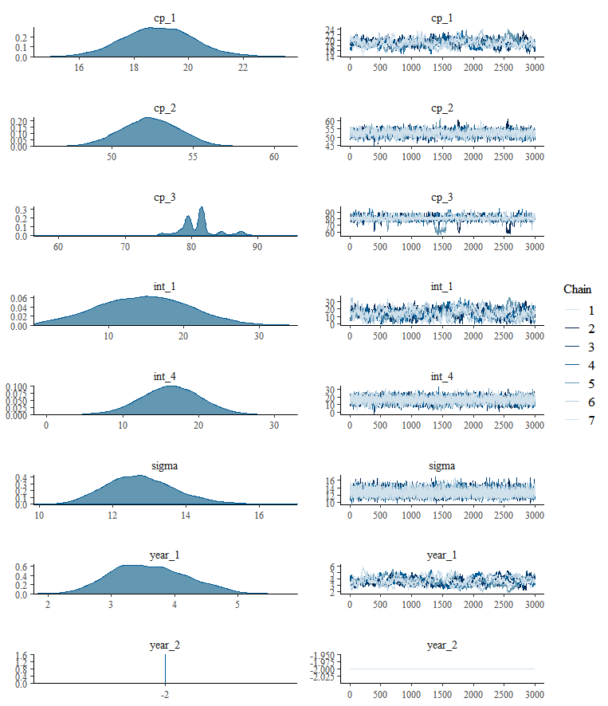

Bayesian inference of multiple change points and the parameters of the (linear) segments in between. Under the hood, `mcp` takes an abstract representation of linear segments and turns it into [JAGS](https://sourceforge.net/projects/mcmc-jags/) code. The rest of the package ensures seamless compatibility with your favourite Bayesian packages, including `tidybayes`, `bayesplot`, and `loo`.

You can see the roadmap for the immediate future under [issues](https://github.com/lindeloev/mcp/issues). Expect breaking changes in the API until version 1.0. Also be aware that it has not been thoroughly tested. I would be very excited about any feedback, positive or negative or constructive. Please raise issues or contact me elsewhere, e.g., [@jonaslindeloev](https://twitter.com/jonaslindeloev) on Twitter or firstname at lindeloev.dk.


# Install

 1. [Install the latest version of JAGS](https://sourceforge.net/projects/mcmc-jags/). Linux users can fetch binaries [here](http://mcmc-jags.sourceforge.net/).
 
 2. Install `mcp` by running this in R: `devtools::install_github("lindeloev/mcp")`. If you don't have `devtools`, install it first using `install.packages("devtools")`.


# How it works

The workhorse of the `mcp` package is the `mcp` function. It takes 


# Quick examples of various change point models

Find the single change point between two plateaus:

```r
library(mcp)

# Define segments
segments = list(
    y ~ 1,  # Intercept
    1 ~ 1  # Intercept
)

# Start sampling
fit = mcp(segments, my_data)

# Plot fit
plot(fit)
```


To see the posteriors, use `summary()` or `plot(fit, "combo")`. This model infers the change point (`cp_1`) on `x`, the intercept for segment 1 (`int_1`), and the intercept for segment 2 (`int_2`). Also the standard deviation of the residuals (`sigma`).

```r
summary(fit)  # or plot(fit, "combo")
```

```r
# A tibble: 4 x 4
  name   mean .lower .upper
  <chr> <dbl>  <dbl>  <dbl>
1 cp_1   39.8   38.0   42.8
2 int_1  52.1   45.7   58.6
3 int_2  19.0   13.8   24.0
4 sigma  20.3   17.5   23.2
```


Find the single change point between two joined slopes:
```r
segments = list(
    y ~ 1 + x,  # intercept + slope
    1 ~ 0 + x  # joined slope
)
fit = mcp(segments, my_data, par_x = "x")
plot(fit)
```


Find the single change point between two joined slopes. While the slopes are shared by all participants, their change point varies:

```r
segments = list(
    y ~ 1 + x,  # intercept + slope
    1 + (1|id) ~ 0 + x  # joined slope. cp varies by id
)
fit = mcp(segments, my_data)
plot(fit, facet_by = "id")
```


Here we find the two change points between three segments. The slope and intercept of segment 2 are parameterized relative to segment 1. So too with the second change point. Some of the default priors are overwritten; the first slope (`x_1`) is forced to be -3.

```r
segments = list(
  y ~ 1 + x,
  1 ~ rel(1) + rel(x),
  rel(1) ~ 0
)
prior = list(
  int_1 = "dnorm(0, 20)",
  x_1 = -3,
  cp_1 = "dunif(20, 50)"
)
fit = mcp(segments, my_data, prior)
plot(fit)
```


# Extended guide

Let us specify a fairly complicated model with four segments, i.e., three change points:

```r
library(mcp)

# Define the segments that are separated by change points
segments = list(
  score ~ 1 + year,  # intercept + slope
  1 ~ 0 + year,  # joined slope
  rel(1) ~ 0,  # joined plateau starting at relative change point
  1 ~ rel(1)  # disjoined plateau with relative intercept parameterization
)
```

This is what we will end up with. We simulate some raw data from this model (the points) and infer the parameter of the linear segments as well as the change points (lines are draws from the posterior distribution).


This model has the following parameters:

 * `cp_1`, `cp_2`, and `cp_3`: change points on the x-axis (here `year`). One between each adjacent segment. `cp_2` is relative to `cp_1`, i.e., it's value is the (positive) *difference* between `cp_1` and `cp_2`.
 * `int_1` and `int_4`: absolute (`1`) and relative (`rel(1)`) intercepts respectively (here `score`) from the first and the last segment.
 * `year_1`, `year_2`: slopes in segments 1 and 2. Takes name after the x-axis predictor.
 * `sigma`: standard deviation of residuals.


## Simulate data using `fit$func_y()`
It will usually be a good idea to run `mcp` without sampling first, in which case it returns a full `mcpfit` object without samples. This contains a list of priors (`mcp$prior`), JAGS code (`fit$jags_code`), and an R function of the model (`mcp$func_y()`). 

We can use the latter to simulate data. This is always a great way to get acquainted with new models and functions, and ensure that they can recover the parameters. 

```r
# Get an mcpfit object without samples
empty = mcp(segments, sample=FALSE)

# Now use empty$func_y() to generate data from this model.
# Set some parameter values to your liking:
data = data.frame(
  year = 1:100,  # Evaluate func_y for each of these
  score = empty$func_y(
    year = 1:100,  # x
    sigma = 12,  # standard deviation
    cp_1 = 20, cp_2 = 35, cp_3 = 80,  # change points 
    int_1 = 20, int_4 = 20,  # intercepts
    year_1 = 3, year_2 = -2  # slopes
  )
)
```

## Set priors
Quite uninformative priors are set using data by default. You can see them in `fit$prior`. We can override some or all of these by providing JAGS code.

```r
prior = list(
  year_1 = "dnorm(0, 5)",  # Slope of segment 1
  int_1 = "dt(10, 30, 1) T(0, )",  # t-distributed prior. Truncated to be positive.
  cp_2 = "dunif(0, 60)",  # Change point is after the first, but within 60 years.
  year_2 = -2  # Fixed slope of segment 2.
)
```

`mcp` has a few tricks up the sleeve for setting priors. 

* Order restriction is automatically applied to `cp_*` parameters using truncation (e.g., `T(cp_1, )`) so that they are in the correct order on the x-axis UNLESS you do it yourself. The one exception is for `dunif` distributions where you have to do it as above. 

* In addition to the model parameters, `MINX` (minimum x-value), `MAXX` (maximum x-value), `SDX` (etc...), `MINY`, `MAXY`, and `SDY` are also available when you set priors. They are used to set uninformative default priors.

* Use SD when you specify priors for dt, dlogis, etc. JAGS uses precision but `mcp` converts to precision under the hood via the `sd_to_prec()` function.

* You can fix any parameter to a specific value. Simply set it to a numerical value
(as `year_2` above). A fixed value is a 100% prior belief in that value.


## Fit the model
This is the easiest step!

```r
fit = mcp(segments, data, prior)
fit
```

```
# A tibble: 8 x 4
  name    mean .lower .upper
  <chr>  <dbl>  <dbl>  <dbl>
1 cp_1   19.5   17.4   21.6 
2 cp_2   37.2   33.6   40.5 
3 cp_3   78.9   73.0   83.0 
4 int_1  16.9    6.70  27.5 
5 int_4  20.9   15.7   26.2 
6 sigma  11.4    9.84  13.1 
7 year_1  3.40   2.48   4.34
8 year_2 -2     -2     -2
```

(This summary is very limited and will be updated)


## Plots
Let us inspect it visually:

```r
plot(fit)
```


By default this draws lines given 25 posterior samples, but change it using `plot(fit, draws=50)`. Of particular interest is how similar the lines are (good precision) and how well they fit to the data. `plot.mcpfit` returns a `ggplot2` object, so you can easily add, e.g., a title: `plot(fit, "combo") + ggtitle("Posteriors and convergence")`.

Notice that the fixed prior on the slope in segment 2 causes parallel lines. The rest of the model adapts.

We may also want to inspect the posterior distributions directly:

```r
plot(fit, "combo")
```



This is a classical Bayesian plot to better see parameter estimates and to check convergence between chains. Compare the inferred values to the one we used to generate the data. Change point models do a remarkably good job of recovering the change points on other parameters, including sigma.

Notice that `int_4` was modeled as relative (`rel(1)`) so it is the *difference* from the change point. It would have had a different value if it was modeled as absolute (`1`).


If you need to increase the warmup or number of post-warmup iterations, `mcp(...)` are channeled directly to `jags.fit`, so you can do `mcp(segments, data, n.adapt = 3000, n.update = 3000, n.iter = 5000)`.


## Model comparison
Now it's time for some model comparison. We will compare to an intercept-only model with default priors. This one has no change points because there is only one segment, i.e., it is a classical linear regression model. Because the x-axis cannot be read out from the segments when there are no slopes, we need to give it explicitly:

```r
segments2 = list(score ~ 1)
fit2 = mcp(segments2, data, par_x = "year")
```


We can use the cross-validation from the `loo` package to compare the predictive performance of various models. We compute loo for each model and then compare them. the `mcpfit` objects have placeholders for `loo` and `waic` fits. You need not use them, but it's nice to keep things together:

```r
fit$loo = loo(fit)
fit2$loo = loo(fit2)
loo::loo_compare(fit$loo, fit2$loo)
```

Result:
```
       elpd_diff se_diff
model1   0.0       0.0  
model2 -81.4       7.6
```

Aha, the first model in `loo_compare` (`fit`) was preferred (higher Estimated Log-Predictive Density). The important thing here is the `elpd_diff`/`se_diff` ratio. This is almost like a z-score, i.e., a ratio of 1.96 corresponds to 95% probability that `fit` has superior predictive accuracy. BUT, the `loo` developers have adviced that it is probably too optimistic in practice, so that one should only begin taking it seriously if this ratio exceeds 5 [Citation needed].


## ... and more
Lastly, don't be constrained by these simple `mcp` functions. You can work with the MCMC samples just as you would with `brms`, `stan_glm`, `jags`, or other samplers using the always excellent `tidybayes`:

```r
library(tidybayes)

# Extract all parameters:
tidy_draws(fit$samples) %>%
  # tidybayes stuff here

# Extract some parameters:
fit$pars$model  # check out which parameters are inferred.
spread_draws(fit$samples, cp_1, cp_2, int_1, year_1) %>%
 # tidybayes stuff here
```
