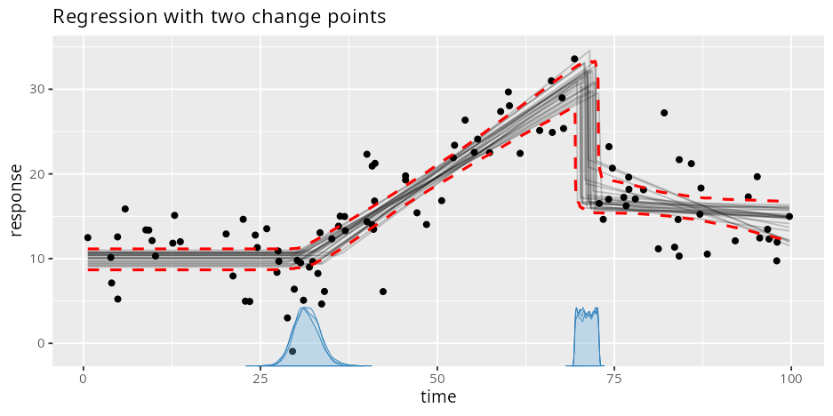
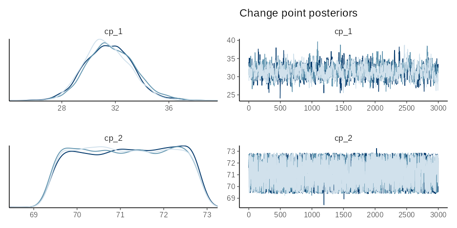
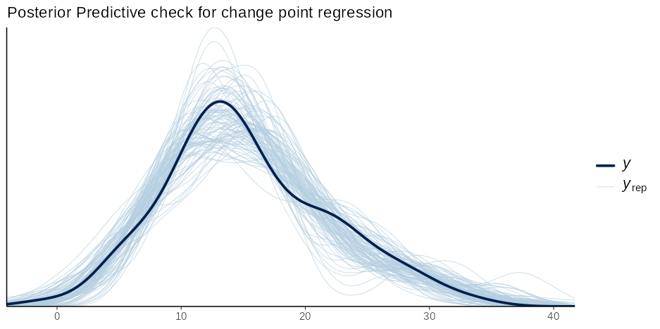

# mcp: Regression with Multiple Change Points

[](https://github.com/lindeloev/mcp/actions/workflows/check-standard.yaml?query=branch%3Adev)
[](https://codecov.io/gh/lindeloev/mcp/branch/dev)
[](https://CRAN.R-project.org/package=mcp)
[](https://cranlogs.r-pkg.org/badges/mcp)

`mcp` does `lm`/`glm`/`brms`-like regression with Multiple Change Points
(hence “`mcp`”) using Bayesian inference. `mcp` is especially useful if
you have a priori knowledge about the number of change points and the
trend of the segments in between. It supports GLMs with group-level
effects (random effects), AR/MA, and regression on distributional
parameters (`sigma`, `shape`, etc.).

`mcp` aims to feel “R-native” like `lm`/`glm` at its simplest while the
more Bayesian aspects are inspired by `brms` and `posterior`. Under the
hood, `mcp` takes a formula-representation of linear segments and turns
it into [JAGS](https://sourceforge.net/projects/mcmc-jags/) code (see
`fit$jags_code`).

`mcp` has [200+ academic
citations](https://scholar.google.com/scholar?cites=5590697509718421309)
across ecology, astronomy, neuroscience, epidemiology, and other
disciplines. See applications in the citing literature. Still, consider
if `mcp` is the right tool for your problem - see [overview of change
point packages](articles/packages.html).

Change points are also called **switch points**, **break points**,
**broken line** regression, **broken stick** regression, **bilinear**
regression, **piecewise linear** regression, **local linear**
regression, **segmented** regression, and (performance)
**discontinuity** models. `mcp` aims to be be useful for all of them.

# Install

Install `mcp` from CRAN:

``` r
install.packages("mcp")
```

or install the development version from GitHub:

``` r
if (!requireNamespace("remotes")) install.packages("remotes")
remotes::install_github("lindeloev/mcp")
```

`mcp` uses JAGS through `rjags`. If installation of `rjags` reports that
JAGS headers or libraries are missing, install [JAGS
4.x](https://sourceforge.net/projects/mcmc-jags/files/JAGS/4.x/) and
rerun the `mcp` installation. JAGS 5 is supported when `rjags` 5 is
released.

# At a glance

`mcp` takes a list of formulas - one for each segment:

``` r
model = list(
  response ~ 1,  # plateau (Intercept_1)
  ~ 0 + time,    # joined slope (time_2) at cp_1
  ~ 1 + time     # disjoined slope (Intercept_3, time_3) at cp_2
)

data = mcp_example_data("demo")
fit = mcp(model, data)
```

The change point(s) are the `x` at which data changes from being better
predicted by one formula to the next. The first formula is just
`response ~ predictors` and the most common formula for segment 2+ would
be `~ predictors` (more details [here](articles/formulas.html)).

You can do change point regression for a large number of models in a
syntax that aligns with `lm()`/`glm()`/`brms`. Visit [the mcp
website](https://lindeloev.github.io/mcp/) for worked examples and tips
for many of them.

<figure>

<figcaption aria-hidden="true">Several plots showing mcp regression fits
across different models and change-point structures.</figcaption>
</figure>

# Brief worked example

The following model infers the two change points between three segments.
You can run this complete worked example (which fits the model and plots
by default) in one line:

``` r
demo_fit = mcp_example("demo")
```

See `demo_fit$example_code` for how it was generated, and explore more
demos in `mcp_example()`. But for now, let’s walk though the example
manually:

``` r
# Define the model
model = list(
  response ~ 1,  # plateau (Intercept_1)
  ~ 0 + time,    # joined slope (time_2) at cp_1.
  ~ 1 + time     # disjoined slope (Intercept_3, time_3) at cp_2
)

# Get example data and fit it: mcp(model, data, ...)
fit = mcp(model, demo_fit$data, sample = "both", seed = 78)
```

## Plot and summary

The default plot includes data, fitted lines drawn randomly from the
posterior, and change point(s) posterior density for each chain. Here we
also add fitted interval (`q_fit`):

``` r
set.seed(42)
plot(fit, q_fit = TRUE) + ggtitle("Regression with two change points")
```



Use `summary()` to summarise the posterior distribution as well as
sampling diagnostics:

``` r
summary(fit)
```

    ## Family: gaussian
    ## Links: mu = identity; sigma = identity
    ## Iterations: 3000 from 3 chains.
    ## Segments:
    ##   1: response ~ 1
    ##   2: response ~ 1 ~ 0 + time
    ##   3: response ~ 1 ~ 1 + time
    ## 
    ## Change point parameters:
    ##     variable   mean    sd lower upper rhat ess_bulk ess_tail  sim match
    ##  cp_1        31.468 1.896 27.73 35.07 1.00     1101     1691 30.0    OK
    ##  cp_2        71.122 1.000 69.46 72.77 1.00     6093     7716 70.0    OK
    ## 
    ## Population-level parameters:
    ##     variable   mean    sd lower upper rhat ess_bulk ess_tail  sim match
    ##  Intercept_1  9.968 0.755  8.46 11.43 1.00     2077     2971 10.0    OK
    ##  time_2       0.534 0.052  0.43  0.64 1.00     1692     2830  0.5    OK
    ##  Intercept_3 -1.414 1.318 -3.89  1.28 1.00     1276     2119  0.0    OK
    ##  time_3      -0.059 0.075 -0.21  0.08 1.00     1213     1927 -0.2    OK
    ##  sigma_1      4.422 0.322  3.85  5.11 1.00     4337     4035  4.0    OK

- `rhat` is the rank-normalized split-Rhat convergence diagnostic.
- `ess_bulk` and `ess_tail` are the effective sample sizes for the bulk
  and tails of the posterior. Warning thresholds can be changed with
  `mcp(..., diagnostics = list(rhat = 1.01, ess_bulk = 400, ess_tail = 400))`;
  `summary()` inherits these settings.
- In this case, we simulated data using `mcp` (see how in
  `demo_fit$example_code`) so the columns `sim` and `match` show true
  value and whether it was recovered.

`plot_pars(fit)` can be used to inspect the posteriors and convergence
of all parameters. See the documentation of `plot_pars()` for many other
plotting options. Here, we plot just the (population-level) change
points. They often have “strange” posterior distributions, highlighting
the need for a computational approach:

``` r
plot_pars(fit, regex_pars = "cp_") + ggtitle("Change point posteriors")
```



Do a posterior predictive check to see if the model recovers the
empirical distribution in the data:

``` r
set.seed(42)
pp_check(fit) + ggtitle("Posterior Predictive check for change point regression")
```



You can expect most generics from R, `posterior`, `tidybayes` to work on
mcpfits. E.g., use `fitted(fit)` and `predict(fit)` to get fits and
predictions for in-sample and out-of-sample data, use `as_draws(fit)` to
get draws, etc.

## Tests and model comparison

We can test (joint) probabilities in the model using `hypothesis()`
([see more here](articles/comparison.html)). For example, what is the
evidence (given priors) that the first change point (`cp_1`) is later
than 25 against it being less than 25?

``` r
hypothesis(fit, "cp_1 > 25")
```

    ##      hypothesis     mean    lower    upper         p       BF
    ## 1 cp_1 - 25 > 0 6.468057 2.729073 10.06531 0.9981111 376.4029

For model comparisons, we can fit a null model and compare the
predictive performance of the two models using (approximate)
leave-one-out cross-validation ([see more
here](articles/comparison.html)). Let’s specify a null model null model
where the first two segments are reduced to one straight line, i.e.,
removing the change point:

``` r
# Define the model
model_null = list(response ~ 1 + time)  # Intercept_1 and time_1

# Fit it
fit_null = mcp(model_null, demo_fit$data, seed = 42)
```

Leveraging the power of `loo::loo()`, we see that the two-change-points
model is preferred (it is on top), but the `elpd_diff / se_diff` ratio
indicates that this preference is not very strong:

``` r
fit_loo = loo(fit)
fit_null_loo = loo(fit_null)

loo::loo_compare(fit_loo, fit_null_loo)
```

    ##   model elpd_diff se_diff p_worse diag_diff diag_elpd
    ##  model1       0.0     0.0      NA                    
    ##  model2     -80.1     9.8    1.00

# Highlights from in-depth guides

The articles on the [mcp website](https://lindeloev.github.io/mcp/) go
in-depth with the functionality of `mcp`. Here is an executive summary,
to give you a quick sense of what mcp can do.

[Understanding mcp formulas](articles/formulas.html):

- Parameter names are `Intercept_i` (intercepts), `cp_i` (change
  points), `x_i` (slopes), `ar*`/`ma*` (autocorrelation), and `sigma_*`
  (Gaussian residual standard deviation).

- The change point model is basically an `ifelse` model with order
  constraints on the change points.

- Generate data for all supported models using `fit$simulate()`. See
  examples in, e.g., `mcp_example("demo")$example_code`.

[Supported families and link functions](articles/families.html):

- `mcp` currently supports specific combinations of families
  (`gaussian()`, `binomial()`, `bernoulli()`, `poisson()`, and
  `negbinomial()`) and link functions (`identity`, `logit`, `probit`,
  and `log`).

- On using informative priors to incorporate expert knowledge.

- Use `binomial(link = "logit")` for [binomial change points in
  mcp](articles/binomial.html). Also relevant for
  `bernoulli(link = "logit")`.

- Use `negbinomial(link = "log")` or `poisson(link = "log")`. Read more
  on [Poisson and negative binomial change points in
  mcp](articles/poisson.html).

- Get results on the linear-predictor (link) scale rather than the
  response scale using `plot(fit, scale = "linear")` or
  `fitted(fit, scale = "linear")`.

[Model comparison and hypothesis testing](articles/comparison.html):

- Do Leave-One-Out Cross-Validation using `loo(fit)` and
  `loo::loo_compare(loo1, loo2)`.

- Compute Savage-Dickey density ratios using
  `hypothesis(fit, "cp_1 = 40")`.

[Group-level (random) effects](articles/group_effects.html):

- Model group-level intercepts, slopes, and change points using
  `(1|id)`, `(condition||id)`, or `+(condition|id)`. Get posteriors
  using `ranef(fit)`.

- Plot using `plot(fit, facet_by = "my_group")` and
  `plot_pars(fit, pars = "group", type = "dens_overlay", ncol = 3)`.

- Default priors bound group-specific change points relative to adjacent
  population-level change points.

Modeling [autoregression](articles/arma.html) and distributional
parameters like [Gaussian residual standard
deviation](articles/dpar.html):

- `~ 0 + sigma(1)` models an intercept change in standard deviation.
  `~ 0 + sigma(0 + x)` models increasing/decreasing standard deviation.
  Explicit `sigma()` formulas use a log link, so their coefficients are
  on the log-SD scale.

- `~ ar(N)` models Nth order autoregression on residuals.
  `~ar(N, 0 + x)` models increasing/decreasing autocorrelation.

- `y | weights(w)` (and `y | trials(N) + weights(w)`) specifies
  observation log-likelihood weights across all families, as in `brms`.

- You can provide complete models in distributional parameters
  (currently `sigma()`, `shape()`, and `mu()`) and time-series (`ar()`
  and `ma()`). For example, `~ x + sigma(1 + x:condition)` models an
  abrupt change followed by a by-condition slopes in variance.

[Get fitted and predicted values and intervals](articles/predict.html):

- `fitted(fit)` and `predict(fit)` take many arguments to predict
  in-sample and out-of-sample values and intervals.

- Forecasting with prior knowledge about future change points.

[Using priors](articles/priors.html):

- See priors in `fit$prior` or `prior_summary(fit)` and set priors using
  `mcp(..., prior = list(cp_1 = "dnorm(0, 1)", cp_2 = "dunif(0, 45)")`.

- The default prior on change points is `dirichlet(1)` (uniform order
  statistics). For a single change point, this is the Beta(1, 1) /
  uniform distribution over `[min(x), max(x)]`. Informativeness
  increases as the number of change points increases.

- Fix parameters to specific values using `cp_1 = 45` and share
  parameters between segments using `slope_1 = "slope_2"`.

- Truncate priors using `T(lower, upper)`, e.g.,
  `Intercept_1 = "dnorm(0, 1) T(0, )"`. `mcp` adds ordering bounds to
  population-level change-point priors. Users can override these.

- Do prior predictive checks using
  `mcp(model, data, sample = "prior") |> plot()`.

[Missing responses and posterior imputation](articles/missing.html):

- Missing responses are sampled in JAGS and retained with their matching
  posterior draws.

- Use `fitted(fit) |> filter(is.na(y))` for expected responses and
  `predict(fit) |> filter(is.na(y))` for posterior imputations.

- On plotting missing responses, asking probabilistic questions about
  them, etc.

[Tips, tricks, and debugging](articles/tips.html)

- Speed up fitting using
  `future::plan(future::multisession, workers = 3)`, and/or fewer
  iterations, `mcp(..., warmup = 500)`.

- Help convergence along using
  `mcp(..., inits = list(cp_1 = 20, Intercept_2 = -3))`.

- Most errors will be caused by circularly defined priors.

# Do more with the MCMC samples

Use the `posterior` package generics to extract draws in any format:

``` r
library(posterior)
library(tidybayes)

as_draws_df(fit)    # draws_df (tidybayes-compatible)
as_draws_array(fit) # draws array (iterations x chains x parameters)
coda::as.mcmc(fit)  # coda mcmc.list (for coda diagnostics)
spread_draws(as_draws_df(fit), cp_1, cp_2, Intercept_1)  # tidybayes
```

Get draws in a tidybayes-like format with `fitted(fit, summary = FALSE)`
or `predict(fit, summary = FALSE)`. Same for `residuals(fit)` and
`log_lik(fit)`.

For example:

``` r
head(fitted(fit, summary = FALSE))  # column .epred
```

    ## # A tibble: 6 × 14
    ##   .chain .iteration .draw  cp_1  cp_2 Intercept_1 time_2 Intercept_3  time_3
    ##    <int>      <int> <int> <dbl> <dbl>       <dbl>  <dbl>       <dbl>   <dbl>
    ## 1      1          1     1  32.0  72.0        10.3  0.536       -2.14 -0.0566
    ## 2      1          1     1  32.0  72.0        10.3  0.536       -2.14 -0.0566
    ## 3      1          1     1  32.0  72.0        10.3  0.536       -2.14 -0.0566
    ## 4      1          1     1  32.0  72.0        10.3  0.536       -2.14 -0.0566
    ## 5      1          1     1  32.0  72.0        10.3  0.536       -2.14 -0.0566
    ## 6      1          1     1  32.0  72.0        10.3  0.536       -2.14 -0.0566
    ## # ℹ 5 more variables: sigma_1 <dbl>, response <dbl>, time <dbl>,
    ## #   data_row <int>, .epred <dbl>

# Citation

[This preprint](https://osf.io/fzqxv) formally introduces `mcp`. Find
citation info at the link, call `citation("mcp")` or copy-paste this
into your reference manager:

      @Article{,
        title = {mcp: An R Package for Regression With Multiple Change Points},
        author = {Jonas Kristoffer Lindeløv},
        journal = {OSF Preprints},
        year = {2020},
        doi = {10.31219/osf.io/fzqxv},
        encoding = {UTF-8},
      }
