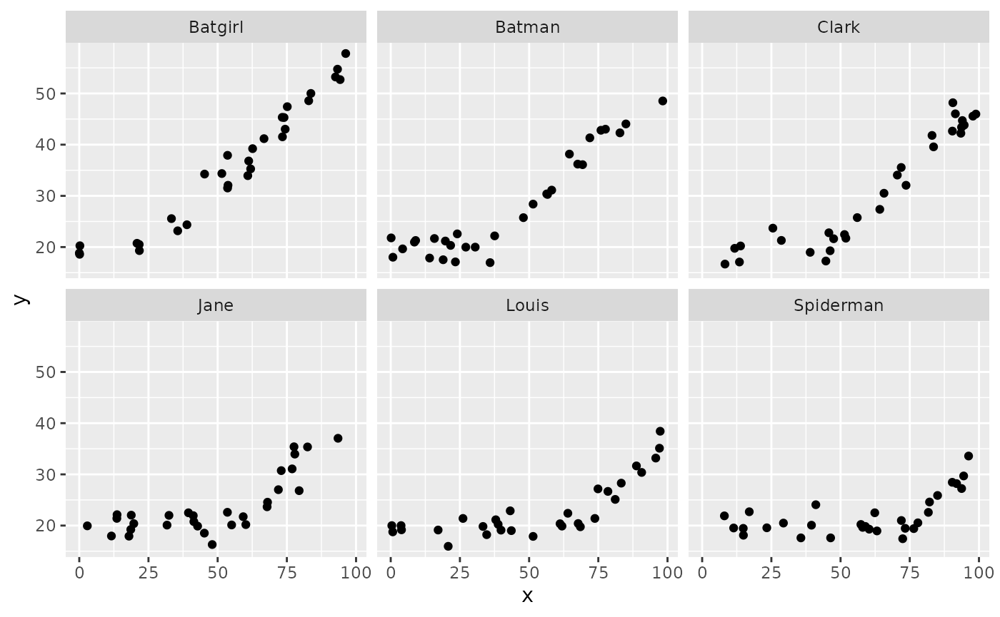
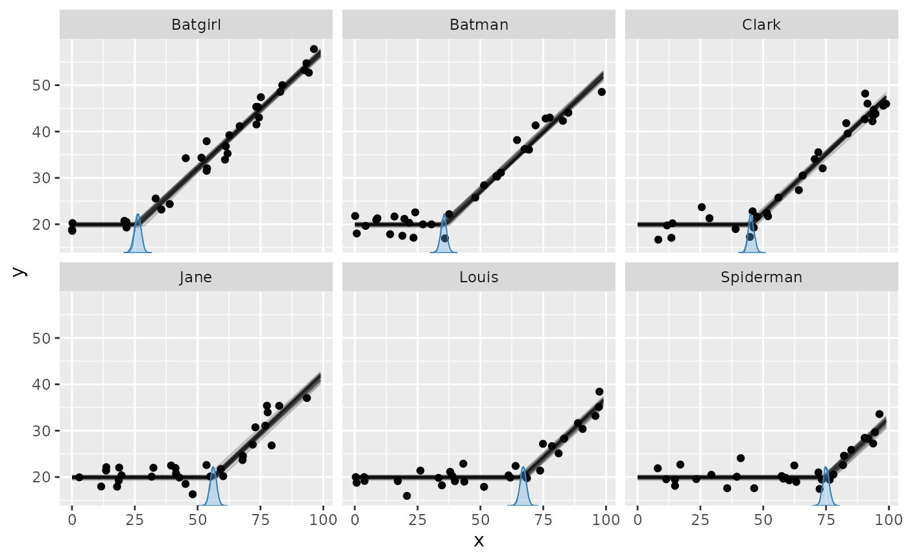
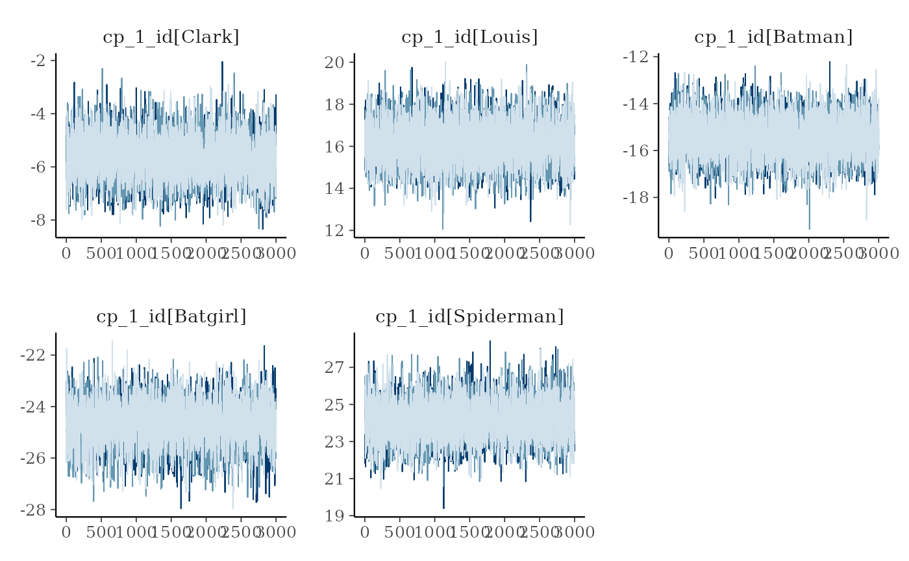
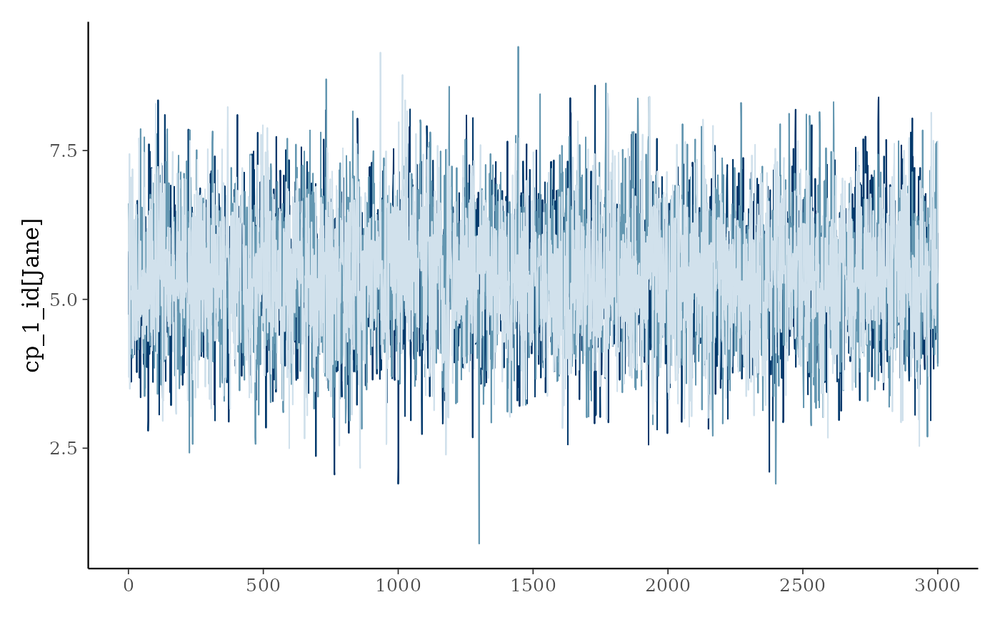
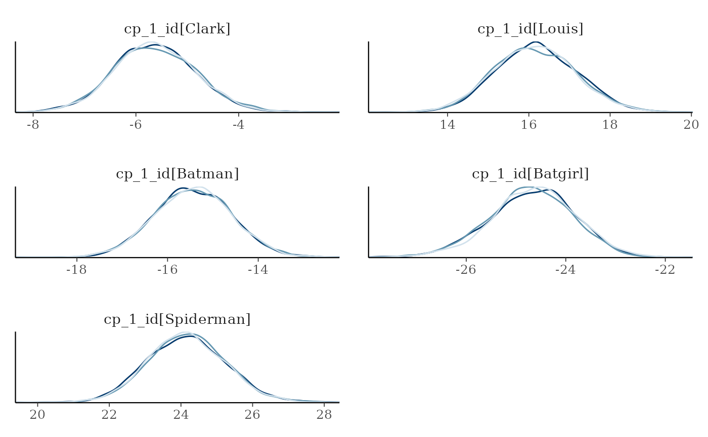
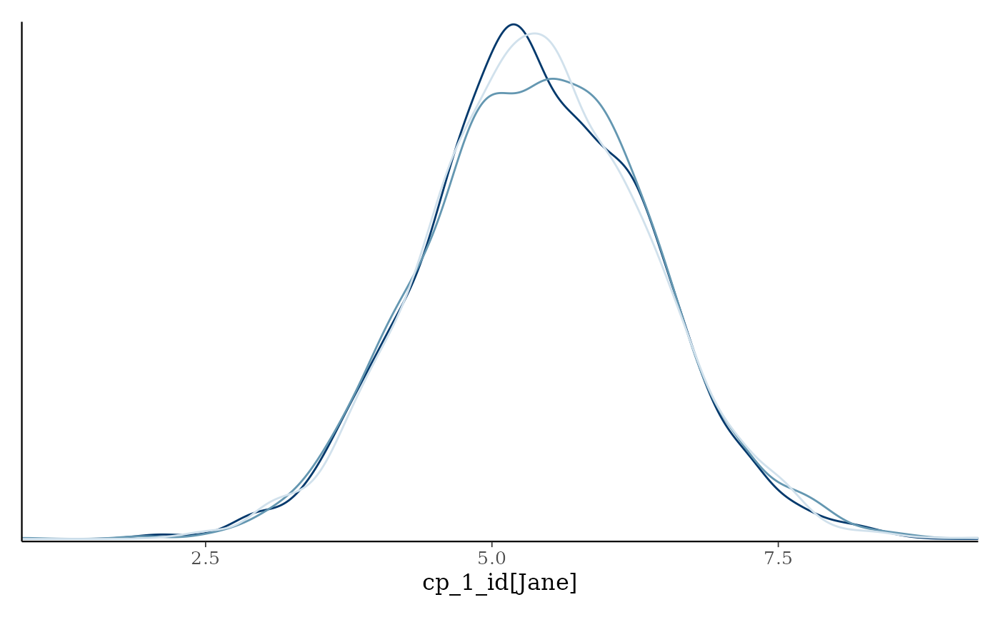
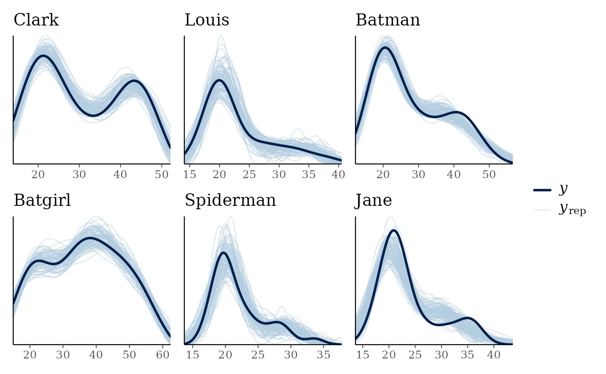

# Group-level effects

`mcp` supports group-level effects (also called varying or random
effects) in both the predictor and change-point parts of a formula. The
syntax and terminology follow `lme4` and `brms`: `(1|group)` specifies a
group-level intercept, `(factor||group)` specifies independent group
coefficients,
[`fixef()`](https://lindeloev.github.io/mcp/reference/summary.mcpfit.md)
reports population-level coefficients, and
[`ranef()`](https://lindeloev.github.io/mcp/reference/summary.mcpfit.md)
reports group-level deviations.

This article in brief:

- Predictor and change-point group-level effects
- How group-level effects persist across segments
- How to simulate varying change points
- Get posteriors using `ranef(fit)`
- Plot using `plot(fit, facet_by="my_group")` and
  `plot_pars(fit, pars = "varying", type = "dens_overlay", ncol = 3)`.
- The default priors restrict varying change points to lie between the
  two adjacent change points.
- The article on modeling variance via
  [`sigma()`](https://rdrr.io/r/stats/sigma.html) contains [an example
  on varying change
  points](https://lindeloev.github.io/mcp/articles/variance.md) as well.

``` r

library(mcp)
future::plan(future::multisession, workers = 3)
set.seed(42)  # Make the script deterministic
```

## Specifying varying change points

You specify group-level effects using the familiar
[`lmer`](https://www.rdocumentation.org/packages/lme4/versions/1.1-21/topics/lmer)
and `brms` syntax `(1|group)`. In the cp part, this models a varying
change point. For example, here we model a varying change point between
a plateau and a joined slope:

``` r

model = list(
  y ~ 1,  # Intercept_1
  1 + (1|id) ~ 0 + x  # cp_1, cp_1_sd, cp_1_id[i]
)
```

You can have multiple varying change points with multiple groupings:

``` r

model = list(
  y ~ 1,  # Intercept_1
  1 + (1|id) ~ 0 + x,  # cp_1, cp_1_sd, cp_1_id[i]
  1 + (1|species) ~ 0,  # cp_2, cp_2_sd, cp_2_species[i]
  (1|id) ~ 1  # cp_3 (implicit), cp_3_sd, cp_3_id[i]
)
```

Here are some properties of the change point varying effects:

**Zero centered:** The group-level deviations are zero-centered around
the associated population-level change point. In other words, the sum of
all varying effects is exactly zero. This constraint is necessary for
the parameters to be identifiable.

**Hierarchical:** Consider the population-level change point `cp_1` and
its associated group-level deviations `cp_1_id`. Their spread is
governed by the population-level parameter `cp_1_sd`.

**Constraints:** The varying effects are constrained to lie (1) in the
observed range of the x-axis, and/or (2) between the two adjacent change
points. That is, all `cp_1_id` are between `min(x)` and `cp_2`. All
`cp_2_species` are between `cp_1` and `cp_3` and all `cp_3_id` are
between `cp_2` and `max(x)`. These constraints are enforced through
truncation of the default prior (`fit$prior`) and you can override them
by specifying a manual prior (see vignette(“priors”)).

## Predictor group-level effects

The same syntax in the predictor part gives each group a deviation from
the population intercept:

``` r

model = list(
  y ~ 1 + (1|id),
  ~ 0 + x,
  ~ 1 + (0|id)
)
```

Here, the group-level intercept introduced in segment 1 also applies in
segment 2. A later `(1|id)` would replace it from that segment onward,
while `(0|id)` turns it off, as in segment 3 above. Persistence is
tracked separately for each grouping factor and distributional
parameter.

Use `||` for independent group-level slopes and factor coefficients:

``` r

model = list(
  y ~ 1 + condition + (condition||id),
  ~ 0 + x
)
```

With the default treatment coding, `(condition||id)` contains a
group-level intercept and one group-level deviation for each
non-reference contrast of `condition`. `(0 + condition||id)` instead
gives each factor level its own group-level coefficient. Similarly,
`(1 + z||id)` specifies independent group-level intercepts and slopes on
a numeric predictor `z`. Each coefficient has its own population-level
SD.

The population-level and group-level formulas need not contain the same
coefficients. For example, `y ~ 1 + (0 + condition||id)` has a
population intercept but only group-specific condition coefficients.

Group-level intercepts also work inside distributional formulas:

``` r

model = list(
  y ~ 1 + (1|id) + sigma(1 + (1|id))
)
```

This model has group-level deviations in both the conditional mean and
log-SD. The `||` syntax works inside distributional formulas too, for
example `sigma(1 + (condition||id))`.

A later predictor group-level term for the same distributional parameter
and grouping factor replaces the entire earlier block. Thus, if
`(condition||id)` is followed in a later segment by `(1||id)`, only the
new intercept deviation applies from that segment onward. `(0|id)` turns
the block off.

Multi-coefficient terms with `|`, such as `(1 + x|id)`, would imply
correlated group coefficients and are not yet supported; use
`(1 + x||id)` for independent coefficients. Group-level terms inside
[`ar()`](https://rdrr.io/r/stats/ar.html) and `ma()` are also not
supported.

Unlike change-point deviations, predictor deviations are not constrained
to sum exactly to zero. They have an ordinary mean-zero hierarchical
normal distribution, matching multilevel regression in `lme4` and
`brms`. For example, `(1|id)` in segment 1 creates the deviation vector
`Intercept_1_id` and its population-level SD parameter
`Intercept_1_id_sd`. `(condition||id)` additionally creates names such
as `conditionB_1_id` and `conditionB_1_id_sd`; inside
[`sigma()`](https://rdrr.io/r/stats/sigma.html), the corresponding names
start with `sigma`.

## Simulating varying change points

Let us do a worked example, simulating the varying change point between
a plateau and a slope:

``` r

model = list(
  y ~ 1,  # Intercept_1
  1 + (1|id) ~ 0 + x  # cp_1, cp_1_sd, cp_1_id[i]
)
```

It is quite similar to simulating non-varying data, except that we need
to simulate some varying offsets before passing all parameters to
`empty$simulate`:

``` r

library(dplyr, warn.conflicts = FALSE)
varying = c("Clark", "Louis", "Batman", "Batgirl", "Spiderman", "Jane")
df = data.frame(
  x = runif(length(varying) * 30, 0, 100),  # 30 data points for each
  id = rep(varying, each = 30),  # the group names
  y = 1
)
df$id_numeric = as.numeric(as.factor(df$id))  # to positive integers

empty = mcp(model, data = df, sample = FALSE)

df$y = empty$simulate(empty, df,
  # Population-level:
  Intercept_1 = 20, x_2 = 0.5, cp_1 = 50, sigma = 2,
  
  # Varying: zero-centered and 10 between each level
  cp_1_id = 10 * (df$id_numeric - mean(df$id_numeric)))

head(df)
```

    ##          x    id        y id_numeric
    ## 1 91.48060 Clark 46.02453          3
    ## 2 93.70754 Clark 43.40142          3
    ## 3 28.61395 Clark 21.30070          3
    ## 4 83.04476 Clark 41.80460          3
    ## 5 64.17455 Clark 27.36570          3
    ## 6 51.90959 Clark 21.73321          3

Here, we “translated” the `id` to an offset on the x-axis by multiplying
with 10. We subtracted the mean to make the varying effects
zero-centered around `cp_1`. The result:

``` r

library(ggplot2)
ggplot(df, aes(x=x, y=y)) + 
  geom_point() +
  facet_wrap(~id)
```



## Summarise and plot varying effects.

Fitting the model is simple:

``` r

fit = mcp(model, data = df)
```

If we just use `plot(fit)`, we would see all points in one plot. We want
to facet by `id`, so:

``` r

plot(fit, facet_by = "id")
```



It seems that `mcp` did a good job of recovering the change points.
There is a lot of information in this data, since the intercept and the
slope on each side of the (varying) change point is shared between
participants here.

If you use `summary(fit)` (or `fixef(fit)`) you will get the posteriors
for the population-level effects. To get the random effects, do:

``` r

mcp::ranef(fit)
```

    ##                 name match sim       mean      lower      upper     Rhat
    ## 1   cp_1_id[Batgirl]    OK -25 -24.674953 -26.425003 -23.097077 1.001671
    ## 2    cp_1_id[Batman]    OK -15 -15.433769 -17.098246 -13.753115 1.002121
    ## 3     cp_1_id[Clark]    OK  -5  -5.625377  -7.172105  -4.013828 1.001112
    ## 4      cp_1_id[Jane]    OK   5   5.402215   3.495635   7.379310 1.000165
    ## 5     cp_1_id[Louis]    OK  15  16.165716  14.259467  18.162702 1.000624
    ## 6 cp_1_id[Spiderman]    OK  25  24.166168  22.102943  26.347378 1.006262
    ##   ess_bulk ess_tail
    ## 1     2474     4506
    ## 2     6194     6230
    ## 3     4667     5844
    ## 4     5174     5911
    ## 5     4886     5622
    ## 6     2364     4885

Inspecting the `sim` and `match` columns, we see that they recovered the
simulation parameters well.

Prediction methods include all group-level effects by default. Set
`varying = FALSE` for population-only predictions, `varying = "cp"` for
all group-level effects in the cp part, `varying = "predictor"` for
predictor-side group-level effects, or supply an exact name such as
`varying = "cp_1_id"`. `ranef(fit)` deliberately remains simple and
returns all group-level effects.

Good convergence is not always as obvious as in this example. While
`plot_pars(fit)` show population-level parameters only, you can do this
to get varying effects only:

``` r

plot_pars(fit, pars = "varying", type = "trace", ncol = 3)
```



Notice the use of the `ncol` argument to set the number of columns. You
will often have *many* levels on your varying effect, so this is useful
to get a good view of all of them. Naturally, you can do this for almost
all kinds of plots.

Using `pars = "varying"` will plot all varying effects. This may be too
much if you have multiple varying effects. To select just one, use
regular expression in `regex_pars`. Two very handy operators are “^”
(begins with) and “\$” (ends with). Just to show that this “faceting”
works for almost all of the many plot types, we now do two columns of
`"dens_overlay`:

``` r

plot_pars(fit, regex_pars = "^cp_1_id", type = "dens_overlay", ncol = 2)
```



You can also do posterior predictive checking with facets. I think that
for the relatively univariate models supported as of `mcp` 0.3, this
does not add much new information over and above
`plot(fit, facet_by = "id")`, but it’s a standard assessment that many
will be acquainted with:

``` r

pp_check(fit, facet_by = "id")
```



## Priors for varying effects

You can see the priors of the model like this:

``` r

cbind(fit$prior)
```

    ##             [,1]                                                                     
    ## cp_1        "dunif(0.02388966, 98.88917)"                                            
    ## cp_1_sd     "dnorm(0, 197.7306) T(0, )"                                              
    ## cp_1_id     "dnorm(0, cp_1_sd) T(0.0238896580412984 - cp_1, 98.8891728920862 - cp_1)"
    ## Intercept_1 "dt(22.5, 5.8, 3)"                                                       
    ## x_2         "dt(0, 0.1173314, 3)"                                                    
    ## sigma_1     "dt(0, 5.8, 3) T(0, )"

The prior `cp_1_sd` is the population-level standard deviation of
`cp_1_id`, the latter of which is applied to all levels of `id`.
Predictor group-level effects similarly receive a population-level SD
parameter, but use ordinary mean-zero normal deviations without exact
zero-centering. This is also apparent if you inspect the JAGS code for a
model. The truncation of change-point deviations keeps them between the
two adjacent population-level change points.

## JAGS code

Here is the JAGS code for the model used in this article:

``` r

fit$jags_code
```

    ## model {
    ##   # mcp helper values
    ##   cp_0 = CONST1_
    ##   cp_2 = CONST2_
    ## 
    ##   # Priors for population-level effects
    ##   cp_1 ~ dunif(CONST1_, CONST2_)  # Within the observed change-point span
    ##   cp_1_sd ~ dnorm(0, 1/(197.7306)^2) T(0,)  # Group-level change-point variation
    ##   Intercept_1 ~ dt(22.5, 1/(5.8)^2, 3)   # Robustly centered mean intercept with a minimum scale of 2.5
    ##   x_2 ~ dt(0, 1/(0.1173314)^2, 3)   # Regularizing mean coefficient scaled to a reference predictor change
    ##   sigma_1 ~ dt(0, 1/(5.8)^2, 3) T(0,)  # Positive residual SD calibrated on the response scale
    ## 
    ##   # Priors for varying effects
    ##   for (id_ in 1:n_unique_id) {
    ##     cp_1_id_uncentered[id_] ~ dnorm(CONST3_, 1/(cp_1_sd)^2) T(CONST1_-cp_1,CONST2_-cp_1)  # Zero-centered group-level change-point offsets
    ##   }
    ##   cp_1_id = cp_1_id_uncentered - mean(cp_1_id_uncentered)  # vectorized zero-centering
    ## 
    ##   # Model and likelihood
    ##   for (i_ in 1:length(x)) {
    ##     # par_x local to each segment
    ##     x_local_1_[i_] = min(x[i_], (cp_1 + cp_1_id[id[i_]]))
    ##     x_local_2_[i_] = min(x[i_], cp_2) - (cp_1 + cp_1_id[id[i_]])
    ##     
    ##     # Formula for mu
    ##     link_mu_[i_] =
    ##     
    ##       # Segment 1: y ~ 1
    ##       (x[i_] >= cp_0) * inprod(rhs_matrix_[i_, c(1)], c(Intercept_1)) * 1 + 
    ##     
    ##       # Segment 2: y ~ 1 + (1 | id) ~ 0 + x
    ##       (x[i_] >= (cp_1 + cp_1_id[id[i_]])) * inprod(rhs_matrix_[i_, c(2)], c(x_2)) * x_local_2_[i_]
    ##     
    ##     # Formula for sigma
    ##     link_sigma_[i_] =
    ##     
    ##       # Segment 1: y ~ 1
    ##       (x[i_] >= cp_0) * inprod(rhs_matrix_[i_, c(3)], c(sigma_1)) * 1
    ## 
    ##     # Likelihood and log-density for family = gaussian()
    ##     mu_[i_] = link_mu_[i_]
    ##     sigma_[i_] = max(1e-03, link_sigma_[i_])
    ##     y[i_] ~ dnorm(mu_[i_], 1 / sigma_[i_]^2)  # SD as precision
    ##   }
    ## }
