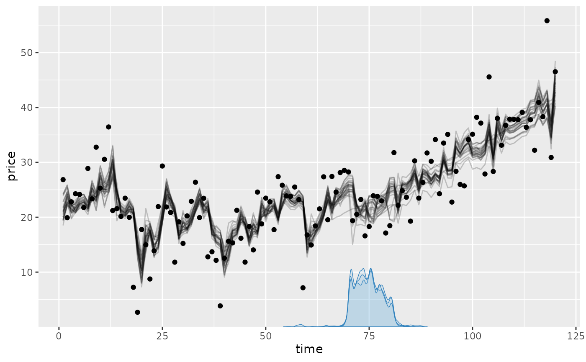
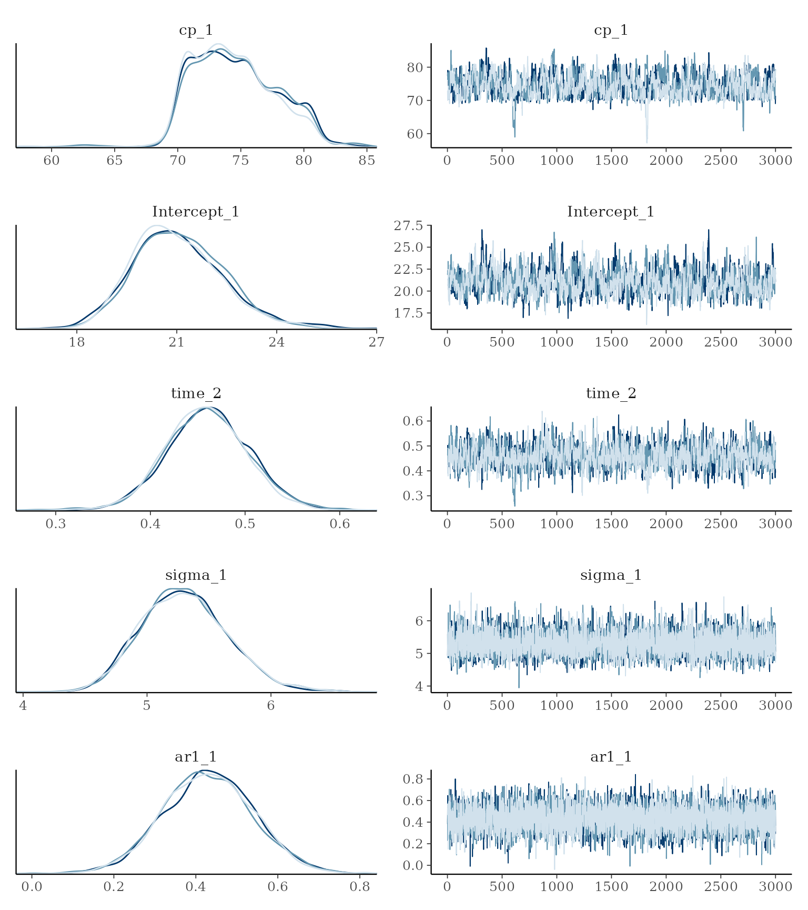
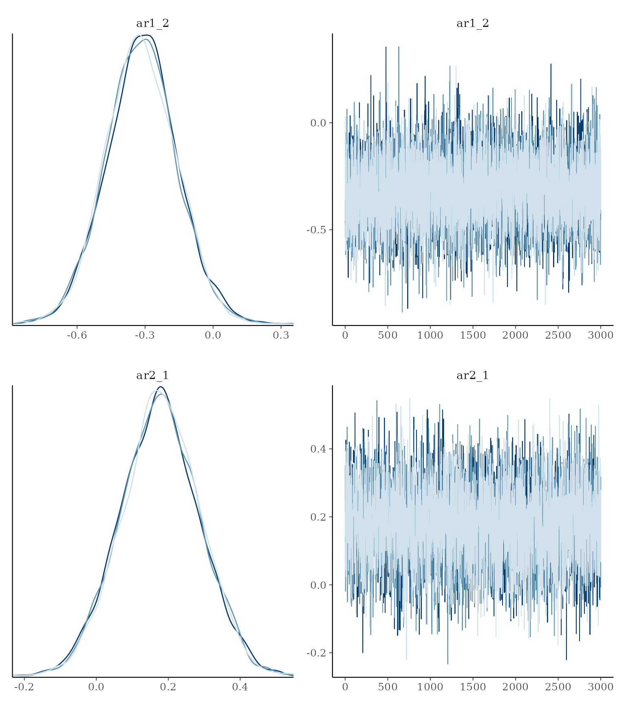
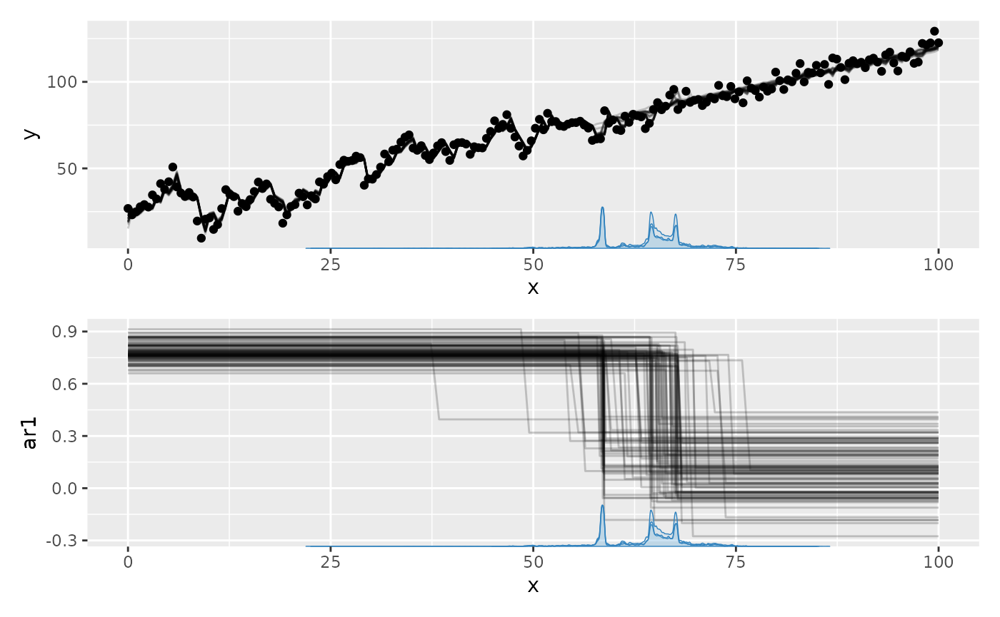
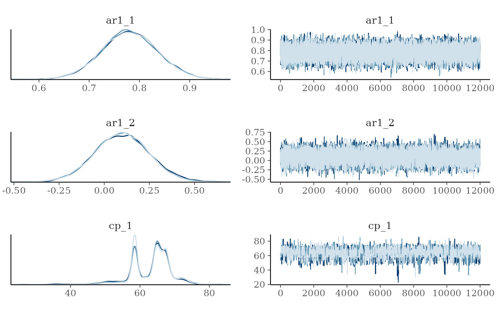
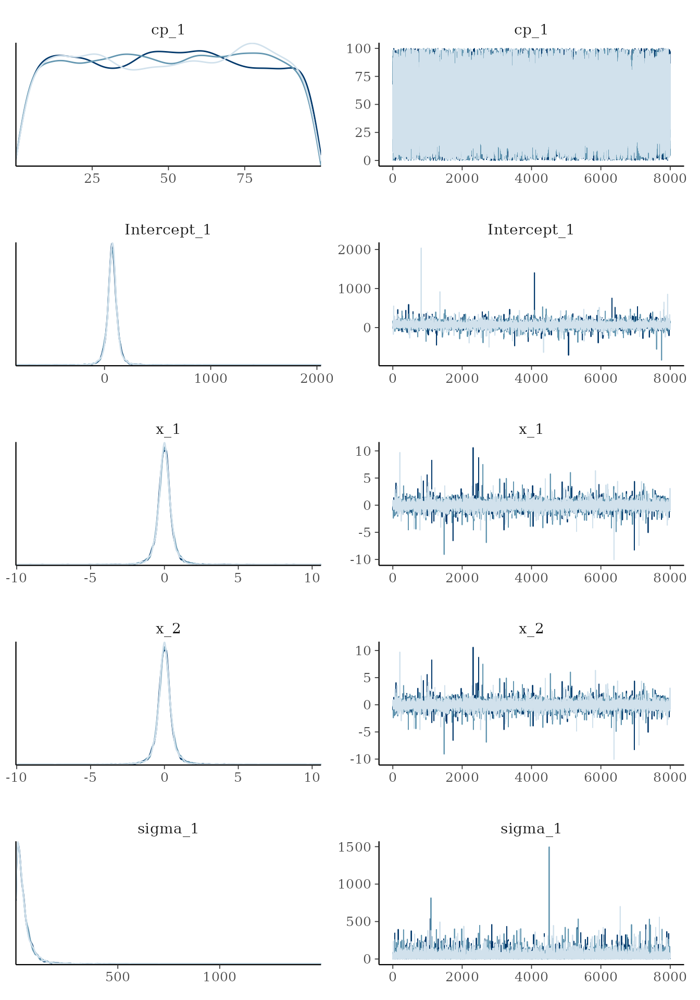
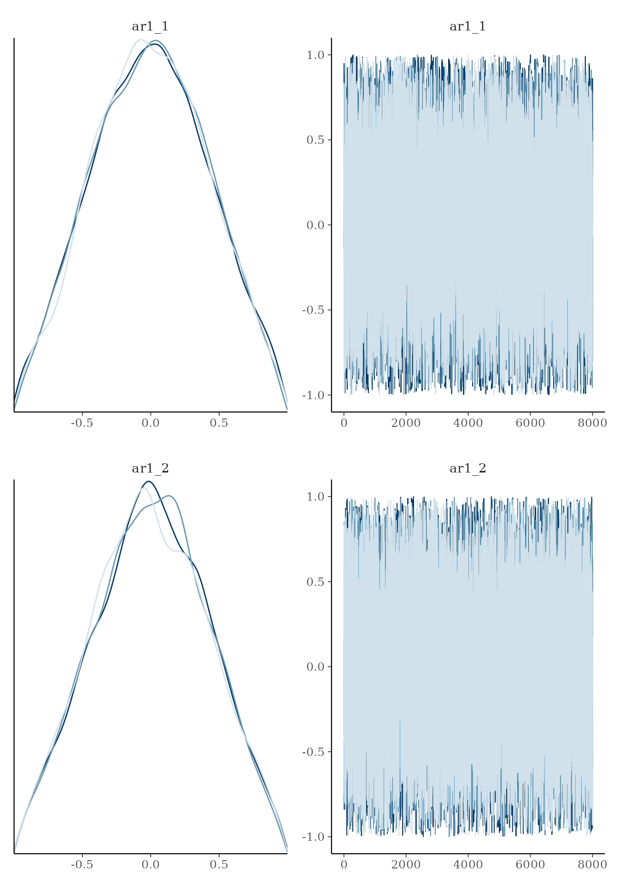

# Time series change points

Serial dependence is common in time series. Add autoregressive terms
with `ar(p)`, moving-average terms with `ma(q)`, or both in the segment
formulas:

``` r

model = list(y ~ 1 + x + ar(1) + ma(1))
```

The most common use case is still `ar(1)`. Like other `mcp` terms, AR
and MA coefficients carry over to later segments until another term for
the same component changes them. An `ar(p)` or `ma(q)` declaration
replaces that whole component: if `ar(1)` follows `ar(2)`, the lag-2
coefficient is zero in the later segment. Both accept a regression
formula, such as `ar(1, 1 + x)` or `ma(1, 0 + x)`.

### GARMA definition

`mcp` implements AR and MA as a generalized ARMA (GARMA) recurrence on
the response-family link scale. If b_t is the ordinary regression
predictor from the segment formulas and \eta_t is the predictor
including serial dependence, then

\begin{aligned} \text{AR}\_t &= \sum\_{j=1}^{p} \phi\_{j,t}
\left\[g(y^\*\_{t-j}) - b\_{t-j}\right\] \\ \text{MA}\_t &=
\sum\_{k=1}^{q} \theta\_{k,t} \left\[g(y^\*\_{t-k}) -
\eta\_{t-k}\right\] \\ \eta_t &= b_t + \text{AR}\_t + \text{MA}\_t
\end{aligned}

where \phi\_{j,t} is the lag-j autoregressive (AR) coefficient at time
t, \theta\_{k,t} is the lag-k moving-average (MA) coefficient at time t,
g(\cdot) is the link function, and y^\* is the boundary-constrained
observation. Thus [`ar()`](https://rdrr.io/r/stats/ar.html) uses lagged
link-scale residuals relative to the ordinary regression, while `ma()`
uses lagged one-step innovations.

**`mcp` does regression with change points on the coefficients**
\phi\_{j,t} **and** \theta\_{k,t}. See below for applied examples.

Unavailable lags at the beginning of the series contribute zero. This
same recurrence is used by JAGS, fitted values, predictions, log
likelihoods, and fresh-series simulation.

A key feature of this recurrence is that AR/MA memory flows continuously
across change points:

- For an order-N component in a new segment, the last N observations
  *before* the change point are input into the first \eta_t in the new
  segment, weighted by the new segment’s AR/MA parameters.
- AR/MA lags do not reset at segment boundaries; they only reset at the
  very beginning of the whole dataset, or across independent series when
  using `series = "column_name"` inside
  [`ar()`](https://rdrr.io/r/stats/ar.html) or `ma()`
  (e.g. `ar(1, series = id)`).
- Because change point locations \Delta are estimated with posterior
  uncertainty, the observation boundary where AR/MA parameters switch
  varies conditionally across MCMC draws.

GARMA currently supports only the default links for
[`gaussian()`](https://rdrr.io/r/stats/family.html) (identity),
[`binomial()`](https://rdrr.io/r/stats/family.html) (logit),
[`poisson()`](https://rdrr.io/r/stats/family.html) (log), and
[`negbinomial()`](https://lindeloev.github.io/mcp/dev/reference/negbinomial.md)
(log).
[`bernoulli()`](https://lindeloev.github.io/mcp/dev/reference/bernoulli.md)
and non-default links are rejected for now.

**Warning:** The AR and MA coefficients are modeled directly and are not
jointly constrained to the stationary or invertible regions. With
higher-order terms such as `ar(2)`, independently bounded coefficients
can violate the usual root conditions. Coefficients that change across
predictors or segments, such as `ar(1, 1 + x)` or
`model = list(y ~ ar(1), ~ ar(1))`, instead define a time-varying
process to which the usual constant-coefficient conditions do not
directly apply. The same applies to `ma()`.

#### Observation boundary

The transformed observation y^\* keeps log and logit residuals finite
when counts lie on a link boundary. The default `boundary = 0.1`
replaces zero counts by 0.1 for Poisson and negative-binomial models.
For binomial models, counts are constrained to the interval from 0.1 to
`trials - 0.1` before conversion to a rate. It has no effect for
Gaussian models.

The default should usually be left unchanged. If needed, set it on
either term, for example `ar(1, boundary = 0.01) + ma(1)`. AR and MA
share one boundary within a segment, and the boundary may differ between
segments. Supplying different AR and MA boundaries in the same segment
is an error.

## Simple example

Let’s simulate some data using the
[`mcp_example()`](https://lindeloev.github.io/mcp/dev/reference/mcp_example.md)
function with the “ar” settings:

``` r

library(mcp)
future::plan(future::multisession, workers = 3)
set.seed(42)  # Make the script deterministic

ar_data = mcp_example_data("ar")
```

    ## Generating residuals for AR(N) model since the response column/argument was not provided.

``` r

head(ar_data)
```

    ##      price time
    ## 1 26.85479    1
    ## 2 19.91843    2
    ## 3 22.81123    3
    ## 4 24.27657    4
    ## 5 24.15365    5
    ## 6 21.77232    6

See how this was generated in `fit$example_code`. We model this as a
plateau (`1`) with a second-order autoregressive residual (`ar(2)`)
followed by a joined slope (`0 + time`) with a negative first-order
autoregressive residual (`ar(1)`):

``` r

model = list(
  price ~ 1 + ar(2),  # Intercept_1, ar1_1, ar2_1
  ~ 0 + time + ar(1)  # time_2, ar1_2; turns off second-order AR
)
fit = mcp(model, ar_data, seed = 42)
```

Let’s plot it and we see that AR was strong in the first segment and
weaker-but-negative in the second:

``` r

set.seed(42)
plot(fit)
```



We can summarise the inferred coefficients:

``` r

summary(fit)
```

    ## Family: gaussian
    ## Links: mu = identity; sigma = identity
    ## Iterations: 3000 from 3 chains.
    ## Segments:
    ##   1: price ~ 1 + ar(2)
    ##   2: price ~ 1 ~ 0 + time + ar(1)
    ## 
    ## Change point parameters:
    ##     variable  mean    sd  lower   upper rhat ess_bulk ess_tail   sim match
    ##  cp_1        74.88 3.404 70.012 80.8900 1.00      568     1328 75.00    OK
    ## 
    ## Population-level parameters:
    ##     variable  mean    sd  lower   upper rhat ess_bulk ess_tail   sim match
    ##  Intercept_1 21.00 1.350 18.509 23.8427 1.00      631     1297 20.00    OK
    ##  time_2       0.46 0.046  0.370  0.5524 1.00     1131     1497  0.50    OK
    ##  sigma_1      5.31 0.358  4.662  6.0729 1.00     4652     4517  5.00    OK
    ##  ar1_1        0.43 0.110  0.215  0.6518 1.00     4627     6150  0.40    OK
    ##  ar1_2       -0.32 0.156 -0.620 -0.0065 1.00     6025     5124 -0.30    OK
    ##  ar2_1        0.18 0.109 -0.037  0.3914 1.00     4975     7028  0.15    OK

The naming syntax is `[component][order]_[segment]` for intercepts. For
example, `ar1_2` is the first-order autoregressive coefficient and
`ma1_2` the first-order moving-average coefficient in segment 2. Slopes
use the usual `mcp` parameter names, e.g., `ar1_x_3` for a slope on
AR(1) in segment 3.

Comparing the columns `mean` and `sim` we see that the AR coefficients
are reasonably recovered. In fact, the posterior mean is almost always
exactly the same as `arima(data, order = c(N, 0, 0))` (see below), so
the non-perfect fits are due to randomness in the simulation - not in
the fit.

For Gaussian GARMA models, `sigma` describes the *innovations*, i.e.,
the part of the residuals not explained by AR and MA coefficients.
`sd(fit$data$price)` is therefore generally higher. In this case, the SD
of raw data in the plateau is 8.93. As always, it is good to assess
posteriors and convergence more directly:

``` r

set.seed(42)
plot_pars(fit)
```



Sometimes, the trace plot shows that the change point (`cp_1`) is not
well identified with this model and data. As discussed in the article on
[tips, tricks, and
debugging](https://lindeloev.github.io/mcp/dev/articles/tips.md), you
could combine a more informative prior with more samples
(`mcp(..., warmup = 10000, iter = 10000)`), if this is a problem.

You can do hypothesis testing with GARMA models using
[`hypothesis()`](https://lindeloev.github.io/mcp/dev/reference/hypothesis.md).
[Read more
here](https://lindeloev.github.io/mcp/dev/articles/comparison.md) or
scroll down for an applied example.

## Tips, comments, and warnings

The AR and MA terms apply to link-scale *residuals* from the ordinary
regression. In time-series jargon, this is a *dynamical* regression
model where the ordinary regression parameters make up the
*deterministic* structure. See further comments in the section on priors
below.

To control the *direction* of a change, put a one-sided prior on the
corresponding coefficient, e.g., `ar1_x_1 = "dnorm(0, 1) T(0, )"`. See
recommendations in [the section on priors](#ar_prior).

### Regression on AR/MA coefficients

You can specify how the coefficients change with x using
`ar(p, formula)` and `ma(q, formula)`. For example, `ar(1, 1 + time)`
models a steady change in AR(1) strength. These regression formulas use
an identity link, so slopes can easily produce non-stationary or
non-invertible coefficients. See [the section on priors](#ar_prior) for
ways to constrain them. The same formula is applied separately to every
order in the term.

Population-level [`mcp` formula
syntax](https://lindeloev.github.io/mcp/dev/articles/formulas.md) is
available inside both terms, so you could use
`ar(3, 1 + I(x^2) + exp(z))` or `ma(1, 0 + group)`. Group-level terms
such as `(1|id)` are not supported inside
[`ar()`](https://rdrr.io/r/stats/ar.html) or `ma()`. Transformed
predictors must stay within the transformation’s domain; for example,
values passed to [`log()`](https://rdrr.io/r/base/Log.html) and
[`sqrt()`](https://rdrr.io/r/base/MathFun.html) must be non-negative.

### Combining ar(), ma(), and sigma()

You can combine [`ar()`](https://rdrr.io/r/stats/ar.html) and `ma()`
with any regression model and with [group-level change
points](https://lindeloev.github.io/mcp/dev/articles/group_effects.md).
For Gaussian models, [`sigma()`](https://rdrr.io/r/stats/sigma.html)
controls the innovation standard deviation:

``` r

model = list(
  y ~ 1 + ar(1) + ma(1) + sigma(1),
  ~ 0 + x + ar(1) + sigma(1),
  ~ 1
)
```

### Order your data

AR and MA lags apply to the *order* of rows in the data frame without
taking into account the distance between values of `x`. This has two
important implications:

- You probably want to sort your data according to your `x`. Just do
  `data = data[order(data$x), ]`.
- Adjacent data points that lie years apart are modeled to be just as
  (auto)correlated as adjacent points lying seconds apart.

For grouped longitudinal data, identify independent residual histories
with `series` inside [`ar()`](https://rdrr.io/r/stats/ar.html) or `ma()`
and sort each series by time:

``` r

model = list(
  y ~ 1 + ar(1, series = id),
  ~ 0 + x + ar(1)
)
fit = mcp(model, ar_series_data)
```

Rows belonging to each series must be contiguous. AR and MA lags reset
at each series boundary. The `series` argument inside
[`ar()`](https://rdrr.io/r/stats/ar.html)/`ma()` is separate from
group-level effects such as `(1 | id)`: either can be used without the
other.

## Simulating autocorrelated change point data

Assessing the correctness of autocorrelation is less intuitive than
seeing e.g. a mean fit. However, we can verify `mcp` up against more
tested-and-tried functions such as
[`arima()`](https://rdrr.io/r/stats/arima.html) in base R. Let us
simulate a single AR(3) segment, i.e., without change points, and see if
it fits:

``` r

# Model
model = list(response ~ 1 + ar(3))

# Simulate data
df = data.frame(time = 1:200, response = 0)
empty = mcp(model, df, sample = FALSE, par_x = "time")
set.seed(42)  # For consistent "random" results
df$response = empty$simulate(
    empty,
    df,
    Intercept_1 = 20,
    ar1_1 = 0.7, 
    ar2_1 = 0.2, 
    ar3_1 = -0.4, 
    sigma_1 = 8)
```

    ## Generating residuals for AR(N) model since the response column/argument was not provided.

``` r

# Base arima AR(3)
arima(df$response, order = c(3, 0, 0))
```

    ## 
    ## Call:
    ## arima(x = df$response, order = c(3, 0, 0))
    ## 
    ## Coefficients:
    ##          ar1     ar2      ar3  intercept
    ##       0.6944  0.2297  -0.4078    19.5891
    ## s.e.  0.0643  0.0798   0.0650     1.1356
    ## 
    ## sigma^2 estimated as 60.17:  log likelihood = -694.1,  aic = 1398.19

OK, we can see that the `ar` coefficients and sigma (sigma =
sqrt(sigma^2)) is simulated correctly, if taking
[`arima()`](https://rdrr.io/r/stats/arima.html) as ground truth.
Inferring with `mcp` is straightforward:

``` r

fit = mcp(model, df, par_x = "time", seed = 42)
```

The Bayesian parameter estimates are in perfect correspondence with
[`arima()`](https://rdrr.io/r/stats/arima.html), even where they deviate
a tiny bit from the simulation parameters (due to the inherent
randomness in simulating data):

``` r

summary(fit)
```

    ## Family: gaussian
    ## Links: mu = identity; sigma = identity
    ## Iterations: 3000 from 3 chains.
    ## Segments:
    ##   1: response ~ 1 + ar(3)
    ## 
    ## Population-level parameters:
    ##     variable  mean    sd  lower upper rhat ess_bulk ess_tail  sim match
    ##  Intercept_1 19.70 1.157 17.453 22.05 1.00     5283     4578 20.0    OK
    ##  sigma_1      7.89 0.399  7.166  8.72 1.00     5315     4773  8.0    OK
    ##  ar1_1        0.69 0.065  0.561  0.81 1.00     3438     5760  0.7    OK
    ##  ar2_1        0.23 0.079  0.076  0.39 1.00     2344     4186  0.2    OK
    ##  ar3_1       -0.40 0.066 -0.528 -0.27 1.00     3393     5241 -0.4    OK

## Inferring an autocorrelation-only change

One “side-effect” of the `mcp` implementation of autocorrelation using
[`ar()`](https://rdrr.io/r/stats/ar.html) *in the formulas* is that you
can infer when autocorrelation parameters and structures change.

Let’s simulate a change point in autocorrelation and see if we can infer
it later:

``` r

# The model
model = list(
  y ~ 1 + x + ar(1),  # Slope
  ~ 0 + x + ar(1)  # Slope
)

# Get predictions
df = data.frame(x = seq(0, 100, length.out = 200), y = 0)
empty = mcp(model, df, sample = FALSE)
set.seed(42)
df$y = empty$simulate(
  empty,
  df,
  cp_1 = 60,
  Intercept_1 = 20,
  x_1 = 1, x_2 = 1,  # same slope
  ar1_1 = 0.8, ar1_2 = 0.2,
  sigma_1 = 5)
```

… and we use a prior to equate the slopes of each segment (read more
about [using
priors](https://lindeloev.github.io/mcp/dev/articles/priors.md) to
equate parameters and define constants). Now let’s see if we can recover
these parameters. We use `sample = "both"` because we will do a
Savage-Dickey test later.

``` r

prior = list(x_2 = "x_1")  # Set the two slopes equal
fit = mcp(model, data = df, prior = prior, iter = 12000, sample = "both", seed = 42)
```

Let’s plot the full model prediction using `plot(fit)`. You could use
`plot(fit, geom_data = "line")` for a more classical line plot of the
time series data. Set `plot(fit, arma = FALSE)` to omit all AR and MA
effects.

We plot it together with the change in the `ar1` parameter using
`plot_dpar(fit)`:

``` r

library(patchwork)
set.seed(42)
plot(fit) /  # Patchwork syntax to show on separate rows
  plot_dpar(fit, dpar = "ar1", lines = 100)
```



We recovered the parameters, including the change point (see `mean` but
also the helpful `sim` and `match` columns):

``` r

summary(fit)
```

    ## Family: gaussian
    ## Links: mu = identity; sigma = identity
    ## Iterations: 12000 from 3 chains.
    ## Segments:
    ##   1: y ~ 1 + x + ar(1)
    ##   2: y ~ 1 ~ 0 + x + ar(1)
    ## 
    ## Change point parameters:
    ##     variable   mean    sd lower upper rhat ess_bulk ess_tail  sim match
    ##  cp_1        63.423 5.636 50.68 73.36 1.00     1592     2133 60.0    OK
    ## 
    ## Population-level parameters:
    ##     variable   mean    sd lower upper rhat ess_bulk ess_tail  sim match
    ##  Intercept_1 21.305 2.531 16.41 26.51 1.00      667     1320 20.0    OK
    ##  x_1          0.980 0.031  0.92  1.04 1.00      667     1275  1.0    OK
    ##  x_2          0.980 0.031  0.92  1.04 1.00      667     1275  1.0    OK
    ##  sigma_1      4.883 0.248  4.43  5.40 1.00    18009    18088  5.0    OK
    ##  ar1_1        0.781 0.056  0.67  0.89 1.00     8512    17873  0.8    OK
    ##  ar1_2        0.098 0.150 -0.20  0.39 1.00     4728     4594  0.2    OK

We can also plot some of the parameters. As usual, we see that the
change point is not well defined by any known distribution. The fact
that the posterior mean is around 60 does not (necessarily) mean that
there is a high credence in this value. Usually, I find that any bi- or
N-modality on the posterior matches well with what you would guess from
looking at the raw data. As they say: Bayesian inference is common sense
applied to data.

``` r

set.seed(42)
plot_pars(fit, regex_pars = "cp_1|ar_*")
```



As usual, we can test hypotheses ([read more
here](https://lindeloev.github.io/mcp/dev/articles/comparison.md)). We
can also ask how much more likely it is (relative to the prior) that
there the two autocorrelations are equal compared to them differing.
Because we sampled both the prior and posterior
(`mcp(..., sample = "both")`), we can do a Savage-Dickey density ratio
test:

``` r

hypothesis(fit, "ar1_1 = ar1_2")
```

    ## Warning: Savage-Dickey Bayes factor was computed using default prior(s) for
    ## `ar1_1` and `ar1_2`. Point Bayes factors are sensitive to the prior
    ## distribution; consider specifying informed priors.

    ## Warning: The tested value is in a sparse tail of the prior or posterior draws;
    ## the Savage-Dickey estimate may be unreliable.

    ##          hypothesis      mean     lower     upper  p           BF
    ## 1 ar1_1 - ar1_2 = 0 0.6830148 0.3761376 0.9848118 NA 7.191393e-06

In this case, the evidence for equality is very small so it was rarely
visited by the sampler and hence the precision is low .

Of course, we can also do directional tests. For example, what is the
evidence that `ar1_1` is more than 0.3 greater than `ar1_2`? Answer:
More than 100 to one.

``` r

hypothesis(fit, "ar1_1 - 0.3 > ar1_2")
```

    ##                hypothesis      mean      lower     upper         p       BF
    ## 1 ar1_1 - 0.3 - ar1_2 > 0 0.3830148 0.07613755 0.6848118 0.9927222 289.8967

## Priors on AR and MA coefficients

The default prior on each AR and MA intercept is a truncated normal
distribution:

``` r
dnorm(0, 0.5) T(-1, 1)
```

It is symmetric around zero and gently shrinks away from the boundaries:
its central 95% interval is approximately \[-0.84, 0.84\]. This is a
regularizing prior on each direct coefficient, not a joint stationarity
or invertibility constraint for orders above one.

`brms` also models AR and MA coefficients directly within \[-1, 1\], but
uses flat default priors over that range. Thus `mcp` keeps the familiar
parameter interpretation while adding mild regularization toward zero;
fits should generally be similar when the likelihood is informative.

Categorical contrasts default to `dnorm(0, 0.25)`. Numeric slopes are
also normal and scaled so that one representative predictor change has
prior SD 0.25. Thus approximately 95% of the prior change lies within
\pm 0.5.

The defaults express no assumption about the sign. For a time series
where positive first-order autocorrelation is expected, alternatives
include `ar1_1 = "dunif(0, 1)"` or `ar1_1 = "dnorm(0.5, 0.5) T(0, 1)"`.
[Read more about specifying and checking
priors](https://lindeloev.github.io/mcp/dev/articles/priors.md).

Here is a complete list of the (default) priors in the model above:

``` r

prior_summary(fit)
```

    ## # A tibble: 7 × 5
    ##   parameter   segment dpar  prior                                         bounds
    ##   <chr>         <int> <chr> <chr>                                         <chr> 
    ## 1 cp_1              2 cp    uniform(min = 0, max = 100)                   [min(…
    ## 2 Intercept_1       1 mu    student_t(df = 3, location = 72.4, scale = 3… none  
    ## 3 x_1               1 mu    student_t(df = 3, location = 0, scale = 0.35… none  
    ## 4 x_2               2 mu    x_1                                           none  
    ## 5 sigma_1           1 sigma student_t(df = 3, location = 0, scale = 35.2) [0, I…
    ## 6 ar1_1             1 ar    normal(mean = 0, sd = 0.5)                    [-1, …
    ## 7 ar1_2             2 ar    normal(mean = 0, sd = 0.5)                    [-1, …

We can also visualize the priors because we sampled the prior.
`prior = TRUE` works in most `mcp` functions, including
[`plot()`](https://lindeloev.github.io/mcp/dev/reference/plot.mcpfit.md)
and
[`summary()`](https://lindeloev.github.io/mcp/dev/reference/summary.mcpfit.md).

``` r

set.seed(42)
plot_pars(fit, prior = TRUE)
```



Notice that the plot smoothes the posteriors at sharp cutoffs, slightly
misrepresenting the true distribution.

Let’s inspect the priors for a more advanced AR model, since you would
often have to inform these:

``` r

model = list(
  y ~ 1 + ar(2, 1 + x),
  ~ 0 + ar(1, 1 + I(x^2))
)
empty = mcp(model, data = data.frame(y = 1:10, x = 1:10), sample = FALSE)
prior_summary(empty)
```

    ## # A tibble: 9 × 5
    ##   parameter   segment dpar  prior                                         bounds
    ##   <chr>         <int> <chr> <chr>                                         <chr> 
    ## 1 cp_1              2 cp    uniform(min = 1, max = 10)                    [min(…
    ## 2 Intercept_1       1 mu    student_t(df = 3, location = 5.5, scale = 3.… none  
    ## 3 sigma_1           1 sigma student_t(df = 3, location = 0, scale = 3.7)  [0, I…
    ## 4 ar1_1             1 ar    normal(mean = 0, sd = 0.5)                    [-1, …
    ## 5 ar1_x_1           1 ar    normal(mean = 0, sd = 0.02777778)             none  
    ## 6 ar1_2             2 ar    normal(mean = 0, sd = 0.5)                    [-1, …
    ## 7 ar1_xE2_2         2 ar    normal(mean = 0, sd = 0.00308642)             none  
    ## 8 ar2_1             1 ar    normal(mean = 0, sd = 0.5)                    [-1, …
    ## 9 ar2_x_1           1 ar    normal(mean = 0, sd = 0.02777778)             none

AR and MA coefficient regressions use an identity link, while their
residual inputs use the supported response-family link described above.
Careful priors become especially important with higher orders or
coefficient slopes, where individual values in \[-1, 1\] do not ensure a
stable recurrence. After fitting,
[`mcp()`](https://lindeloev.github.io/mcp/dev/reference/mcp.md) checks
up to 500 posterior draws at up to 100 observed predictor rows and warns
if the checked-draw violation rate exceeds the corresponding `ar` or
`ma` threshold in `diagnostics` (10% by default). `fit$simulate()`
checks the supplied coefficient trajectory before generating a fresh
series. For predictor- or segment-varying coefficients these are local
smoke tests, not proofs of global stationarity or invertibility.

Here are a few ways in which you may want to inform the AR or MA
parameters:

- For a constant AR(2) process, stationarity requires -1 \< \phi_2 \< 1
  and \phi_2 - 1 \< \phi_1 \< 1 - \phi_2. One dependent-prior
  construction that stays in this region is `ar2_1 = "dunif(-1, 1)"`
  together with `ar1_1 = "dunif(ar2_1 - 1, 1 - ar2_1)"`. The simpler
  suggestion `ar2_1 = "dunif(0, ar1_1)"` is not sufficient. Higher
  orders require the corresponding joint root condition.
- Slopes can quickly make AR coefficients non-stationary or MA
  coefficients non-invertible. Constrain their magnitude with reference
  to a plausible change over the predictor range. For example, a shallow
  negative change over the observed x-span could use
  `"dnorm(0, 0.1 / (max(x) - min(x))) T(, 0)"`.

## Notes on observed data vs simulated data

JAGS,
[`fitted()`](https://lindeloev.github.io/mcp/dev/reference/execute-mcp-model.md),
[`predict()`](https://lindeloev.github.io/mcp/dev/reference/execute-mcp-model.md),
and
[`log_lik()`](https://lindeloev.github.io/mcp/dev/reference/execute-mcp-model.md)
evaluate a finite, conditional recurrence: the response history supplies
earlier residuals, and unavailable residuals before the start of the
series are set to zero.

- [`fitted()`](https://lindeloev.github.io/mcp/dev/reference/execute-mcp-model.md)
  and
  [`predict()`](https://lindeloev.github.io/mcp/dev/reference/execute-mcp-model.md)
  use posterior imputations for the actual missing response data, so it
  is conditional on the actual data values/order for the ar/ma modeling.
- [`log_lik()`](https://lindeloev.github.io/mcp/dev/reference/execute-mcp-model.md)
  is unavailable if the data has missingness before some observed data.
- In contrast, `posterior_predict()` and
  [`pp_check()`](https://lindeloev.github.io/mcp/dev/reference/pp_check.md)
  generate each series from the model posteriors without regards to the
  original data. This makes serial summaries of posterior replications,
  such as their autocorrelation and run lengths, meaningful.

## JAGS code

Here is the JAGS code for the second simulation example, i.e., the one
with a single slope going from AR(2) to AR(1). You can print
`fit$simulate` and see that it runs much of the same code.

``` r

fit$jags_code
```

    ## model {
    ##   # mcp helper values
    ##   cp_0 = CONST1_
    ##   cp_2 = CONST2_
    ## 
    ##   # Priors for population-level effects
    ##   cp_1 ~ dunif(CONST1_, CONST2_)  # Within the observed change-point span
    ##   ar1_1 ~ dnorm(0, 1/(0.5)^2) T(-1,1)  # Zero-centered regularizing dependence coefficient
    ##   ar1_2 ~ dnorm(0, 1/(0.5)^2) T(-1,1)  # Zero-centered regularizing dependence coefficient
    ##   Intercept_1 ~ dt(72.4, 1/(35.2)^2, 3)   # Robustly centered mean intercept with a minimum scale of 2.5
    ##   x_1 ~ dt(0, 1/(0.352)^2, 3)   # Regularizing mean coefficient scaled to a reference predictor change
    ##   x_2 = x_1  # Same value as x_1
    ##   sigma_1 ~ dt(0, 1/(35.2)^2, 3) T(0,)  # Positive residual SD calibrated on the response scale
    ## 
    ##   # Apply GARMA recursion to link-scale residuals
    ##   resid_garma_[1] = 0
    ##   for (i_ in 2:length(x)) {
    ##     resid_garma_[i_] = ar1_[i_] * resid_abs_[i_ - 1]
    ##   }
    ##   # Model and likelihood
    ##   for (i_ in 1:length(x)) {
    ##     # par_x local to each segment
    ##     x_local_1_[i_] = min(x[i_], cp_1)
    ##     x_local_2_[i_] = min(x[i_], cp_2) - cp_1
    ##     
    ##     # GARMA observation boundary
    ##     garma_boundary_[i_] =
    ##       (x[i_] < cp_1) * 0.1 +
    ##       (x[i_] >= cp_1) * 0.1
    ##     
    ##     # Formula for ar1
    ##     ar1_[i_] =
    ##       (x[i_] >= cp_0) * (x[i_] < cp_1) * inprod(rhs_matrix_[i_, c(1)], c(ar1_1)) * 1 + 
    ##       (x[i_] >= cp_1) * inprod(rhs_matrix_[i_, c(2)], c(ar1_2)) * 1
    ##     
    ##     # Formula for mu
    ##     link_mu_[i_] =
    ##       (x[i_] >= cp_0) * inprod(rhs_matrix_[i_, c(3)], c(Intercept_1)) * 1 + 
    ##       (x[i_] >= cp_0) * inprod(rhs_matrix_[i_, c(4)], c(x_1)) * x_local_1_[i_] + 
    ##       (x[i_] >= cp_1) * inprod(rhs_matrix_[i_, c(5)], c(x_2)) * x_local_2_[i_]
    ##     
    ##     # Formula for sigma
    ##     link_sigma_[i_] =
    ##       (x[i_] >= cp_0) * inprod(rhs_matrix_[i_, c(6)], c(sigma_1)) * 1
    ## 
    ##     # Likelihood and log-density for family = gaussian()
    ##     mu_[i_] = link_mu_[i_] + resid_garma_[i_]
    ##     sigma_[i_] = max(1e-03, link_sigma_[i_])
    ##     y[i_] ~ dnorm(mu_[i_], 1 / sigma_[i_]^2)
    ##     garma_y_[i_] = y[i_]
    ##     garma_link_y_[i_] = garma_y_[i_]
    ##     resid_abs_[i_] = garma_link_y_[i_] - link_mu_[i_]
    ##   }
    ## }
