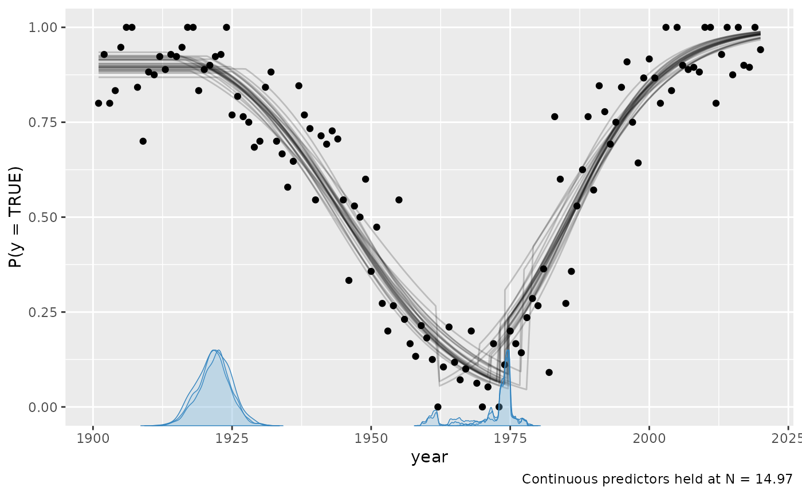
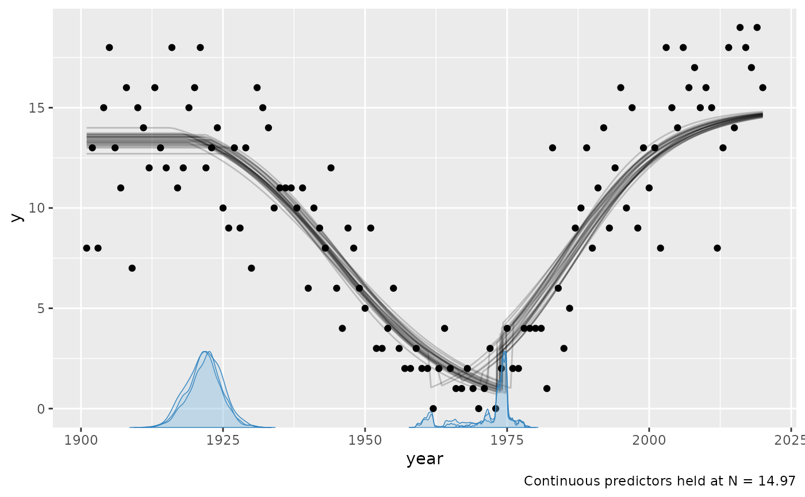
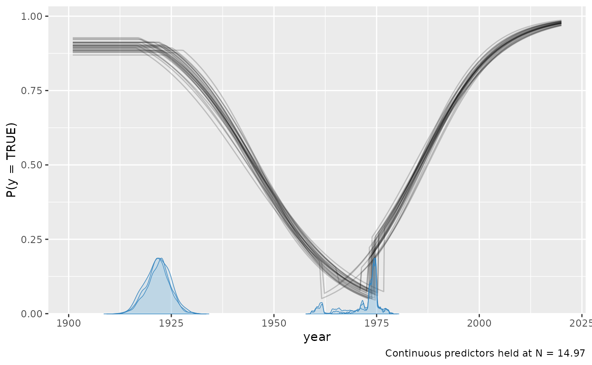
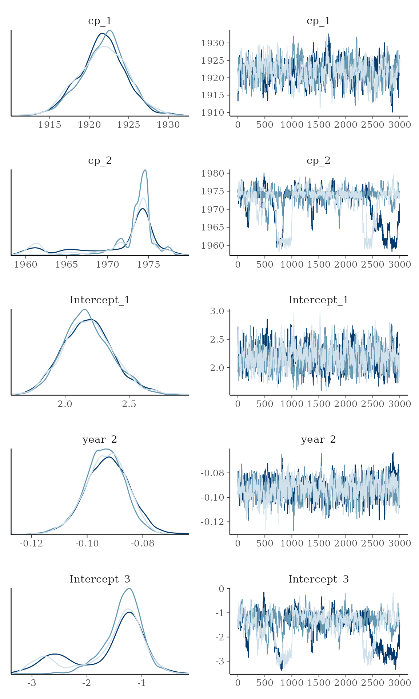
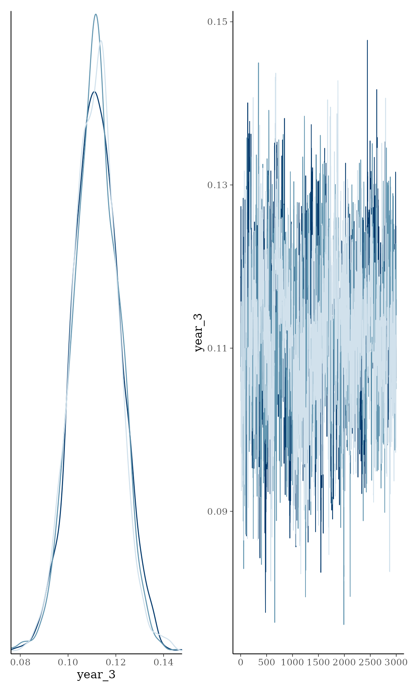
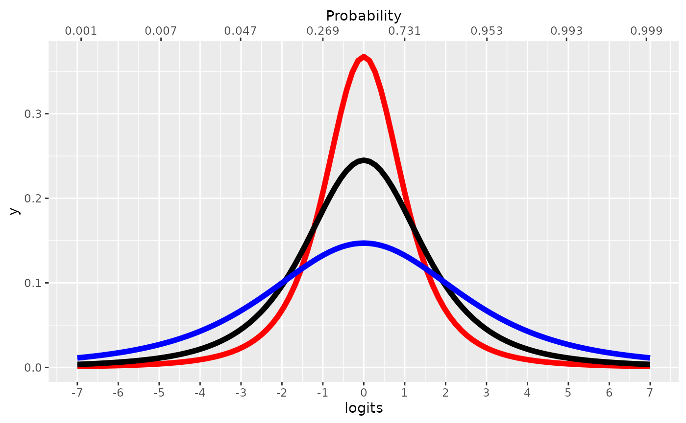

# Binomial change point analysis

`mcp` aims to implement Generalized Linear Models in a way that closely
mimics that of [brms::brm](https://github.com/paul-buerkner/brms). You
can set the family and link functions using the `family` argument.

First, let us specify a toy model with three segments:

``` r

model = list(
  y | trials(N) ~ 1,  # constant rate
  ~ 0 + year,  # joined changing rate
  ~ 1 + year  # disjoined changing rate
)
```

## Simulate data

If you already have data, you can safely skip this section.

We run `mcp` with `sample = FALSE` to get what we need to simulate data.

``` r

library(mcp)
future::plan(future::multisession, workers = 3)
set.seed(42)  # Make the script deterministic

df = data.frame(
  year = 1901:2020,  # evaluate for each of these
  N = sample(10:20, size = 120, replace = TRUE),  # number of trials
  y = 1
)

empty = mcp(model, data = df, family = binomial(), sample = FALSE)
```

Now we can simulate. First, let us see the model parameters.

``` r

empty$pars
```

    ## List of 10
    ##  $ x         :"year"
    ##  $ y         :"y"
    ##  $ cp        :"cp_1" "cp_2"
    ##  $ fixed     :"Intercept_1" "year_2" "Intercept_3" "year_3"
    ##  $ population:"cp_1" "cp_2" "Intercept_1" "year_2" "Intercept_3" "year_3"
    ##  $ varying   : NULL
    ##  $ sigma     :
    ##  $ arma      :
    ##  $ trials    :"N"
    ##  $ weights   : NULL

- It takes two intercepts (`Intercept_*`), for segments 1 and 3.
- It takes two slopes (`year_*`), for segment 2 and 3.
- It takes two change points (`cp_*`) - one between each segment.

`empty$simulate` is now a function that can predict data given these
parameters (signature: `empty$simulate(fit, newdata, ...)`). If you are
in a reasonable R editor, type `empty$simulate(` and press TAB to see
the required arguments. I came up with some values below, including
change points at $`year = 25`$ and $`year = 65`$. Notice that because
[`binomial()`](https://rdrr.io/r/stats/family.html) defaults to the link
function `link = "logit"`, the intercept and slopes are on a [logit
scale](https://en.wikipedia.org/wiki/Logit). Briefly, this extends the
narrow range of binomial rates (0-1) to an infinite logit scale from
minus infinity to plus infinity. This will be important later when we
set priors.

``` r

df$y = empty$simulate(
  empty, df, 
  cp_1 = 1925, cp_2 = 1975, 
  Intercept_1 = 2, Intercept_3 = -1, 
  year_2 = -0.1, year_3 = 0.1)

head(df)
```

    ##   year  N  y
    ## 1 1901 10  8
    ## 2 1902 14 13
    ## 3 1903 10  8
    ## 4 1904 18 15
    ## 5 1905 19 18
    ## 6 1906 13 13

Visually:

``` r

plot(df$year, df$y)
```


## Check parameter recovery

The next sections go into more detail, but let us quickly see if we can
recover the parameters used to simulate the data.

``` r

fit = mcp(model, data = df, family = binomial(), adapt = 5000)
```

We can use `summary` to see that it recovered the parameters to a pretty
good precision. Again, recall that intercepts and slopes are on a
`logit` scale.

``` r

summary(fit)
```

    ## Family: binomial(link = 'logit')
    ## Iterations: 3000 from 3 chains.
    ## Segments:
    ##   1: y | trials(N) ~ 1
    ##   2: y | trials(N) ~ 1 ~ 0 + year
    ##   3: y | trials(N) ~ 1 ~ 1 + year
    ## 
    ## Population-level parameters:
    ##         name match    sim     mean    lower    upper Rhat ess_bulk ess_tail
    ##         cp_1    OK 1925.0 1921.756 1915.729 1927.613    1      316      765
    ##         cp_2    OK 1975.0 1972.308 1960.533 1977.352    1       66       84
    ##  Intercept_1    OK    2.0    2.179    1.818    2.582    1      526     1140
    ##       year_2    OK   -0.1   -0.093   -0.109   -0.079    1      386      699
    ##  Intercept_3    OK   -1.0   -1.497   -2.938   -0.712    1       70       80
    ##       year_3    OK    0.1    0.112    0.093    0.130    1      380     1246
    ## 
    ## Warning: 5 parameters show poor convergence (Rhat > 1.01 or ESS < 400).

`summary` uses 95% central posterior intervals by default, but you can
change it using `summary(fit, width = 0.80)`. If you have [varying
effects](https://lindeloev.github.io/mcp/dev/articles/varying.md), use
`ranef(fit)` to see them.

Plotting the fit confirms good fit to the data, and we see the
discontinuities at the two change points:

``` r

plot(fit)
```



These lines are just `fit$simulate` applied to a random draw of the
posterior samples. In other words, they represent the joint distribution
of the parameters. You can change the number of draws (lines) using
`plot(fit, lines = 50)`.

Notice for binomial models it defaults to plot the *rate* (`y / N`) as a
function of x. The reason why is obvious when we plot on “raw” data by
toggling `rate`:

``` r

plot(fit, rate = FALSE)
```



These lines are jagged because `N` varies from year to year. Although
there is close too 100% success rate in the years 1900 - 1920, the
number of trials varies, as you can see in the raw data. However, using
`rate = FALSE` will be great when the number of trials is constant for
extended periods of time, as `y` is more interpretable then.

Speaking of alternative visualizations, you can also plot this on the
logit scale, where the linear trends are modeled:

``` r

plot_dpar(fit)
```



Of course, these plots work with [varying
effects](https://lindeloev.github.io/mcp/dev/articles/varying.md) as
well.

## Model diagnostics and sampling options

Already in the default `plot` as used above, it will be obvious if there
was poor convergence. A more direct assessment is to look at the
posterior distributions and trace plots:

``` r

plot_pars(fit)
```



Convergence is perfect here as evidenced by the overlapping trace plots
that look like fat caterpillars (Bayesians love fat caterpillars).
Notice that the posterior distribution of change points can be quite
non-normal and sometimes even bimodal. Therefore, one should be careful
not to interpret the interval as if it was normal.

[`plot()`](https://lindeloev.github.io/mcp/dev/reference/plot.mcpfit.md)
and
[`plot_pars()`](https://lindeloev.github.io/mcp/dev/reference/plot_pars.md)
can do a lot more than this, so check out their documentation.

## Priors for binomial models

`mcp` uses priors to achieve a lot of it’s functionality. See [how to
set priors](https://lindeloev.github.io/mcp/dev/articles/priors.md),
including how to share parameters between segments and how to fix
values. Here, I post a few notes about the binomial-specific default
priors.

The default priors in `mcp` are set so that they are reasonably broad to
cover most scenarios, though also specific enough to sample effectively.
They are not “default” as in “canonical”. Rather, they are “default” as
in “what happens if you do nothing else”. All priors are stored in
`fit$prior` (also `empty$prior`). We did not specify `prior` above, so
it ran with default priors:

``` r

cbind(fit$prior)
```

    ##             [,1]                             
    ## cp_1        "dt(1901, 59.5, 1) T(1901, 2020)"
    ## cp_2        "dt(1901, 59.5, 1) T(cp_1, 2020)"
    ## Intercept_1 "dt(0, 1.5, 3)"                  
    ## year_2      "dt(0, 0.03781513, 3)"           
    ## Intercept_3 "dt(0, 1.5, 3)"                  
    ## year_3      "dt(0, 0.03781513, 3)"

The priors on change points are discussed extensively in the prior
vignette. With the default logit link, intercepts and categorical
contrasts use `dt(0, 1.5, 3)`. Its central 95% interval is approximately
-4.8 to 4.8 logits, corresponding to probabilities from 0.008 to 0.992,
while its heavy tails retain support for more extreme values. The figure
compares Student-t priors with scales 1 (red), 1.5 (black, the `mcp`
default), and 2.5 (blue), together with their correspondence to
probabilities. The probit link currently uses the same numerical default
for simplicity.

Compared with the `dt(0, 2.5, 3)` intercept and flat coefficient
defaults in `brms`, these proper priors mildly reduce extreme
predictions in short segments while remaining broad and heavy-tailed.

``` r

inverse_logit = function(x) exp(x) / (1 + exp(x))
scaled_t = function(x, scale) dt(x / scale, df = 3) / scale

# Start the plot
library(ggplot2)
ggplot(data.frame(logits = 0), aes(x = logits)) + 
  
  # Plot Student-t priors. Set scale in "args"
  stat_function(fun=scaled_t, args = list(scale = 1), lwd=2, col="red") +
  stat_function(fun=scaled_t, args = list(scale = 1.5), lwd=2, col="black") +
  stat_function(fun=scaled_t, args = list(scale = 2.5), lwd=2, col="blue") +
  
  # Set the secondary axis
  scale_x_continuous(breaks = -7:7,limits = c(-7, 7), sec.axis = sec_axis(~ inverse_logit(.), name = "Probability", breaks = round(inverse_logit(seq(-7, 7, by = 2)), 3)))
```



Please keep in mind that when these priors combine through the model,
the joint probability may be quite different.

Numeric coefficient scales are divided by a representative change in
their model-matrix column: its range when it has two values, and two
standard deviations otherwise. Terms involving local `par_x`
additionally use the expected segment width,
`(max(x) - min(x)) / n_segments()`. The implied change across a typical
segment therefore has the same 1.5-logit scale, even when the model
contains several change points.

## JAGS code

Here is the JAGS code for the model used in this article.

``` r

fit$jags_code
```

    ## model {
    ##   # mcp helper values
    ##   cp_0 = CONST1_
    ##   cp_3 = CONST2_
    ## 
    ##   # Priors for population-level effects
    ##   cp_1 ~ dt(CONST1_, 1/(CONST3_)^2, CONST4_) T(CONST1_,CONST2_)  # Within the observed change-point span
    ##   cp_2 ~ dt(CONST1_, 1/(CONST3_)^2, CONST4_) T(cp_1,CONST2_)  # Ordered after cp_1 within the observed change-point span
    ##   Intercept_1 ~ dt(0, 1/(1.5)^2, 3)   # Weakly regularizing link-scale intercept
    ##   year_2 ~ dt(0, 1/(0.03781513)^2, 3)   # Weakly regularizing link-scale coefficient scaled to a reference predictor change
    ##   Intercept_3 ~ dt(0, 1/(1.5)^2, 3)   # Weakly regularizing link-scale intercept
    ##   year_3 ~ dt(0, 1/(0.03781513)^2, 3)   # Weakly regularizing link-scale coefficient scaled to a reference predictor change
    ## 
    ##   # Model and likelihood
    ##   for (i_ in 1:length(year)) {
    ##     # par_x local to each segment
    ##     x_local_1_[i_] = min(year[i_], cp_1)
    ##     x_local_2_[i_] = min(year[i_], cp_2) - cp_1
    ##     x_local_3_[i_] = min(year[i_], cp_3) - cp_2
    ##     
    ##     # Formula for mu
    ##     link_mu_[i_] =
    ##     
    ##       # Segment 1: y | trials(N) ~ 1
    ##       (year[i_] >= cp_0) * (year[i_] < cp_2) * inprod(rhs_matrix_[i_, c(1)], c(Intercept_1)) * 1 + 
    ##     
    ##       # Segment 2: y | trials(N) ~ 1 ~ 0 + year
    ##       (year[i_] >= cp_1) * (year[i_] < cp_2) * inprod(rhs_matrix_[i_, c(2)], c(year_2)) * x_local_2_[i_] + 
    ##     
    ##       # Segment 3: y | trials(N) ~ 1 ~ 1 + year
    ##       (year[i_] >= cp_2) * inprod(rhs_matrix_[i_, c(3)], c(Intercept_3)) * 1 + 
    ##       (year[i_] >= cp_2) * inprod(rhs_matrix_[i_, c(4)], c(year_3)) * x_local_3_[i_]
    ## 
    ##     # Likelihood and log-density for family = binomial()
    ##     mu_[i_] = ilogit(link_mu_[i_])
    ##     y[i_] ~ dbin(mu_[i_], N[i_])
    ##   }
    ## }
