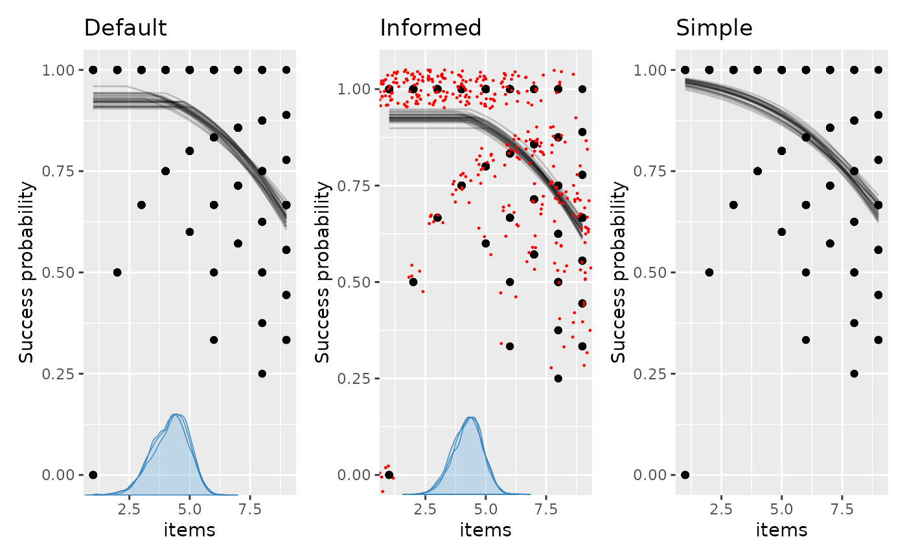

# Change point model comparison

There are three main ways of doing model comparison in `mcp`:

- Compare any N `mcp` models using leave-One-Out cross validation
  (LOO-CV). Check out `loo(fit)`, `loo::loo_compare(loo1, loo2, ...)`,
  and `loo::loo_model_weights(loo1, loo2, ...)`.
- Flexible directional tests using `hypothesis(fit, cp_1 > 40)` or
  `hypothesis(fit, cp_1 > 40 & x_2 > x_1)`.
- Point Bayes Factors tests using the Savage-Dickey density ratio, e.g.,
  `hypothesis(fit, cp_1 = 50)` or `hypothesis(fit, x_2 = x_1)`.

``` r

library(mcp)
future::plan(future::multisession, workers = 3)
set.seed(42) # Make the script deterministic
```

## Some models to play with

We know quite a bit about human short term memory. Namely, the average
human has almost perfect recall when presented with 1-4 items (we
remember them all), and then errors begins intruding when presented with
more items [(Cowan,
2001)](https://www.ncbi.nlm.nih.gov/pubmed/11515286). We also know that
memory is not infinite, so as $`N \rightarrow \infty`$, it has to
plateau.

In other words, on “easy” trials with $`N <= capacity`$ items to be
recalled, we expect a constant high binomial rate. When
$`N > capacity`$, the rate declines. We specify a prior reflecting our a
priori knowledge.

``` r

model = list(
  recalled | trials(items) ~ 1,
  ~ 0 + items
)
prior = list(
  Intercept_1 = "dnorm(2, 1)", # high recall for easy trials
  cp_1 = "dnorm(4, 1)", # performance dicontinuity around 4
  items_2 = "dnorm(-0.4, 1) T( , -0.2)" # performance deteriorates considerably
)

# A very simple model
model_simple = list(recalled | trials(items) ~ 1 + items)
```

Notice that `items` is used both as `trials` and x-axis. No problem.

Simulate some data using `fit$simulate()`:

``` r

# Simulate data
df = data.frame(items = rep(1:9, each = 40), recalled = 1)

# Get just the model - no fit
empty = mcp(model, data = df, family = binomial(), sample = FALSE)

set.seed(42)
df$recalled = empty$simulate(
  empty, df,
  cp_1 = 4,
  Intercept_1 = 2.5,
  items_2 = -0.4
)

head(df)
```

    ##   items recalled
    ## 1     1        1
    ## 2     1        0
    ## 3     1        1
    ## 4     1        1
    ## 5     1        1
    ## 6     1        1

Now fit it with and without the informative prior. We set `iter` fairly
high because this model is not sampled effectively. We will also add
`sample = "both"` to sample *both* prior and posterior. We will need
both to compute Bayes factors using
[`hypothesis()`](https://lindeloev.github.io/mcp/dev/reference/hypothesis.md)
later.

``` r

fit_default = mcp(model, data = df, family = binomial(), sample = "both", iter = 10000, seed = 42)
fit_info = mcp(model, data = df, prior = prior, family = binomial(), sample = "both", iter = 10000, seed = 42)
fit_simple = mcp(model_simple, data = df, family = binomial(), sample = "both", iter = 10000, seed = 42)
```

We plot them and add a few `ggplot2` layers. We jitter the raw data in
the middle plot, just to give a sense of the densities.

``` r

library(patchwork)
library(ggplot2)

set.seed(42)
plot(fit_default) +
  ggtitle("Default") +

  plot(fit_info) +
  ggtitle("Informed") +
  geom_jitter(height = 0.05, color = "red", size = 0.2) +

  plot(fit_simple) +
  ggtitle("Simple")
```



## Bayes Factors using Savage-Dickey density ratios

You can compute Bayes Factors for point-null hypotheses using
[`hypothesis()`](https://lindeloev.github.io/mcp/dev/reference/hypothesis.md).
For example, let’s compare a model in which the change point in recall
is fixed at four items with the fitted continuous model:

``` r

equality = hypothesis(fit_default, "cp_1 = 4")
```

    ## Warning: Savage-Dickey Bayes factor was computed using default prior(s) for
    ## `cp_1`. Point Bayes factors are sensitive to the prior distribution; consider
    ## specifying informed priors.

``` r

equality
```

    ##     hypothesis      mean     lower    upper  p       BF
    ## 1 cp_1 - 4 = 0 0.1844021 -1.418307 1.482445 NA 3.371139

Notice that `mcp` issues a warning when computing Savage-Dickey Bayes
factors on default priors. Because default priors are broad, they
suppress the prior density denominator and can heavily bias point Bayes
factors. If you obtained these results with a bespoke, substantive
prior, you would interpret them as:

- `hypothesis`: For internal convenience, `hypothesis` always
  re-arranges to test against zero.
- `mean`: When subtracting $`4`$, the posterior distribution is very
  close, but somewhat dispersed.
- `lower` and `upper`: The interval width defaults to a 95% central
  posterior interval, but you can change it using
  `hypothesis(..., width = 0.8)`.
- `BF`: The Savage-Dickey density ratio in favor of the point-null
  model. It is the posterior density divided by the prior density at the
  tested equality (here $`\theta = \text{cp}_1`$ and $`\theta_0 = 4`$):
  ``` math
  BF_{01} = \frac{p(\theta = \theta_0 \mid \text{data})}{p(\theta = \theta_0)}
  ```
  where $`\theta`$ is the tested parameter (or contrast), $`\theta_0`$
  is the hypothesized point value,
  $`p(\theta = \theta_0 \mid \text{data})`$ is the posterior density,
  and $`p(\theta = \theta_0)`$ is the prior density. A $`BF > 1`$ favors
  the point-null model, $`BF = 1`$ favors neither model, and $`BF < 1`$
  favors the continuous alternative.
- `p`: This is `NA` because equality is not an event with positive
  probability in the continuous model.

Equality tests are limited to named parameters and affine contrasts such
as `Intercept_1 - Intercept_2 = 0`. Ratios, parameter products,
exponentials, and other nonlinear expressions are rejected.

To convert a Bayes Factor to a posterior probability for the point-null
model, supply your own prior probability for that model. For example:

``` r

prior_null_prob = 0.25
posterior_model_prob = equality$BF * prior_null_prob /
  (equality$BF * prior_null_prob + 1 - prior_null_prob)
posterior_model_prob
```

    ## [1] 0.5291266

Because point Bayes factors depend directly on the prior density, they
require bespoke, substantively justified priors. For example, testing
`cp_1 = 4` on `fit_info` runs without warnings because an explicit prior
was provided, yielding a substantially different Bayes factor:

``` r

hypothesis(fit_info, "cp_1 = 4")
```

    ##     hypothesis      mean     lower    upper  p       BF
    ## 1 cp_1 - 4 = 0 0.2464631 -1.004274 1.353279 NA 1.365847

[The Dirichlet prior on change
points](https://lindeloev.github.io/mcp/dev/articles/priors.md) may be
better than the default prior when testing point hypotheses on change
points, but an informed prior beats both.

## Directional and combinatoric tests

Maybe we just want to test a few directional hypothesis. For example:

- Does recall begin to deteriorate when `cp_1 > 3`?
- Is the change point in the interval `cp_1 > 3.5 & cp_1 < 4.5`?
- The only constraint is your imagination. How about all hypotheses we
  may have at once?
  `cp_1 > 3.5 & cp_1 < 4.5 & items_2 < -0.4 & Intercept_1 > 2.5` against
  it’s inverse
  `(cp_1 < 3.5 | cp_1 > 4.5) & items_2 > -0.4 & Intercept_1 < 2.5`

``` r

hypothesis(fit_info, c(
  "cp_1 > 3",
  "cp_1 > 3.5 & cp_1 < 4.5",
  "cp_1 > 3.5 & cp_1 < 4.5 & items_2 < -0.4 & Intercept_1 > 2.5",
  "(cp_1 < 3.5 | cp_1 > 4.5) & items_2 > -0.4 & Intercept_1 < 2.5"
))
```

    ##                                                       hypothesis     mean
    ## 1                                                   cp_1 - 3 > 0 1.246463
    ## 2                                        cp_1 > 3.5 & cp_1 < 4.5       NA
    ## 3   cp_1 > 3.5 & cp_1 < 4.5 & items_2 < -0.4 & Intercept_1 > 2.5       NA
    ## 4 (cp_1 < 3.5 | cp_1 > 4.5) & items_2 > -0.4 & Intercept_1 < 2.5       NA
    ##          lower    upper          p        BF
    ## 1 -0.004274233 2.353279 0.97443333 7.0303988
    ## 2           NA       NA 0.52990000 1.8105230
    ## 3           NA       NA 0.27370000 3.2676607
    ## 4           NA       NA 0.04033333 0.7098227

Comparing the Bayes factors shows which hypothesis received the larger
update from prior to posterior.

There are more examples [in the documentation for
`hypothesis`](https://lindeloev.github.io/mcp/dev/reference/hypothesis.md),
including how to test group-level deviations.

`mcp` evaluates the directional hypothesis for both posterior and prior
samples. The posterior probability is reported as `p`, and the Bayes
factor is the posterior odds divided by the prior odds:
``` math
BF_{10} = \frac{P(H \mid \text{data}) \,/\, [1 - P(H \mid \text{data})]}{P(H) \,/\, [1 - P(H)]}
```
where $`H`$ is the stated directional hypothesis,
$`P(H \mid \text{data})`$ is its posterior probability, and $`P(H)`$ is
its prior probability.

``` r

hypothesis(fit_info, "cp_1 > 3.5 & cp_1 < 4.5")
```

    ##                hypothesis mean lower upper      p       BF
    ## 1 cp_1 > 3.5 & cp_1 < 4.5   NA    NA    NA 0.5299 1.810523

``` r

# ... is identical to
prob = function(fit, prior = FALSE) {
  draws = as_draws_df(fit, prior = prior)
  mean(draws$cp_1 > 3.5 & draws$cp_1 < 4.5)
}

p_post = prob(fit_info, prior = FALSE)
p_prior = prob(fit_info, prior = TRUE)
BF = (p_post / (1 - p_post)) / (p_prior / (1 - p_prior))

print(c(p = p_post, BF = BF))
```

    ##        p       BF 
    ## 0.529900 1.810523

## Cross Validation

We can use the cross-validation from the `loo` package to compare the
predictive performance of `mcp` models. Use loo to compute Widely
Applicable Information Criterion (WAIC) or Estimated Log Predictive
Density (ELPD) for each model, and then compare them using
[`loo::loo_compare()`](https://mc-stan.org/loo/reference/loo_compare.html).

The strength of LOO-CV is that you can compare any N models, as long as
they are models of same data. In general, LOO-CV is the only inferential
method for non-nested models in `mcp`. For example:

- The existence of one or several change points. The [article on Poisson
  change
  points](https://lindeloev.github.io/mcp/dev/articles/poisson.md)
  contain an example of comparing a change-point model to a model
  without change points.
- Models that differ by several parameters.
- Comparing different priors.

### What is LOO-CV?

You can read more about Leave-One-Out Cross Validation elsewhere, but
briefly, it does this:

1.  Computes the posteriors using all data *less one data point* (hence
    “leave one out”).
2.  Computes the posterior density at the left-out data point
    (out-of-sample data), i.e., the height of the posterior at that data
    point. For example, if the posterior is a normal distribution, a
    data point near the mean of the posterior has higher density (it is
    less “surprising”) than if it is at $`z = -3`$. Better predictions
    means higher densities, i.e., less surprisal.
3.  Repeats step 2 for all observed data and multiplies these densities
    to get the combined predictive densities at unobserved data.
    Multiplying is the same as summing in log-space, and the latter has
    the advantage of being computationally much more feasible. I hope
    that the name “Estimated Log Predictive Density” (ELPD) makes sense
    now. The higher the ELPD, the better.

As with Bayes Factors, you can obtain positive evidence for null models.
The reason simpler models can be preferred in Bayes is that each new
parameter increases the prior predictive space, and thereby comes with a
greater “risk” of making way-off predictions. If the parameter does too
little to “make up” for this by increasing the likelihood at the
observed data points, it is a net negative for predictive accuracy, and
the simpler model will be preferred. So *a narrower prior predictive
space is a simpler model*. Fewer parameters and narrower priors simplify
the model.

Also, if the data is reasonably informative (it almost always is),
LOO-CV is much less influenced by priors than Bayes factors. For LOO,
the priors can more be thought of as a regularization (a way to ensure
that sampling is efficient) than as the point of departure which all our
inferences are relative to (Bayes Factors).

### Applied example

We can look at the loo for one model:

``` r

loo(fit_info)
```

    ## 
    ## Computed from 30000 by 360 log-likelihood matrix.
    ## 
    ##          Estimate   SE
    ## elpd_loo   -365.6 16.5
    ## p_loo         2.8  0.3
    ## looic       731.2 33.0
    ## ------
    ## MCSE of elpd_loo is 0.0.
    ## MCSE and ESS estimates assume MCMC draws (r_eff in [0.0, 1.0]).
    ## 
    ## All Pareto k estimates are good (k < 0.7).
    ## See help('pareto-k-diagnostic') for details.

This is not terribly informative in and of itself.
$`looic = -2 * elpd_{loo}`$ as is the corresponding SEs, so that is just
a matter of scale. What ELPD tells you is that the product of the
densities of all left-out data points is approximately
$`exp(-350) \sim 10 ^ {-146}`$, a vanishingly small number because we
multiply many small numbers. This is mentally hard to interpret because
the density at a given point is only meaningful relative to the full
distribution. Furthermore, it depends on the size of the dataset (the
more small densities you multiply, the smaller the ELPD).

What is interesting is the *relative* differences in these predicted
densities. We can compare the models using
[`loo::loo_compare()`](https://mc-stan.org/loo/reference/loo_compare.html).
Save the results as separate objects if you want to reuse them or save
them for later.

``` r

loo_default = loo(fit_default)
loo_info = loo(fit_info)
loo_simple = loo(fit_simple)

loo::loo_compare(loo_default, loo_info, loo_simple)
```

    ##   model elpd_diff se_diff p_worse       diag_diff diag_elpd
    ##  model2       0.0     0.0      NA                          
    ##  model1      -0.3     0.3    0.91 |elpd_diff| < 4          
    ##  model3      -4.1     2.8    0.93

    ## 
    ## Diagnostic flags present.
    ## See ?`loo-glossary` (sections `diag_diff` and `diag_elpd`)
    ## or https://mc-stan.org/loo/reference/loo-glossary.html.

Aha, so the second model (“model2”, i.e., `fit_info`) passed to
`loo_compare()` was preferred as the other models had smaller ELPDs. As
a first rough conclusion, we’ve learned that informed priors and a
plateau improved out-of-sample predictions.

In recent versions of `loo`, `loo_compare()` reports `p_worse` (the
estimated probability that a model is worse than the best model)
alongside diagnostic flags (`diag_diff` and `diag_elpd`) based on
[Sivula et al. (2025)](https://doi.org/10.1214/25-BA1569).

These diagnostics highlight when the normal approximation underlying
`se_diff` and `p_worse` is unreliable. For example, `|elpd_diff| < 4`
flags that models have very similar predictive performance and should be
treated as practically indistinguishable (as between `model2` and
`model1` here), while `N < 100` warns of small-sample uncertainty
underestimation. See the [LOO
glossary](https://mc-stan.org/loo/reference/loo-glossary.html) or
`?loo::loo-glossary` for details on all diagnostic flags.

You could do the same using `waic`. This is computationally lighter at
the cost of robustness to influential data points. The results are
almost always practically identical.

``` r

waic_default = waic(fit_default)
waic_info = waic(fit_info)
waic_simple = waic(fit_simple)

loo::loo_compare(waic_default, waic_info, waic_simple)
```

    ##   model elpd_diff se_diff p_worse       diag_diff diag_elpd
    ##  model2       0.0     0.0      NA                          
    ##  model1      -0.3     0.3    0.91 |elpd_diff| < 4          
    ##  model3      -4.1     2.8    0.93

    ## 
    ## Diagnostic flags present.
    ## See ?`loo-glossary` (sections `diag_diff` and `diag_elpd`)
    ## or https://mc-stan.org/loo/reference/loo-glossary.html.

### Stacking

The `loo` package contains many other useful functions. For example, if
prediction is your goal, it is often optimal to *combine* models rather
than letting the “winner-takes-it-all” do all the predicting. This is
also called *stacking*:

``` r

loo::stacking_weights(loo_default, loo_info, loo_simple)
```

This means that once model2 (`fit_info`) has done it’s “predicting”, the
others add very little over and above that. If you want to learn about
how well they predict relative to each other, use
`loo::peudobma_weights()` which weights proportional to the ELPD of each
model.
