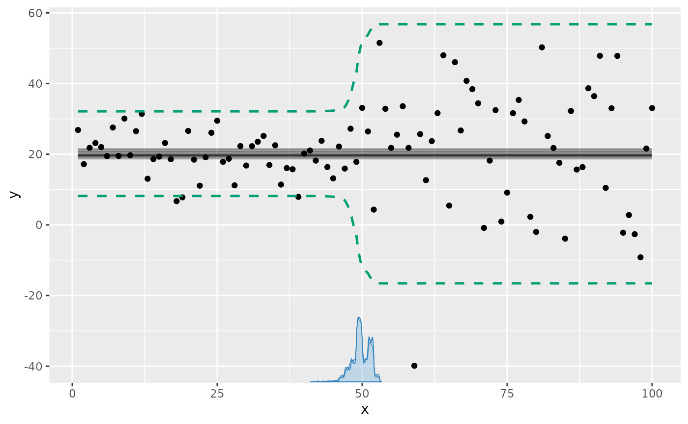
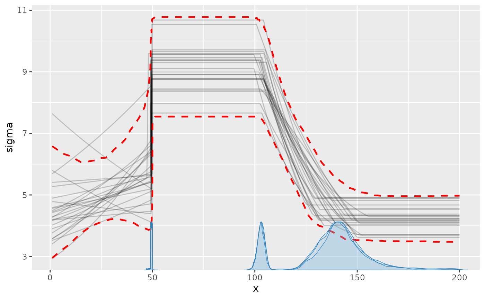
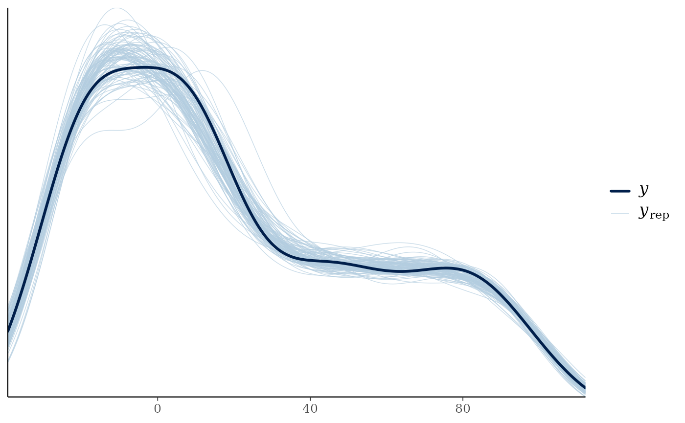
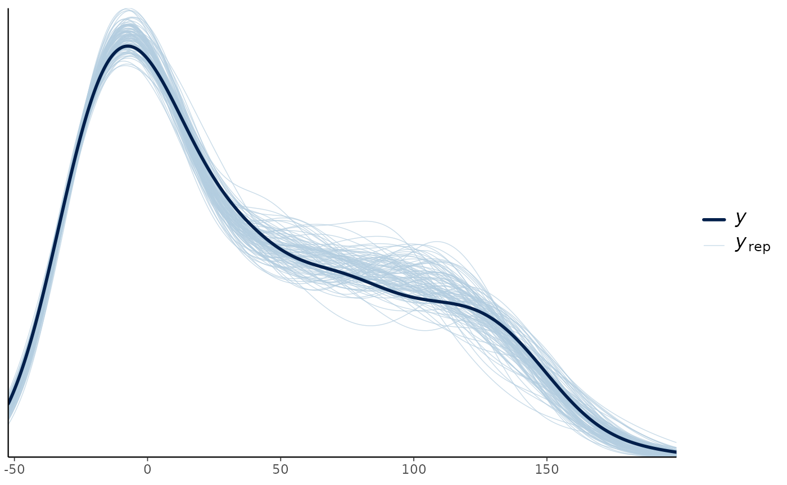
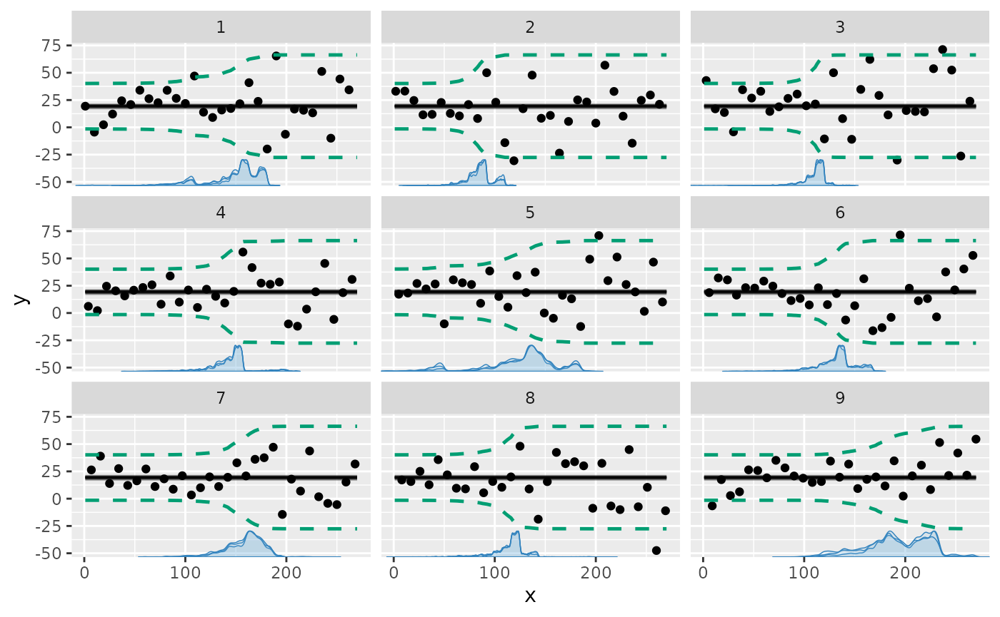
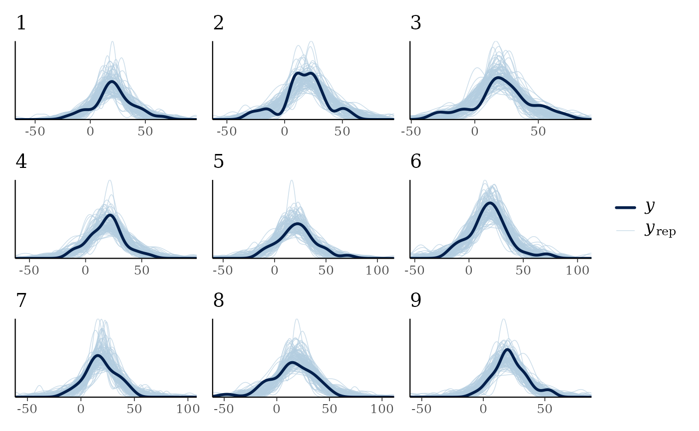

# Variance change points and other distributional parameters

`mcp` supports **distributional regression**, where any parameter of a
response distribution can be regressed on predictors and have change
points across segments. In standard regression, formulas model only the
conditional mean `mu()`. Distributional regression extends this by
allowing formulas for distributional parameters such as residual
standard deviation (`sigma`), negative-binomial overdispersion
(`shape`) - and auxilliary parameters for time-series autocorrelation
(`ar` / `ma`).

Here, we exemplify regression on the standard deviation `sigma`. A
plateau mean with an increasing standard deviation can be written as
`y ~ 1 + sigma(1 + x)`. Read more about mcp formulas
[here](https://lindeloev.github.io/mcp/dev/articles/formulas.md).

## Priors for distributional parameters

Aligning with `brms` convention, without an explicit
[`sigma()`](https://rdrr.io/r/stats/sigma.html) formula, the default is
the intercept-only prior `dt(0, max(2.5, round(mad(y), 1)), 3) T(0, )`
directly on the residual SD, i.e., an **identity link**. The
response-calibrated scale adapts to the units of `y`, with a minimum of
2.5 to avoid an accidentally narrow prior. This matches `brms`.

With an explicit [`sigma()`](https://rdrr.io/r/stats/sigma.html)
formula, the intercept instead defaults to `dt(0, 2.5, 3)` on
**log-SD**, with scaled Student-t coefficient priors.

## Simple example: a change in standard deviation

Let us model a simple change in residual standard deviation with a
plateau mean:

``` r

library(mcp)
future::plan(future::multisession, workers = 3)
set.seed(42)  # Make the script deterministic

model = list(
  y ~ 1,  # sigma(1) is implicit in the first segment
  ~ 0 + sigma(1)  # a new intercept on sigma, but not on the mean
)
```

We can simulate data with an abrupt change from a low to a high residual
standard deviation at x = 50:

``` r

df = data.frame(x = 1:100, y = 1)
empty = mcp(model, data = df, sample = FALSE, par_x = "x")

set.seed(42)
df$y = empty$simulate(
  empty, df, 
  cp_1 = 50, Intercept_1 = 20, 
  sigma_1 = log(5), sigma_2 = log(20))

head(df)
```

    ##   x        y
    ## 1 1 26.85479
    ## 2 2 17.17651
    ## 3 3 21.81564
    ## 4 4 23.16431
    ## 5 5 22.02134
    ## 6 6 19.46938

Now we fit the model to the simulated data.

``` r

fit = mcp(model, data = df, par_x = "x", seed = 42)
```

We plot a posterior predictive interval to show the effect of the
changing standard deviation, which is not immediately visible in the
default plot of the expected response:

``` r

set.seed(42)
plot(fit, q_predict = TRUE, ndraws = Inf)  # Inf to get high precision
```



We can see all parameters are well recovered (compare `sim` to `mean`).
Like the other parameters, the `sigma`s are named after the segment
where they were instantiated. There will always be a `sigma_1`.

``` r

summary(fit)
```

    ## Family: gaussian(link = 'identity')
    ## Iterations: 3000 from 3 chains.
    ## Segments:
    ##   1: y ~ 1
    ##   2: y ~ 1 ~ 0 + sigma(1)
    ## 
    ## Change point parameters:
    ##         name mean   sd lower upper rhat ess_bulk ess_tail  sim match
    ##  cp_1        49.8 1.58  46.4  52.3 1.00     2934     3619 50.0    OK
    ## 
    ## Population-level parameters:
    ##         name mean   sd lower upper rhat ess_bulk ess_tail  sim match
    ##  Intercept_1 20.1 0.81  18.6  21.8 1.00     5284     4788 20.0    OK
    ##  sigma_1      1.8 0.10   1.6   2.0 1.00     4839     4896  1.6    OK
    ##  sigma_2      2.9 0.10   2.7   3.1 1.00     4898     4539  3.0    OK

## Advanced example

We can model changes in `sigma` alone or together with changes in the
mean. The following deliberately complex model demonstrates that
flexibility:

``` r

model = list(
  # Increasing standard deviation.
  y ~ 1 + sigma(1 + x),
  
  # Abrupt change in mean and standard deviation.
  ~ 1 + sigma(1),
  
  # Joined slope on mean; log-SD changes as a second-order polynomial.
  ~ 0 + x + sigma(0 + x + I(x^2)),
  
  # Continue slope on mean, but plateau standard deviation (no sigma() term).
  ~ 0 + x
)

# The slope in segment 4 is just a continuation of 
# the slope in segment 3, as if there was no change point.
prior = list(
  x_4 = "x_3"
)
```

Notice a few things here:

- The prior ensures that the mean slope remains constant between segment
  3 and 4. So only `sigma` changes there. Sharing the slope through the
  prior effectively removes the change point in the mean (read more
  about [priors in
  mcp](https://lindeloev.github.io/mcp/dev/articles/priors.md)).
- Segment 4: Without a new
  [`sigma()`](https://rdrr.io/r/stats/sigma.html) term, segment 4 and
  later segments inherit the preceding standard-deviation trajectory at
  the value where it was left.

In general, the log-SD parameters are named `sigma_[normalname]`, where
“normalname” is the usual parameter names in mcp (see more
[here](https://lindeloev.github.io/mcp/dev/articles/formulas.md)). For
example, the log-SD slope on `x` in segment 3 is `sigma_x_3`. However,
`sigma_int_i` is just too verbose, so log-SD intercepts are simply
called `sigma_i`, where i is the segment number.

### Simulate data

We simulate some data from this model, setting all parameters. As
always, we can fit an empty model to get `fit$simulate`, which is useful
for simulation and predictions from this model.

``` r

# Set up model
df = data.frame(x = 1:200, y = 1)
empty = mcp(model, data = df, sample = FALSE)

# Simulate data
set.seed(42)
df$y = empty$simulate(
  empty, df,
  cp_1 = 50, cp_2 = 100, cp_3 = 150,
  Intercept_1 = -20, Intercept_2 = 0,
  sigma_1 = log(3), sigma_x_1 = log(2) / 50,
  sigma_2 = log(10),
  sigma_x_3 = -0.03,
  sigma_xE2_3 = 0.0003,
  x_3 = 1, x_4 = 1)
```

### Fit it and inspect results

Fit it:

``` r

fit = mcp(model, data = df, prior = prior, warmup = 6000, iter = 10000, seed = 42)
```

Plotting a posterior predictive interval is an intuitive way to see how
the residual standard deviation is estimated:

``` r

set.seed(42)
plot(fit, q_predict = TRUE)
```


We can also plot the `sigma_` parameters directly. Now the y-axis is
`sigma`:

``` r

set.seed(42)
plot_dpar(fit, dpar = "sigma", q_fit = TRUE)
```



`summary(fit)` shows that the parameters are well recovered and a
posterior predictive check (`pp_check(fit)`) looks good too. The last
change point is estimated with greater uncertainty than the others
because its only signal is a stop in standard-deviation growth.

``` r

summary(fit)
```

    ## Family: gaussian(link = 'identity')
    ## Iterations: 10000 from 3 chains.
    ## Segments:
    ##   1: y ~ 1 + sigma(1 + x)
    ##   2: y ~ 1 ~ 1 + sigma(1)
    ##   3: y ~ 1 ~ 0 + x + sigma(0 + x + I(x^2))
    ##   4: y ~ 1 ~ 0 + x
    ## 
    ## Change point parameters:
    ##         name     mean      sd    lower    upper rhat ess_bulk ess_tail      sim
    ##  cp_1         4.9e+01 4.3e-01  4.8e+01  5.0e+01 1.00    11182     4626  50.0000
    ##  cp_2         1.0e+02 1.8e+00  9.9e+01  1.1e+02 1.00      860     1558 100.0000
    ##  cp_3         1.4e+02 1.2e+01  1.2e+02  1.8e+02 1.00      769      832 150.0000
    ##  match
    ##     OK
    ##     OK
    ##     OK
    ## 
    ## Population-level parameters:
    ##         name     mean      sd    lower    upper rhat ess_bulk ess_tail      sim
    ##  Intercept_1 -2.0e+01 7.4e-01 -2.2e+01 -1.9e+01 1.00    10943    15391 -20.0000
    ##  Intercept_2  1.4e+00 1.3e+00 -1.3e+00  3.8e+00 1.00     1120     2118   0.0000
    ##  x_3          1.0e+00 2.0e-02  9.8e-01  1.1e+00 1.00     1445     3218   1.0000
    ##  x_4          1.0e+00 2.0e-02  9.8e-01  1.1e+00 1.00     1445     3218   1.0000
    ##  sigma_1      1.5e+00 2.1e-01  1.1e+00  1.9e+00 1.00     2741     5363   1.0986
    ##  sigma_x_1    5.7e-03 7.1e-03 -8.1e-03  2.0e-02 1.00     2769     5395   0.0139
    ##  sigma_2      2.2e+00 8.7e-02  2.0e+00  2.4e+00 1.00     4325     8234   2.3026
    ##  sigma_x_3   -2.0e-02 7.1e-03 -3.6e-02 -8.3e-03 1.00     1169     1932  -0.0300
    ##  sigma_xE2_3 -1.3e-05 9.5e-05 -2.2e-04  1.7e-04 1.00     2611     3535   0.0003
    ##  match
    ##     OK
    ##     OK
    ##     OK
    ##     OK
    ##     OK
    ##     OK
    ##     OK
    ##     OK
    ## 

``` r

pp_check(fit)
```



The bulk and tail effective sample sizes (`ess_bulk` and `ess_tail`) are
fairly low, indicating poor mixing for these parameters. `rhat` is
acceptable at \< 1.1, indicating good convergence between chains. Let us
verify this by taking a look at the posteriors and trace. For now, we
just look at the sigmas:

``` r

set.seed(42)
plot_pars(fit, regex_pars = "sigma_")
```



This confirms the impression from `rhat`, `ess_bulk`, and `ess_tail`.
Setting `mcp(..., iter = 10000)` would be advisable to increase the
effective sample size. Read more about [tips, tricks, and
debugging](https://lindeloev.github.io/mcp/dev/articles/tips.md).

## JAGS code for distributional parameters

Printing the underlying JAGS code, you can see that the regression model
is the same for the mean `mu` (see under “# Formula for mu”) and the
standard deviation `sigma` (see under “# Formula for sigma”).

This is explained more in [Understanding mcp
formulas](https://lindeloev.github.io/mcp/dev/articles/formulas.md).

``` r

fit$jags_code
```

    ## model {
    ##   # mcp helper values
    ##   cp_0 = CONST1_
    ##   cp_4 = CONST2_
    ## 
    ##   # Priors for population-level effects
    ##   cp_1 ~ dt(CONST1_, 1/(CONST3_)^2, CONST4_) T(CONST1_,CONST2_)  # Regularizing t-tail within the observed change-point span
    ##   cp_2 ~ dt(CONST1_, 1/(CONST3_)^2, CONST4_) T(cp_1,CONST2_)  # Regularizing t-tail ordered after cp_1 within the observed change-point span
    ##   cp_3 ~ dt(CONST1_, 1/(CONST3_)^2, CONST4_) T(cp_2,CONST2_)  # Regularizing t-tail ordered after cp_2 within the observed change-point span
    ##   Intercept_1 ~ dt(10, 1/(40.8)^2, 3)   # Robustly centered mean intercept with a minimum scale of 2.5
    ##   Intercept_2 ~ dt(10, 1/(40.8)^2, 3)   # Robustly centered mean intercept with a minimum scale of 2.5
    ##   x_3 ~ dt(0, 1/(0.2050251)^2, 3)   # Regularizing mean coefficient scaled to a reference predictor change
    ##   x_4 = x_3  # Same value as x_3
    ##   sigma_1 ~ dt(0, 1/(2.5)^2, 3)   # Weakly regularizing modeled log-SD intercept
    ##   sigma_x_1 ~ dt(0, 1/(0.01256281)^2, 3)   # Regularizing log-SD coefficient scaled to a reference predictor change
    ##   sigma_2 ~ dt(0, 1/(2.5)^2, 3)   # Weakly regularizing modeled log-SD intercept
    ##   sigma_x_3 ~ dt(0, 1/(0.01256281)^2, 3)   # Regularizing log-SD coefficient scaled to a reference predictor change
    ##   sigma_xE2_3 ~ dt(0, 1/(0.00006312972)^2, 3)   # Regularizing log-SD coefficient scaled to a reference predictor change
    ## 
    ##   # Model and likelihood
    ##   for (i_ in 1:length(x)) {
    ##     # par_x local to each segment
    ##     x_local_1_[i_] = min(x[i_], cp_1)
    ##     x_local_2_[i_] = min(x[i_], cp_2) - cp_1
    ##     x_local_3_[i_] = min(x[i_], cp_3) - cp_2
    ##     x_local_4_[i_] = min(x[i_], cp_4) - cp_3
    ##     
    ##     # Formula for mu
    ##     link_mu_[i_] =
    ##     
    ##       # Segment 1: y ~ 1 + sigma(1 + x)
    ##       (x[i_] >= cp_0) * (x[i_] < cp_1) * inprod(rhs_matrix_[i_, c(1)], c(Intercept_1)) * 1 + 
    ##     
    ##       # Segment 2: y ~ 1 ~ 1 + sigma(1)
    ##       (x[i_] >= cp_1) * inprod(rhs_matrix_[i_, c(2)], c(Intercept_2)) * 1 + 
    ##     
    ##       # Segment 3: y ~ 1 ~ 0 + x + sigma(0 + x + I(x^2))
    ##       (x[i_] >= cp_2) * inprod(rhs_matrix_[i_, c(3)], c(x_3)) * x_local_3_[i_] + 
    ##     
    ##       # Segment 4: y ~ 1 ~ 0 + x
    ##       (x[i_] >= cp_3) * inprod(rhs_matrix_[i_, c(4)], c(x_4)) * x_local_4_[i_]
    ##     
    ##     # Formula for sigma
    ##     link_sigma_[i_] =
    ##     
    ##       # Segment 1: y ~ 1 + sigma(1 + x)
    ##       (x[i_] >= cp_0) * (x[i_] < cp_1) * inprod(rhs_matrix_[i_, c(5)], c(sigma_1)) * 1 + 
    ##       (x[i_] >= cp_0) * (x[i_] < cp_1) * inprod(rhs_matrix_[i_, c(6)], c(sigma_x_1)) * x_local_1_[i_] + 
    ##     
    ##       # Segment 2: y ~ 1 ~ 1 + sigma(1)
    ##       (x[i_] >= cp_1) * inprod(rhs_matrix_[i_, c(7)], c(sigma_2)) * 1 + 
    ##     
    ##       # Segment 3: y ~ 1 ~ 0 + x + sigma(0 + x + I(x^2))
    ##       (x[i_] >= cp_2) * inprod(rhs_matrix_[i_, c(8)], c(sigma_x_3)) * x_local_3_[i_] + 
    ##       (x[i_] >= cp_2) * inprod(rhs_matrix_[i_, c(9)], c(sigma_xE2_3)) * x_local_3_[i_]^2
    ## 
    ##     # Likelihood and log-density for family = gaussian()
    ##     mu_[i_] = link_mu_[i_]
    ##     sigma_[i_] = max(1e-03, exp(link_sigma_[i_]))
    ##     y[i_] ~ dnorm(mu_[i_], 1 / sigma_[i_]^2)
    ##   }
    ## }

## Group-level change points and standard deviation

The standard-deviation model also applies with group-level change-point
deviations. Here we model a by-person change in `sigma` on a flat mean.

``` r

model = list(
  # intercept mean. sigma(1) is implicit in first segment if not specified
  y ~ 1,
  
  # Changed standard deviation, with a group-level change point.
  1 + (1|id) ~ 0 + sigma(1)
)
```

Simulate data:

``` r

# Set up model
df = data.frame(
  x = 1:270,
  id = rep(1:9, times = 30),
  y = 1
)
empty = mcp(model, data = df, par_x = "x", sample = FALSE)

# Simulate data
set.seed(42)
df$y = empty$simulate(
  empty, df, 
  cp_1 = 130, cp_1_sd = 40,
  Intercept_1 = 20,
  sigma_1 = log(10), sigma_2 = log(25))
```

Fit it:

``` r

fit = mcp(model, data = df, par_x = "x", seed = 42)
```

Plot it:

``` r

set.seed(42)
plot(fit, q_predict = TRUE, facet_by = "id", ndraws = Inf)
```



As usual, we can get the individual change points:

``` r

ranef(fit)
```

    ##         name       mean       sd      lower       upper     rhat ess_bulk
    ## 1 cp_1_id[1]  12.891966 25.73489 -50.661212  46.9359646 1.008117      395
    ## 2 cp_1_id[2] -49.534762 14.82521 -80.386600 -20.8536498 1.015089      244
    ## 3 cp_1_id[3] -24.411367 14.47693 -55.395103   0.3412921 1.023132      183
    ## 4 cp_1_id[4]   9.965783 17.99175 -32.652003  47.4641046 1.003617      342
    ## 5 cp_1_id[5]  -8.665072 31.81727 -88.497511  40.5007570 1.008986      202
    ## 6 cp_1_id[6]  -2.088472 17.79401 -40.949633  29.0989973 1.002865      722
    ## 7 cp_1_id[7]  24.018186 18.25717 -18.135626  55.7575853 1.004919      721
    ## 8 cp_1_id[8] -20.387099 18.13377 -64.270796   8.4576484 1.013982      426
    ## 9 cp_1_id[9]  58.210836 28.39638  -1.208064 106.8040858 1.030851      175
    ##   ess_tail         sim match
    ## 1      343  30.2353078    OK
    ## 2      454 -47.1909570    OK
    ## 3      523 -10.0778936    OK
    ## 4      296   0.7114741    OK
    ## 5      211  -8.4322972    OK
    ## 6     2058 -28.8480107    OK
    ## 7      996  35.8578498    OK
    ## 8     1158 -28.3893916    OK
    ## 9      477  56.1339185    OK

… and verify via posterior predictive checks:

``` r

pp_check(fit, facet_by = "id")
```



## Generalizing to other distributional parameters (dpars)

`sigma` is just one instance of a distributional parameter in `mcp`. In
general, every response family defines a set of supported `dpars`
(distributional parameters). The default linear predictor in any segment
formula models the location parameter `mu` (or probability/rate under
the family’s link function). Other `dpars` can be regressed on
predictors or given change points using wrapper functions named after
the `dpar`.

Here is an overview of standard distributional parameters across
response families:

- **`mu`**: Conditional mean or location (e.g. mean for
  [`gaussian()`](https://rdrr.io/r/stats/family.html), success
  probability for [`binomial()`](https://rdrr.io/r/stats/family.html),
  event rate for [`poisson()`](https://rdrr.io/r/stats/family.html)).
  Modeled by default without any wrapper.
- **`sigma`**: Residual standard deviation for
  [`gaussian()`](https://rdrr.io/r/stats/family.html) (modeled on the
  log-SD scale via `sigma(...)`).
- **`shape`**: Overdispersion / shape parameter for
  [`negbinomial()`](https://lindeloev.github.io/mcp/dev/reference/negbinomial.md)
  (modeled on the log-shape scale via `shape(...)`).
- **[`ar()`](https://rdrr.io/r/stats/ar.html) / `ma()`** Autoregressive
  and moving-average serial dependence terms for time-series models
  ([read more
  here](https://lindeloev.github.io/mcp/dev/articles/arma.md)). They are
  not really distributional parameters, but they are similar in terms of
  the `mcp` model syntax.

#### Inspecting and working with dpars

You can inspect the parameters in a fitted model or family object using
`mcp_pars(fit)` or `print(fit$prior)`.

Many core `mcp` functions take a `dpar` argument to extract or visualize
specific distributional parameters:

- **`fitted(fit, dpar = "sigma")` or `fitted(fit, dpar = "shape")`**:
  Returns fitted values for the target `dpar` evaluated on the
  natural/response scale.
- **`predict(fit, dpar = "sigma")`**: Generates posterior predictive
  draws for the specified distributional parameter.
- **`plot_dpar(fit, dpar = "sigma")` or
  `plot_dpar(fit, dpar = "shape")`**: Plots the trajectory of the
  distributional parameter over x, complete with credible intervals
  across segments.
