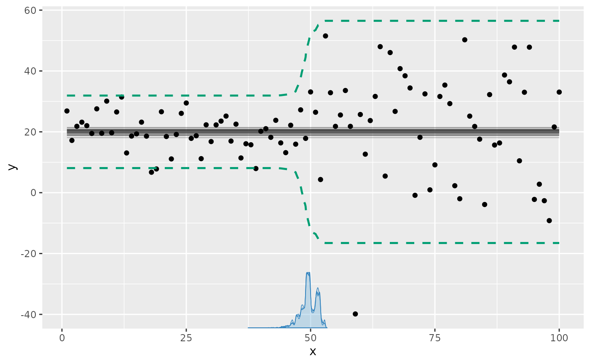
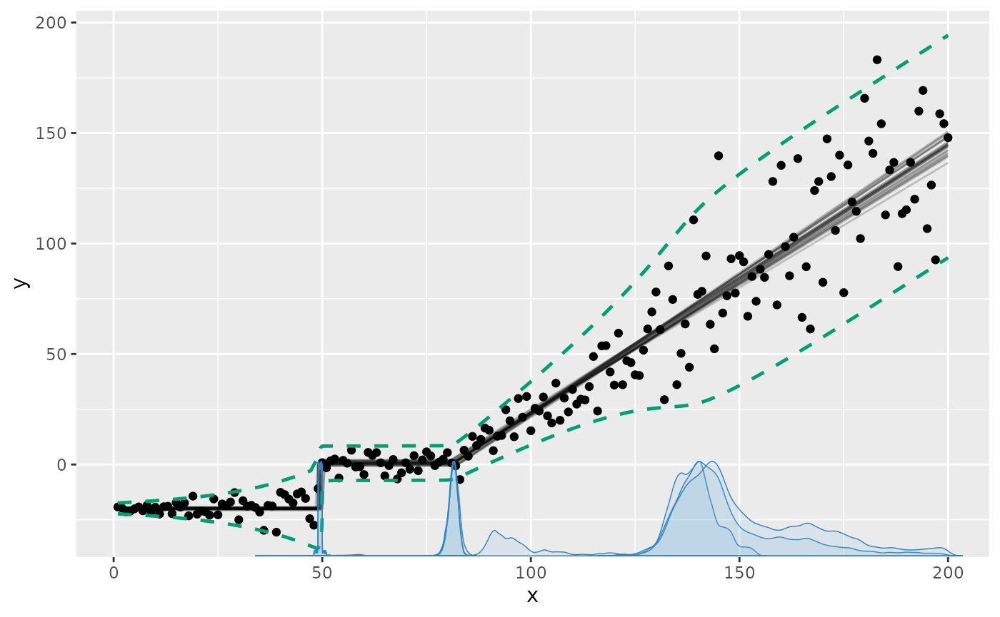
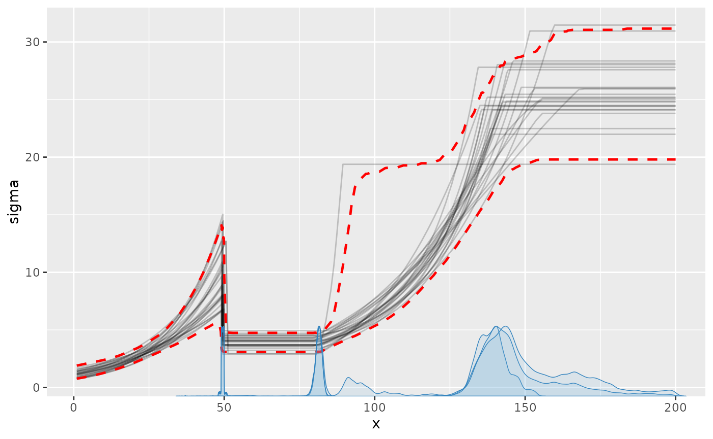
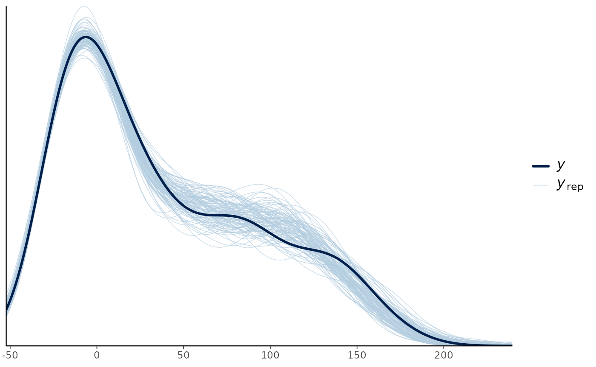
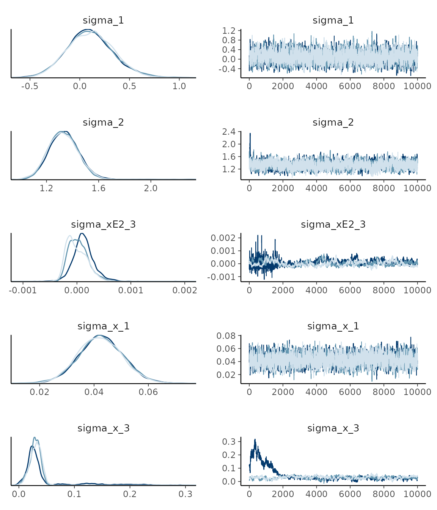
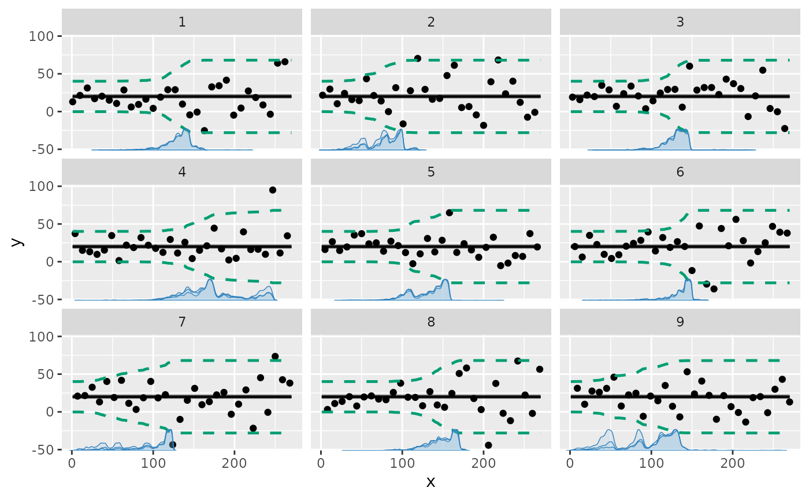
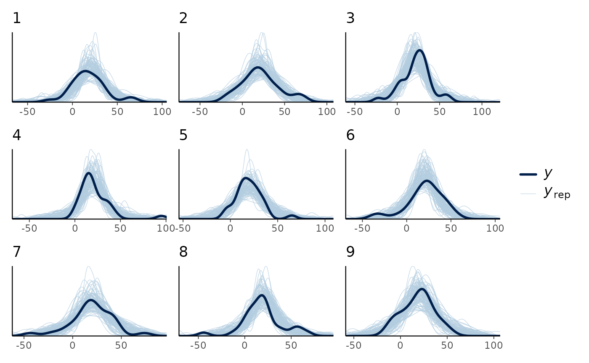

# Variance change points and other distributional parameters

`mcp` supports **distributional regression**, where any parameter of a
response distribution can be regressed on predictors and have change
points across segments. In standard regression, formulas model only the
conditional mean `mu()`, where the expected response on the response
scale relates to the linear predictor via link function g(\mu_i) =
\eta_i (\mu_i = g^{-1}(\eta_i)). Distributional regression extends this
by allowing formulas for distributional parameters such as residual
standard deviation (`sigma`), negative-binomial overdispersion
(`shape`) - and auxiliary parameters for time-series autocorrelation
(`ar` / `ma`) - on their respective link scales.

Here, we exemplify regression on the standard deviation `sigma`. A
plateau mean with an increasing standard deviation can be written as
`y ~ 1 + sigma(1 + x)`. Read more about mcp formulas
[here](https://lindeloev.github.io/mcp/dev/articles/formulas.md).

## Priors for distributional parameters

Aligning with `brms` convention, without an explicit
[`sigma()`](https://rdrr.io/r/stats/sigma.html) formula, the default is
the intercept-only prior `dt(0, max(2.5, round(mad(y), 1)), 3) T(0, )`
directly on the residual SD, i.e., an **identity link**. The
response-calibrated scale adapts to the units of `y`, with a minimum of
2.5 to avoid an accidentally narrow prior. This matches `brms`.

With an explicit [`sigma()`](https://rdrr.io/r/stats/sigma.html)
formula, the intercept instead defaults to `dt(0, 2.5, 3)` on
**log-SD**, with scaled Student-t coefficient priors.

## Simple example: a change in standard deviation

Let us model a simple change in residual standard deviation with a
plateau mean:

``` r

library(mcp)
future::plan(future::multisession, workers = 3)

model = list(
  y ~ 1,  # sigma(1) is implicit in the first segment
  ~ 0 + sigma(1)  # a new intercept on sigma, but not on the mean
)
```

We can simulate data with an abrupt change from a low to a high residual
standard deviation at x = 50:

``` r

df = data.frame(x = 1:100, y = 1)
empty = mcp(model, data = df, sample = FALSE, par_x = "x")

df$y = empty$simulate(
  empty, df, 
  cp_1 = 50, Intercept_1 = 20, 
  sigma_1 = log(5), sigma_2 = log(20))

head(df)
```

    ##   x        y
    ## 1 1 26.85479
    ## 2 2 17.17651
    ## 3 3 21.81564
    ## 4 4 23.16431
    ## 5 5 22.02134
    ## 6 6 19.46938

Now we fit the model to the simulated data.

``` r

fit = mcp(model, data = df, par_x = "x")
```

We plot a posterior predictive interval to show the effect of the
changing standard deviation, which is not immediately visible in the
default plot of the expected response:

``` r

plot(fit, q_predict = TRUE)
```



We can see all parameters are well recovered (compare `sim` to `mean`).
Like the other parameters, the `sigma`s are named after the segment
where they were instantiated. There will always be a `sigma_1`.

``` r

summary(fit)
```

    ## Family: gaussian
    ## Links: mu = identity; sigma = log
    ## Iterations: 3000 from 3 chains.
    ## Segments:
    ##   1: y ~ 1
    ##   2: y ~ 1 ~ 0 + sigma(1)
    ## 
    ## Change point parameters:
    ##     variable mean   sd lower upper rhat ess_bulk ess_tail  sim match
    ##  cp_1        49.7 1.64  46.1  52.2 1.00     3277     3827 50.0    OK
    ## 
    ## Population-level parameters:
    ##     variable mean   sd lower upper rhat ess_bulk ess_tail  sim match
    ##  Intercept_1 20.1 0.82  18.5  21.7 1.00     7972     8574 20.0    OK
    ##  sigma_1      1.8 0.11   1.6   2.0 1.00     4639     4599  1.6    OK
    ##  sigma_2      2.9 0.10   2.7   3.1 1.00     5458     5230  3.0    OK

## Advanced example

We can model changes in `sigma` alone or together with changes in the
mean. The following deliberately complex model demonstrates that
flexibility:

``` r

model = list(
  # 1. Increasing standard deviation.
  y ~ 1 + sigma(1 + x),  # Intercept_1, sigma_1, sigma_x_1
  
  # 2. Abrupt change in mean and standard deviation.
  ~ 1 + sigma(1),  # At cp_1: Intercept_2, sigma_2
  
  # 3. Joined slope on mean; log-SD changes as a second-order polynomial.
  ~ 0 + x + sigma(0 + x + I(x^2)),  # At cp_2: x_3, sigma_x_3, sigma_xE2_3
  
  # 4. Continue slope on mean, but plateau standard deviation (no sigma() term).
  ~ 0 + same(x)  # At cp_3: reuse x_3; sigma joined
)
```

Notice a few things here:

- `same(x)` ensures that the mean slope remains constant between segment
  3 and 4. So only `sigma` changes there. Sharing the slope effectively
  removes the change point in the mean (read more about [formulas in
  mcp](https://lindeloev.github.io/mcp/dev/articles/formulas.md)).
- Segment 4: `sigma` is required by the likelihood, so it cannot be
  turned off. A segment that does not include
  [`sigma()`](https://rdrr.io/r/stats/sigma.html) is joined, so the
  log-SD plateaus here.

In general, the log-SD parameters are named `sigma_[normalname]`, where
“normalname” is the usual parameter names in mcp (see more
[here](https://lindeloev.github.io/mcp/dev/articles/formulas.md)). For
example, the log-SD slope on `x` in segment 3 is `sigma_x_3`. However,
`sigma_Intercept_i` is just too verbose, so log-SD intercepts are simply
called `sigma_i`, where i is the segment number.

### Simulate data

We simulate some data from this model, setting all parameters. As
always, we can fit an empty model to get `fit$simulate`, which is useful
for simulation and predictions from this model.

``` r

# Set up model
df = data.frame(x = 1:200, y = 1)
empty = mcp(model, data = df, sample = FALSE)

# Simulate data
df$y = empty$simulate(
  empty, df,
  cp_1 = 50, cp_2 = 80, cp_3 = 140,
  Intercept_1 = -20, Intercept_2 = 0,
  sigma_1 = log(1), sigma_x_1 = log(2) / 15,
  sigma_2 = log(4),
  sigma_x_3 = 0.02,
  sigma_xE2_3 = 0.00015,
  x_3 = 1.2
)
```

### Fit it and inspect results

Fit it:

``` r

fit = mcp(model, data = df, iter = 10000, diagnostics = FALSE)
```

Plotting a posterior predictive interval is an intuitive way to see how
the residual standard deviation is estimated:

``` r

plot(fit, q_predict = TRUE)
```



We can also plot the `sigma_` parameters directly. Now the y-axis is
`sigma`:

``` r

plot_dpar(fit, dpar = "sigma", q_fit = TRUE)
```



`summary(fit)` shows that the parameters are well recovered and a
posterior predictive check (`pp_check(fit)`) looks good too. The last
change point is estimated with greater uncertainty than the others
because its only signal is a stop in standard-deviation growth.

``` r

summary(fit)
```

    ## Family: gaussian
    ## Links: mu = identity; sigma = log
    ## Iterations: 10000 from 3 chains.
    ## Segments:
    ##   1: y ~ 1 + sigma(1 + x)
    ##   2: y ~ 1 ~ 1 + sigma(1)
    ##   3: y ~ 1 ~ 0 + x + sigma(0 + x + I(x^2))
    ##   4: y ~ 1 ~ 0 + same(x)
    ## 
    ## Change point parameters:
    ##     variable     mean      sd    lower    upper rhat ess_bulk ess_tail      sim match
    ##  cp_1         4.9e+01  0.6603  4.9e+01  5.0e+01 1.00     8220     4651  5.0e+01    OK
    ##  cp_2         8.1e+01  1.8309  7.9e+01  8.4e+01 1.01      256      140  8.0e+01    OK
    ##  cp_3         1.4e+02 18.2840  9.3e+01  1.8e+02 1.18       12       11  1.4e+02    OK
    ## 
    ## Population-level parameters:
    ##     variable     mean      sd    lower    upper rhat ess_bulk ess_tail      sim match
    ##  Intercept_1 -2.0e+01  0.3432 -2.1e+01 -1.9e+01 1.00    21424    18774 -2.0e+01    OK
    ##  Intercept_2  5.9e-01  1.0207 -7.7e-01  1.9e+00 1.00     8038     7658  0.0e+00    OK
    ##  x_3          1.2e+00  0.0401  1.1e+00  1.3e+00 1.01      313      525  1.2e+00    OK
    ##  sigma_1      1.0e-01  0.2330 -3.3e-01  5.8e-01 1.00     2042     3804  0.0e+00    OK
    ##  sigma_x_1    4.2e-02  0.0082  2.7e-02  5.9e-02 1.00     2077     3933  4.6e-02    OK
    ##  sigma_2      1.3e+00  0.1159  1.1e+00  1.6e+00 1.00      781     2247  1.4e+00    OK
    ##  sigma_x_3    3.5e-02  0.0335  7.0e-03  1.5e-01 1.07       28       11  2.0e-02    OK
    ##  sigma_xE2_3  5.1e-05  0.0002 -2.7e-04  4.8e-04 1.06       76      306  1.5e-04    OK

``` r

pp_check(fit)
```



Parameters almost converge well (\hat{R} \le 1.01 and \text{ESS} \>
400), but I set `diagnostics = FALSE` to quiet warnings since this is
just a demonstration. Notice that `cp_3` and the quadratic `sigma`
parameters have lower effective sample sizes than the others, reflecting
greater uncertainty in detecting subtle changes in variance curvature.
Let us verify this by taking a look at the posteriors and trace. For
now, we just look at the sigmas:

``` r

plot_pars(fit, regex_pars = "sigma_")
```



This confirms the impression from `rhat`, `ess_bulk`, and `ess_tail`.
Read more about [tips, tricks, and
debugging](https://lindeloev.github.io/mcp/dev/articles/tips.md).

## JAGS code for distributional parameters

Printing the underlying JAGS code, you can see that the regression model
is the same for the mean `mu` (see under “# Formula for mu”) and the
standard deviation `sigma` (see under “# Formula for sigma”).

This is explained more in [Understanding mcp
formulas](https://lindeloev.github.io/mcp/dev/articles/formulas.md).

``` r

fit$jags_code
```

    ## model {
    ##   # mcp helper values
    ##   cp_0 = CONST1_
    ##   cp_4 = CONST2_
    ## 
    ##   # Priors for population-level effects
    ##   cp_frac_1_ ~ dbeta(1, 3)  # Relative fraction of remaining span (Uniform order statistics)
    ##   cp_1 = cp_0 + cp_frac_1_ * (cp_4 - cp_0)  # Ordered change point
    ##   cp_frac_2_ ~ dbeta(1, 2)  # Relative fraction of remaining span (Uniform order statistics)
    ##   cp_2 = cp_1 + cp_frac_2_ * (cp_4 - cp_1)  # Ordered change point
    ##   cp_frac_3_ ~ dbeta(1, 1)  # Relative fraction of remaining span (Uniform order statistics)
    ##   cp_3 = cp_2 + cp_frac_3_ * (cp_4 - cp_2)  # Ordered change point
    ##   Intercept_1 ~ dnorm(39.06538, 1/(139.559)^2)   # Mean intercept (rstanarm default)
    ##   Intercept_2 ~ dnorm(39.06538, 1/(139.559)^2)   # Mean intercept (rstanarm default)
    ##   x_3_rise_ ~ dnorm(0, 1/(2.411212*(cp_3-cp_2))^2)   # Autoscaled mean coefficient (rstanarm default); sampled as the rise over the segment
    ##   x_3 = x_3_rise_ / (cp_3 - cp_2)
    ##   sigma_1_start_ ~ dt(0, 1/(2.5)^2, 3)   # Weakly regularizing modeled log-SD intercept; on the level at min(x)
    ##   sigma_1 = sigma_1_start_ - (sigma_x_1 * 1)  # Intercept at x = 0
    ##   sigma_x_1 ~ dt(0, 1/(0.04319342)^2, 3)   # Regularizing log-SD coefficient scaled by the predictor SD
    ##   sigma_2 ~ dt(0, 1/(2.5)^2, 3)   # Weakly regularizing modeled log-SD intercept
    ##   sigma_x_3 ~ dt(0, 1/(0.04319342)^2, 3)   # Regularizing log-SD coefficient scaled by the predictor SD
    ##   sigma_xE2_3 ~ dt(0, 1/(0.0002100946)^2, 3)   # Regularizing log-SD coefficient scaled by the predictor SD
    ## 
    ##   # Model and likelihood
    ##   for (i_ in 1:length(x)) {
    ##     # par_x local to each segment
    ##     x_local_1_[i_] = min(x[i_], cp_1)
    ##     x_local_2_[i_] = min(x[i_], cp_2) - cp_1
    ##     x_local_3_[i_] = min(x[i_], cp_3) - cp_2
    ##     x_local_4_[i_] = min(x[i_], cp_4) - cp_3
    ##     
    ##     # Formula for mu
    ##     link_mu_[i_] =
    ##       (x[i_] >= cp_0) * (x[i_] < cp_1) * inprod(rhs_matrix_[i_, c(1)], c(Intercept_1)) * 1 + 
    ##       (x[i_] >= cp_1) * inprod(rhs_matrix_[i_, c(2)], c(Intercept_2)) * 1 + 
    ##       (x[i_] >= cp_2) * inprod(rhs_matrix_[i_, c(3)], c(x_3)) * x_local_3_[i_] + 
    ##       (x[i_] >= cp_3) * inprod(rhs_matrix_[i_, c(4)], c(x_3)) * x_local_4_[i_]
    ##     
    ##     # Formula for sigma
    ##     link_sigma_[i_] =
    ##       (x[i_] >= cp_0) * (x[i_] < cp_1) * inprod(rhs_matrix_[i_, c(5)], c(sigma_1)) * 1 + 
    ##       (x[i_] >= cp_0) * (x[i_] < cp_1) * inprod(rhs_matrix_[i_, c(6)], c(sigma_x_1)) * x_local_1_[i_] + 
    ##       (x[i_] >= cp_1) * inprod(rhs_matrix_[i_, c(7)], c(sigma_2)) * 1 + 
    ##       (x[i_] >= cp_2) * inprod(rhs_matrix_[i_, c(8)], c(sigma_x_3)) * x_local_3_[i_] + 
    ##       (x[i_] >= cp_2) * inprod(rhs_matrix_[i_, c(9)], c(sigma_xE2_3)) * x_local_3_[i_]^2
    ## 
    ##     # Likelihood and log-density for family = gaussian()
    ##     mu_[i_] = link_mu_[i_]
    ##     sigma_[i_] = max(1e-03, exp(link_sigma_[i_]))
    ##     y[i_] ~ dnorm(mu_[i_], 1 / sigma_[i_]^2)
    ##   }
    ## }

## Group-level change points and standard deviation

The standard-deviation model also applies with group-level change-point
deviations. Here we model a by-person change in `sigma` on a flat mean.

``` r

model = list(
  # intercept mean. sigma(1) is implicit in first segment if not specified
  y ~ 1,
  
  # Changed standard deviation, with a group-level change point.
  1 + (1|id) ~ 0 + sigma(1)
)
```

Simulate data:

``` r

# Set up model
df = data.frame(
  x = 1:270,
  id = rep(1:9, times = 30),
  y = 1
)
empty = mcp(model, data = df, par_x = "x", sample = FALSE)

# Simulate data
df$y = empty$simulate(
  empty, df, 
  cp_1 = 130, cp_1_sd = 40,
  Intercept_1 = 20,
  sigma_1 = log(10), sigma_2 = log(25))
```

Fit it:

``` r

fit = mcp(model, data = df, par_x = "x")
```

Plot it:

``` r

plot(fit, q_predict = TRUE, facet_by = "id")
```



As usual, we can get the individual change points:

``` r

ranef(fit)
```

    ##     variable       mean       sd      lower     upper     rhat ess_bulk ess_tail        sim match
    ## 1 cp_1_id[1]   3.208518 53.97599 -123.80777 116.95871 1.042916      715      476  -2.902793    OK
    ## 2 cp_1_id[2] -49.238207 54.67359 -184.64457  55.62917 1.044136      727      536 -44.692962    OK
    ## 3 cp_1_id[3]   2.233039 53.67133 -123.81857 115.78047 1.041385      790      534  -1.644795    OK
    ## 4 cp_1_id[4]  47.920881 62.26592  -71.63198 195.63129 1.032080      504      458  41.216150    OK
    ## 5 cp_1_id[5]   4.372002 54.86719 -120.49809 120.64593 1.033373      758      412  -5.617847    OK
    ## 6 cp_1_id[6]   7.832260 53.76407 -116.91775 121.99790 1.037196      742      559 -47.784897    OK
    ## 7 cp_1_id[7] -34.804901 61.10313 -189.13540  77.68395 1.044932      382      238  -8.872215    OK
    ## 8 cp_1_id[8]  20.808166 54.00987 -100.44776 138.65007 1.034425      655      489  39.499206    OK
    ## 9 cp_1_id[9] -30.476202 60.90628 -187.32072  81.24282 1.037093      363      258 -42.698803    OK

… and verify via posterior predictive checks:

``` r

pp_check(fit, facet_by = "id")
```



## Generalizing to other distributional parameters (dpars)

`sigma` is just one instance of a distributional parameter in `mcp`. In
general, every response family defines a set of supported `dpars`
(distributional parameters). The default linear predictor in any segment
formula models the location parameter `mu` (or probability/rate under
the family’s link function). Other `dpars` can be regressed on
predictors or given change points using wrapper functions named after
the `dpar`.

Here is an overview of standard distributional parameters across
response families:

- **`mu`**: Conditional mean or location (e.g. mean for
  [`gaussian()`](https://rdrr.io/r/stats/family.html), success
  probability for [`binomial()`](https://rdrr.io/r/stats/family.html),
  event rate for [`poisson()`](https://rdrr.io/r/stats/family.html)).
  Modeled by default without any wrapper.
- **`sigma`**: Residual standard deviation for
  [`gaussian()`](https://rdrr.io/r/stats/family.html) (modeled on the
  log-SD scale via `sigma(...)`).
- **`shape`**: Overdispersion / shape parameter for
  [`negbinomial()`](https://lindeloev.github.io/mcp/dev/reference/negbinomial.md)
  (modeled on the log-shape scale via `shape(...)`).
- **[`ar()`](https://rdrr.io/r/stats/ar.html) / `ma()`**: Autoregressive
  and moving-average serial dependence terms for time-series models
  ([read more
  here](https://lindeloev.github.io/mcp/dev/articles/arma.md)). They are
  not really distributional parameters, but they are similar in terms of
  the `mcp` model syntax.

#### Inspecting and working with dpars

You can inspect the parameters in a fitted model or family object using
`mcp_pars(fit)` or `print(fit$prior)`.

Many core `mcp` functions take a `dpar` argument to extract or visualize
specific distributional parameters:

- **`fitted(fit, dpar = "sigma")` or `fitted(fit, dpar = "shape")`**:
  Returns fitted values for the target `dpar` evaluated on the response
  scale.
- **`predict(fit, dpar = "sigma")`**: Generates posterior predictive
  draws for the specified distributional parameter.
- **`plot_dpar(fit, dpar = "sigma")` or
  `plot_dpar(fit, dpar = "shape")`**: Plots the trajectory of the
  distributional parameter over x, complete with credible intervals
  across segments.
