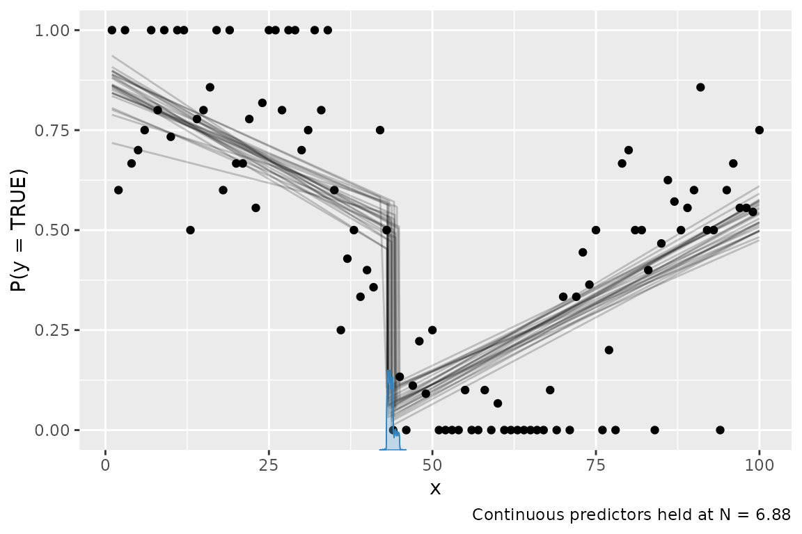

# Families and link functions

`mcp 0.3` added support for more response families and link functions.
For example, you can now do

``` r

fit = mcp(model, data = df, family = gaussian("log"))
fit = mcp(model, data = df, family = binomial("identity"))
```

This is an ongoing effort and more will be added. This table shows the
current status:


- **Green:** supported and the default priors are unlikely to change.
- **Yellow:** supported but the default priors may change.
- **White:** not currently supported. [Raise a GitHub
  issue](https://github.com/lindeloev/mcp/issues) if you need it.
- **Red:** impossible or will not be supported.

See the “GLM” menu above for more details on using GLM with `mcp`.

## General remarks

Some link functions are *default* in GLM for good reasons: they have
proven computationally convenient and interpretable. When using a
non-default link function, you risk predicting impossible values, at
which point `mcp` will error (as it should) - hopefully with informative
error messages. For example a `bernoulli("identity")` family with model
`prob ~ 1 + x` (i.e., a slope directly on the probability of success)
can easily exceed 1 or 0 and there are, of course, no such thing as
probabilities below 0% or above 100%. One way to ameliorate such
problems is by setting informative
[priors](https://lindeloev.github.io/mcp/dev/articles/priors.md) (e.g.,
via truncation) to prevent the sampler from visiting illegal
combinations of such values.

In short: think carefully and proceed at your own risk.

## An example

``` r

library(mcp)
future::plan(future::multisession, workers = 3)
set.seed(42)  # Make the script deterministic
```

Reviving the example from the article on [binomial models in
mcp](https://lindeloev.github.io/mcp/dev/articles/binomial.md)…

``` r

model = list(
  y | trials(N) ~ 1 + x,  # Intercept and slope on P(success)
  ~ 1 + x                 # Disjoined slope on P(success)
)
```

we can model it using an `identity` link function:

``` r

data = mcp_example_data("binomial")
fit = mcp(model, data = data, family = binomial(link = "identity"))
```

    ## Parallel sampling in progress...
    ## 
    ## Error in update.jags(model, n.iter, ...) : Error in node loglik_[63]
    ## Invalid parent values

Oops, the sampler visited impossible values! Likely `P(success) < 0%` or
`P(success) > 100%`. Let’s help it along with some more informative
priors. For this data and model, the main problem is that the slope of
the second segment has too great posterior probability of surpasses 100%
with the default `mcp` priors. So let’s set some more informative priors
render a long (early `cp_1`) and steep (high `x_2`) slope unlikely:

``` r

prior = list(
  x_2 = "dnorm(0, 0.002)",         # Slope is unlikely to be steep
  cp_1 = "dnorm(30, 10) T(20, )"   # Slope starts not-too-early
)

fit = mcp(model, data = data, family = binomial(link = "identity"), prior = prior)
```

``` r

plot(fit)
```



Sampling succeeded! This is a bad model of this data. But it illustrates
the necessary considerations and steps to ameliorate problems when going
beyond default link functions.

Because of the identity-link, the regression coefficients are
interpretable as intercepts and slopes on `P(success)` in contrast to
the “usual” log-odds fitted when `family = binomial(link = "logit")`.
For example, `Intercept_1` is inferred probability of success at `x = 0`
and likewise for `Intercept_2` at `x = cp_1`.

``` r

summary(fit)
```

    ## Family: binomial(link = 'identity')
    ## Iterations: 3000 from 3 chains.
    ## Segments:
    ##   1: y | trials(N) ~ 1 + x
    ##   2: y | trials(N) ~ 1 ~ 1 + x
    ## 
    ## Population-level parameters:
    ##         name match   sim    mean   lower   upper Rhat ess_bulk ess_tail
    ##         cp_1       30.00 43.6779 43.0255 44.8693    1     3177     4573
    ##  Intercept_1        1.50  0.8551  0.7571  0.9381    1     1050     1844
    ##          x_1  <NA>    NA -0.0073 -0.0109 -0.0034    1      995     1819
    ##  Intercept_2  <NA>    NA  0.0685  0.0163  0.1326    1     1745     2409
    ##          x_2       -0.15  0.0081  0.0062  0.0100    1     1775     2604

## Specific remarks

- The mean ($`1 / {inverse\_link}(\lambda)`$) is plotted for
  `family = exponential()` and output by
  `fit$simulate(..., fype = "fitted")`. Multiply by `log(2)` to get the
  median.
