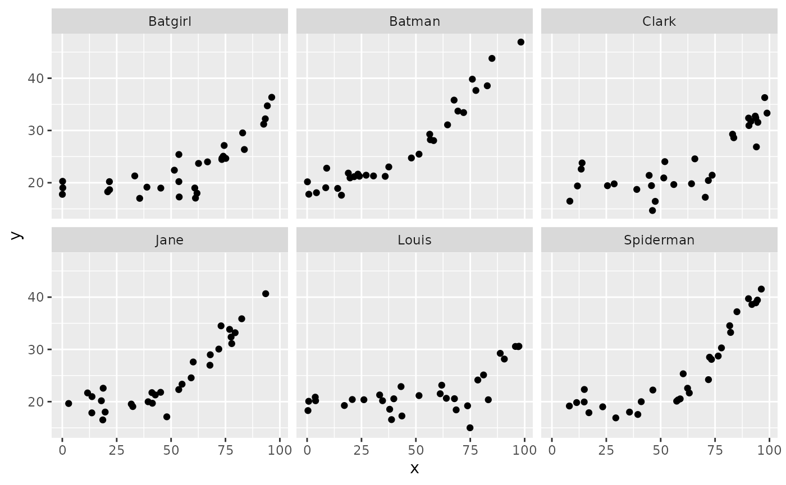
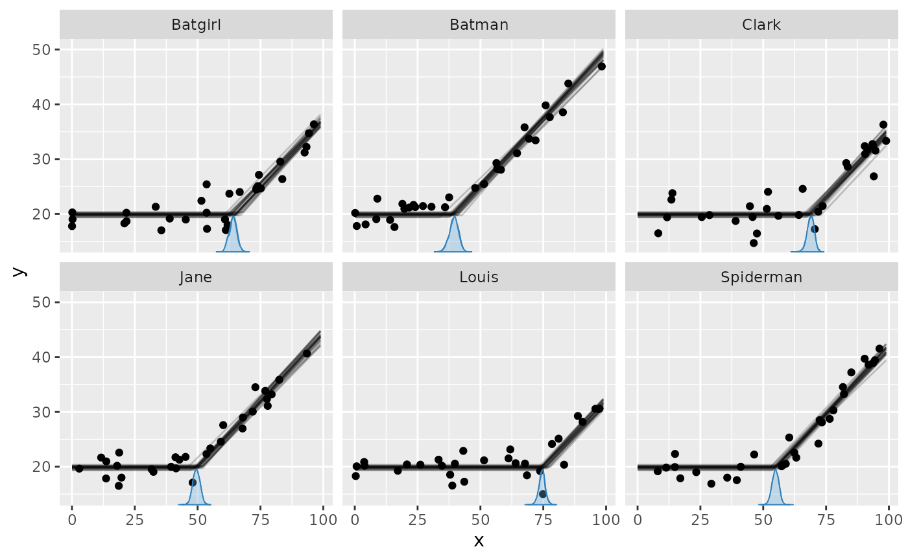
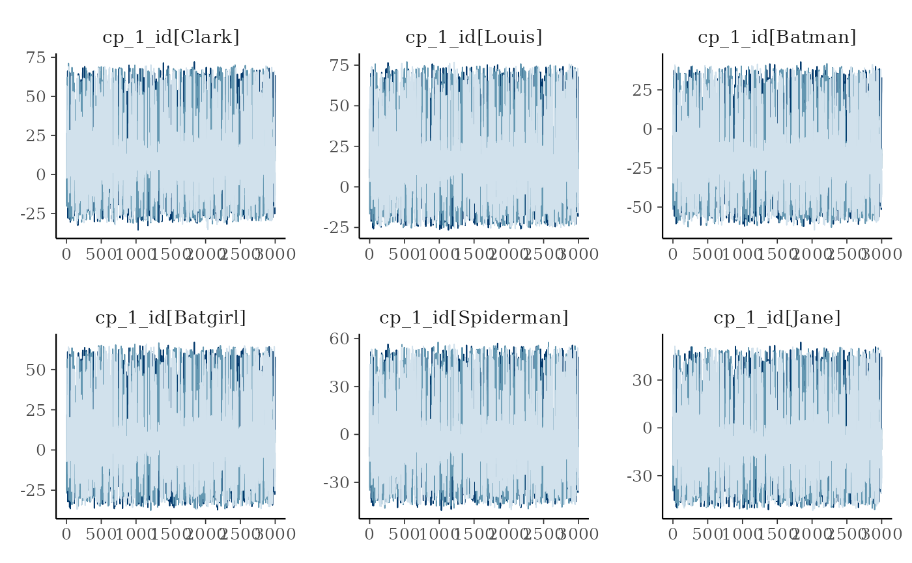
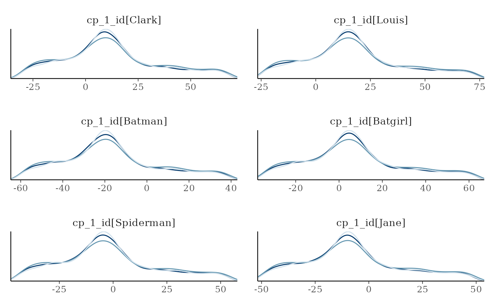
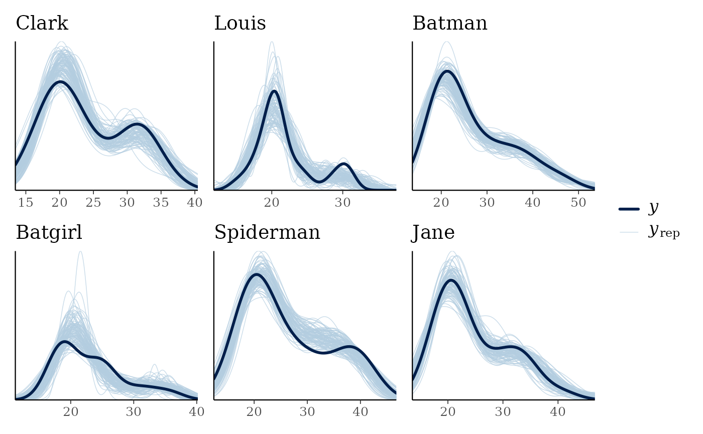

# Group-level (random) effects in mcp

`mcp` supports group-level effects (also called random effects) in both
the predictor and change-point parts of a formula. The syntax follows
`lme4` and `brms`: `(1|group)` specifies a group-level intercept,
`(factor||group)` specifies independent group coefficients,
[`fixef()`](https://lindeloev.github.io/mcp/dev/reference/summary.mcpfit.md)
reports population-level effects, and
[`ranef()`](https://lindeloev.github.io/mcp/dev/reference/summary.mcpfit.md)
reports group-level deviations.

This article in brief:

- Predictor and change-point group-level effects
- How group-level effects persist across segments
- How to simulate group-level change-point deviations
- Get posteriors using `ranef(fit)`
- Plot using `plot(fit, facet_by="my_group")` and
  `plot_pars(fit, pars = "group", type = "dens_overlay", ncol = 3)`.
- How group-specific change points are kept in range and ordered.
- The article on modeling standard deviation via
  [`sigma()`](https://rdrr.io/r/stats/sigma.html) contains [another
  group-level change-point
  example](https://lindeloev.github.io/mcp/dev/articles/dpar.md).

``` r

library(mcp)
future::plan(future::multisession, workers = 3)
set.seed(42)  # Make the script deterministic
```

## Specifying group-level change points

You specify group-level effects using the familiar
[`lmer`](https://www.rdocumentation.org/packages/lme4/versions/1.1-21/topics/lmer)
and `brms` syntax `(1|group)`. In the cp part, this models a
group-specific deviation from the population-level change point. For
example:

``` r

model = list(
  y ~ 1,  # Intercept_1
  1 + (1|id) ~ 0 + x  # cp_1, cp_1_sd, cp_1_id[i]
)
```

You can have multiple group-level change points, but they must use the
same grouping factor so their realized locations can be ordered within
each group:

``` r

model = list(
  y ~ 1,  # Intercept_1
  1 + (1|id) ~ 0 + x,  # cp_1, cp_1_sd, cp_1_id[i]
  1 + (1|id) ~ 0,      # cp_2, cp_2_sd, cp_2_id[i]
  (1|id) ~ 1           # cp_3 (implicit), cp_3_sd, cp_3_id[i]
)
```

For change point i and group g, the hierarchy is

\kappa\_{ig} \sim \operatorname{Normal}(cp_i, cp\_{i,\mathrm{sd}}),
\qquad cp\_{i,\mathrm{id}\[g\]} = \kappa\_{ig} - cp_i,

where \kappa\_{ig} is the group-specific location. Thus `cp_i_id[g]` is
the reported deviation and `cp_i_sd` is the latent normal scale. The
deviations are not forced to sum to zero.

The hierarchy is subject to x\_{\min} \< \kappa\_{1g} \< \cdots \<
\kappa\_{Kg} \< x\_{\max}. Thus, if adjacent change points both vary,
their group-specific locations are ordered against each other—not
against the adjacent population change point. Internally, JAGS samples
\kappa\_{ig} directly for efficiency.

Unlike predictor group-level effects, a change-point group effect
applies only to the boundary where it is written. There is no carry-over
as there is for group-level effects on RHS.

## Predictor group-level effects

The same syntax in the predictor part gives each group a deviation from
the population-level intercept:

``` r

model = list(
  y ~ 1 + (1|id),  # Starts group-level intercept
  ~ 0 + x,         # Group-level intercept persists here
  ~ 1 + (0|id)     # 0 Turns it off
)
```

Here, the group-level intercept introduced in segment 1 also applies in
segment 2. A later `(1|id)` would replace it from that segment onward,
while `(0|id)` turns it off, as in segment 3 above. Persistence is
tracked separately for each grouping factor and distributional
parameter. Read more on carry-over rules between segments in [the
article on
formulas](https://lindeloev.github.io/mcp/dev/articles/formulas.html#on-carry-over-between-segments).

Use `||` for independent group-level slopes and factor coefficients:

``` r

model = list(
  y ~ 1 + condition + (condition||id),
  ~ 0 + x
)
```

With the default treatment coding, `(condition||id)` contains a
group-level intercept and one group-level deviation for each
non-reference contrast of `condition`. `(0 + condition||id)` instead
gives each factor level its own group-level coefficient. Similarly,
`(1 + z||id)` specifies independent group-level intercepts and slopes on
a numeric predictor `z`. Each coefficient has its own population-level
SD.

The population-level and group-level formulas need not contain the same
coefficients. For example, `y ~ 1 + (0 + condition||id)` has a
population-level intercept but only group-specific condition
coefficients.

Group-level intercepts also work inside distributional formulas:

``` r

model = list(
  y ~ 1 + (1|id) + sigma(1 + (1|id))
)
```

This model has group-level deviations in both the conditional mean and
log-SD. The `||` syntax works inside distributional formulas too, for
example `sigma(1 + (condition||id))`.

A later predictor group-level term for the same distributional parameter
and grouping factor replaces the entire earlier block. Thus, if
`(condition||id)` is followed in a later segment by `(1||id)`, only the
new intercept deviation applies from that segment onward. `(0|id)` turns
the block off.

Multi-coefficient terms with `|`, such as `(1 + x|id)`, would imply
correlated group coefficients and are not yet supported; use
`(1 + x||id)` for independent coefficients. Group-level terms inside
[`ar()`](https://rdrr.io/r/stats/ar.html) and `ma()` are also not
supported.

Unlike change-point deviations, predictor deviations are not constrained
to sum exactly to zero. They have an ordinary mean-zero hierarchical
normal distribution, matching multilevel regression in `lme4` and
`brms`. For example, `(1|id)` in segment 1 creates the deviation vector
`Intercept_1_id` and its population-level SD parameter
`Intercept_1_id_sd`. `(condition||id)` additionally creates names such
as `conditionB_1_id` and `conditionB_1_id_sd`; inside
[`sigma()`](https://rdrr.io/r/stats/sigma.html), the corresponding names
start with `sigma`.

## Simulating group-level change points

Let us simulate group-specific deviations in the change point between a
plateau and a slope:

``` r

model = list(
  y ~ 1,  # Intercept_1
  1 + (1|id) ~ 0 + x  # cp_1, cp_1_sd, cp_1_id[i]
)
```

This follows the same interface as predictor group-level effects: supply
the population-level SD and `fit$simulate()` draws one deviation per
group and centers them exactly on zero.

``` r

library(dplyr, warn.conflicts = FALSE)
group_levels = c("Clark", "Louis", "Batman", "Batgirl", "Spiderman", "Jane")
df = data.frame(
  x = runif(length(group_levels) * 30, 0, 100),  # 30 data points for each
  id = rep(group_levels, each = 30),  # the group names
  y = 1
)
empty = mcp(model, data = df, sample = FALSE)

set.seed(42)
df$y = empty$simulate(empty, df,
  # Population-level:
  Intercept_1 = 20, x_2 = 0.5, cp_1 = 50, sigma = 2,
  
  # Generate exactly centered group-level deviations with this SD
  cp_1_sd = 15)

head(df)
```

    ##          x    id        y
    ## 1 91.48060 Clark 31.74661
    ## 2 93.70754 Clark 32.40289
    ## 3 28.61395 Clark 19.78775
    ## 4 83.04476 Clark 29.28600
    ## 5 64.17455 Clark 19.81068
    ## 6 51.90959 Clark 24.03685

For models with multiple group-level change points, all deviations are
drawn once and then checked for ordering. An unordered draw produces an
error; `fit$simulate()` does not redraw, sort, or clip the change
points. The result:

``` r

library(ggplot2)
ggplot(df, aes(x=x, y=y)) + 
  geom_point() +
  facet_wrap(~id)
```



## Summarise and plot group-level effects

Fitting the model is simple:

``` r

fit = mcp(model, data = df, seed = 42)
```

If we just use `plot(fit)`, we would see all points in one plot. We want
to facet by `id`, so:

``` r

set.seed(42)
plot(fit, facet_by = "id")
```



It seems that `mcp` recovered the group-specific change points well.
There is a lot of information in these data because the population-level
intercept and slopes on either side of the change point are shared
across participants (`id`).

`summary(fit)` (or `fixef(fit)`) returns posterior summaries for the
population-level effects. To get the group-level deviations (random
effects), use:

``` r

mcp::ranef(fit)
```

    ##             variable       mean       sd     lower    upper     rhat ess_bulk ess_tail       sim match
    ## 1   cp_1_id[Batgirl]   7.748753 23.56258 -31.85555 58.85708 1.001548     4745     5882 14.315858    OK
    ## 2    cp_1_id[Batman] -16.906485 23.54159 -56.42552 34.31066 1.001206     4656     5862 -8.463936    OK
    ## 3     cp_1_id[Clark]  12.532440 23.55908 -27.01466 63.70903 1.001393     4698     5954 20.518845    OK
    ## 4      cp_1_id[Jane]  -6.806863 23.53981 -46.22738 44.38053 1.001252     4698     6116  0.715170    OK
    ## 5     cp_1_id[Louis]  18.201298 23.56281 -21.31165 69.60913 1.001186     4691     6085 22.900143    OK
    ## 6 cp_1_id[Spiderman]  -1.480419 23.54962 -40.98176 49.48032 1.001462     4675     5991  5.438742    OK

Inspecting the `sim` and `match` columns, we see that they recovered the
simulation parameters well.

Prediction methods include all group-level effects by default. Set
`varying = FALSE` for population-only predictions, `varying = "cp"` for
all group-level effects in the cp part, `varying = "predictor"` for
predictor-side group-level effects, or supply an exact name such as
`varying = "cp_1_id"`. `ranef(fit)` deliberately remains simple and
returns all group-level effects.

Good convergence is not always as obvious as in this example. While
`plot_pars(fit)` shows population-level parameters only, you can select
the group-level deviations with `"group"`:

``` r

set.seed(42)
plot_pars(fit, pars = "group", type = "trace", ncol = 3, nvariables = NULL)
```



The `ncol` argument controls the number of columns. Group-level effects
often have many levels, so this is useful for viewing all deviations.

Using `pars = "group"` plots all group-level deviations. To select one
group-level effect, use a regular expression in `regex_pars`; for
example, `^` anchors the start of a parameter name:

``` r

set.seed(42)
plot_pars(fit, regex_pars = "^cp_1_id", type = "dens_overlay", ncol = 2, nvariables = NULL)
```



You can also do posterior predictive checking with facets. I think that
for the relatively univariate models supported as of `mcp` 0.3, this
does not add much new information over and above
`plot(fit, facet_by = "id")`, but it’s a standard assessment that many
will be acquainted with:

``` r

set.seed(42)
pp_check(fit, facet_by = "id")
```



## Priors for group-level effects

You can see the priors of the model like this:

``` r

prior_summary(fit)
```

    ## # A tibble: 6 × 5
    ##   parameter   segment dpar  prior                                               bounds                        
    ##   <chr>         <int> <chr> <chr>                                               <chr>                         
    ## 1 cp_1              2 cp    dirichlet(alpha = 1)                                [min(x), max(x)]              
    ## 2 cp_1_sd           2 cp    normal(mean = 0, sd = 197.7306)                     [0, Inf]                      
    ## 3 cp_1_id           2 cp    normal(mean = 0, sd = cp_1_sd)                      [min(x) - cp_1, max(x) - cp_1]
    ## 4 Intercept_1       1 mu    student_t(df = 3, location = 21.7, scale = 4.6)     none                          
    ## 5 x_2               2 mu    student_t(df = 3, location = 0, scale = 0.04652796) none                          
    ## 6 sigma_1           1 sigma student_t(df = 3, location = 0, scale = 4.6)        [0.001, Inf]

`cp_1_sd` is the latent normal scale governing the `cp_1_id` deviations.
Unlike predictor group-level effects, change-point locations are also
constrained to remain in range and ordered within each group.

## JAGS code

Here is the JAGS code for the model used in this article:

``` r

fit$jags_code
```

    ## model {
    ##   # mcp helper values
    ##   cp_0 = CONST1_
    ##   cp_2 = CONST2_
    ## 
    ##   # Priors for population-level effects
    ##   cp_frac_1_ ~ dbeta(1, 1)  # Relative fraction of remaining span (Uniform order statistics)
    ##   cp_1 = cp_0 + cp_frac_1_ * (cp_2 - cp_0)  # Ordered change point
    ##   cp_1_sd ~ dnorm(0, 1/(197.7306)^2) T(0,)  # Group-level change-point variation
    ##   Intercept_1 ~ dt(21.7, 1/(4.6)^2, 3)   # Robustly centered mean intercept with a minimum scale of 2.5
    ##   x_2 ~ dt(0, 1/(0.04652796)^2, 3)   # Regularizing mean coefficient scaled to a reference predictor change
    ##   sigma_1 ~ dt(0, 1/(4.6)^2, 3) T(0.001,)  # Positive residual SD calibrated on the response scale
    ## 
    ##   # Priors for group-level effects
    ##   for (id_ in 1:n_unique_id) {
    ##     cp_1_id_location[id_] ~ dnorm(cp_1 + CONST3_, 1/(cp_1_sd)^2) T(cp_1 + (CONST1_-cp_1), cp_1 + (CONST2_-cp_1))  # Ordered group-level change-point deviations from the population location
    ##     cp_1_id[id_] = cp_1_id_location[id_] - cp_1  # deviation from population change point
    ##   }
    ## 
    ##   # Model and likelihood
    ##   for (i_ in 1:length(x)) {
    ##     # par_x local to each segment
    ##     x_local_1_[i_] = min(x[i_], (cp_1_id_location[id[i_]]))
    ##     x_local_2_[i_] = min(x[i_], cp_2) - (cp_1_id_location[id[i_]])
    ##     
    ##     # Formula for mu
    ##     link_mu_[i_] =
    ##       (x[i_] >= cp_0) * inprod(rhs_matrix_[i_, c(1)], c(Intercept_1)) * 1 + 
    ##       (x[i_] >= (cp_1_id_location[id[i_]])) * inprod(rhs_matrix_[i_, c(2)], c(x_2)) * x_local_2_[i_]
    ##     
    ##     # Formula for sigma
    ##     link_sigma_[i_] =
    ##       (x[i_] >= cp_0) * inprod(rhs_matrix_[i_, c(3)], c(sigma_1)) * 1
    ## 
    ##     # Likelihood and log-density for family = gaussian()
    ##     mu_[i_] = link_mu_[i_]
    ##     sigma_[i_] = max(1e-03, link_sigma_[i_])
    ##     y[i_] ~ dnorm(mu_[i_], 1 / sigma_[i_]^2)
    ##   }
    ## }
