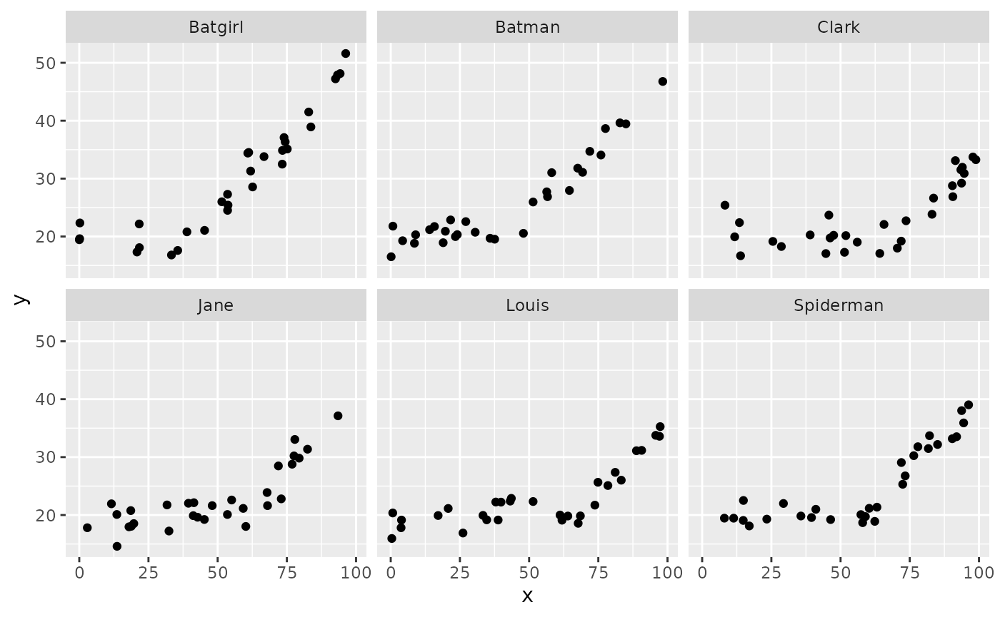
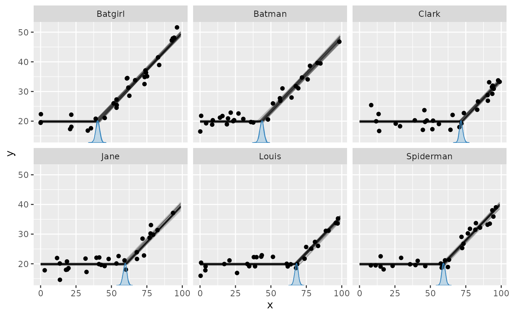
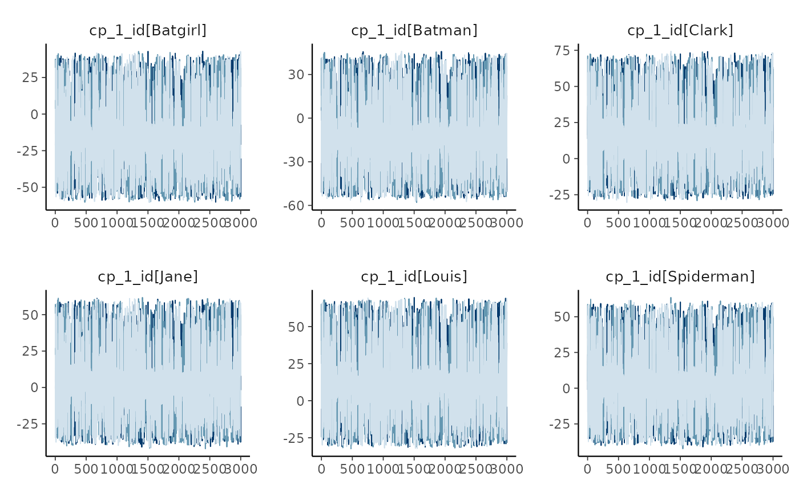
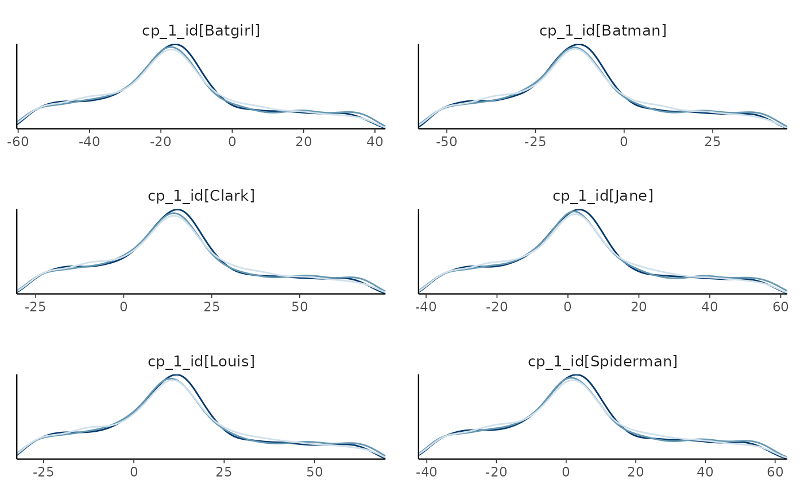
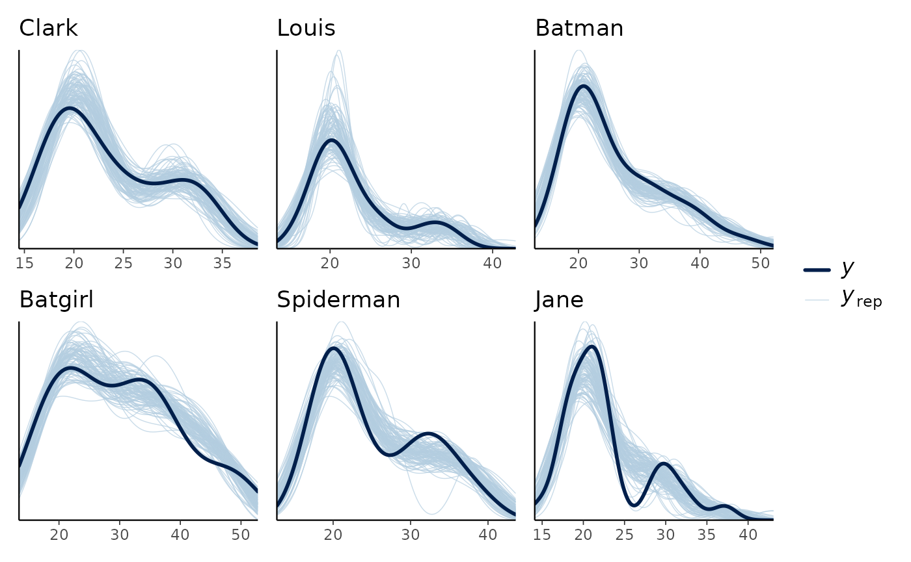

# Group-level (random) effects in mcp

`mcp` supports group-level effects (also called random effects) in both
the predictor and change-point parts of a formula. The syntax follows
`lme4` and `brms`: `(1|group)` specifies a group-level intercept,
`(factor||group)` specifies independent group coefficients,
[`fixef()`](https://lindeloev.github.io/mcp/dev/reference/summary.mcpfit.md)
reports population-level effects, and
[`ranef()`](https://lindeloev.github.io/mcp/dev/reference/summary.mcpfit.md)
reports group-level deviations.

This article in brief:

- Predictor and change-point group-level effects
- How group-level effects apply across segments
- How to simulate group-level change-point deviations
- Get posteriors using `ranef(fit)`
- Plot using `plot(fit, facet_by="my_group")` and
  `plot_pars(fit, pars = "group", type = "dens_overlay", ncol = 3)`.
- How group-specific change points are kept in range and ordered.
- The article on modeling standard deviation via
  [`sigma()`](https://rdrr.io/r/stats/sigma.html) contains [another
  group-level change-point
  example](https://lindeloev.github.io/mcp/dev/articles/dpar.md).

``` r

library(mcp)
future::plan(future::multisession, workers = 3)
```

## Specifying group-level change points

You specify group-level effects using the familiar
[`lmer`](https://www.rdocumentation.org/packages/lme4/versions/1.1-21/topics/lmer)
and `brms` syntax `(1|group)`. In the cp part, this models a
group-specific deviation from the population-level change point. For
example:

``` r

model = list(
  y ~ 1,  # Intercept_1
  1 + (1|id) ~ 0 + x  # cp_1, cp_1_sd, cp_1_id[i]
)
```

You can have multiple group-level change points, but they must use the
same grouping factor so their realized locations can be ordered within
each group:

``` r

model = list(
  y ~ 1,  # Intercept_1
  1 + (1|id) ~ 0 + x,  # cp_1, cp_1_sd, cp_1_id[i]
  1 + (1|id) ~ 0,      # cp_2, cp_2_sd, cp_2_id[i]
  (1|id) ~ 1           # cp_3 (implicit), cp_3_sd, cp_3_id[i]
)
```

For change point i and group g, the hierarchy is

\kappa\_{ig} \sim \operatorname{Normal}(cp_i, cp\_{i,\mathrm{sd}}),
\qquad cp\_{i,\mathrm{id}\[g\]} = \kappa\_{ig} - cp_i,

where \kappa\_{ig} is the group-specific location. Thus `cp_i_id[g]` is
the reported deviation and `cp_i_sd` is the latent normal scale. The
deviations are not forced to sum to zero.

The hierarchy is subject to x\_{\min} \< \kappa\_{1g} \< \cdots \<
\kappa\_{Kg} \< x\_{\max}. Thus, if adjacent change points both vary,
their group-specific locations are ordered against each other—not
against the adjacent population change point. Internally, JAGS samples
\kappa\_{ig} directly for efficiency.

Unlike predictor group-level effects, a change-point group effect
applies only at the change point where it is included.

## Predictor group-level effects

The same syntax in the predictor part gives each group a deviation from
the population-level intercept:

``` r

model = list(
  y ~ 1 + (1|id),  # Starts group-level intercept
  ~ 0 + x,         # (1|id) not included, so group intercepts end at cp_1
  ~ 1 + (0|id),    # (0|id) turns it off
  ~0 + same((1|id), as = 1)  # Share/reuse group-level intercept from segment 1
)
```

Group terms follow the [rules for how segments
connect](https://lindeloev.github.io/mcp/dev/articles/formulas.html#how-segments-connect),
separately for each grouping factor and distributional parameter. Group
intercepts apply only in segments that include them, so each group can
jump at a joined change point; use `same((1|id))` to keep them. Group
slopes on `x`, such as `(0 + x||id)`, are x-terms: they join until a
disjoined segment (`~ 1 + ...`), a later group intercept for the same
grouping factor, or `(0|id)`, which ends all group terms for `id`.

Notice `same()` above. It reuses the complete group term from the source
segment (deviations and SD), never a subset of it. Reused group slopes
are still measured from the current change point. The same syntax works
inside [`sigma()`](https://rdrr.io/r/stats/sigma.html) and other
distributional parameters. See `mcp_example("group_mu")`.

Use `||` for independent group-level slopes and factor coefficients:

``` r

model = list(
  y ~ 1 + state + (state||id),
  ~ 0 + x
)
```

With the default treatment coding, `(state||id)` contains a group-level
intercept and one group-level deviation for each non-reference contrast
of `state`. `(0 + state||id)` instead gives each factor level its own
group-level coefficient. Similarly, `(1 + z||id)` specifies independent
group-level intercepts and slopes on a numeric predictor `z`. Each
coefficient has its own population-level SD.

The population-level and group-level formulas need not contain the same
coefficients. For example, `y ~ 1 + (0 + state||id)` has a
population-level intercept but only group-specific state coefficients.

Group-level intercepts also work inside distributional formulas:

``` r

model = list(
  y ~ 1 + (1|id) + sigma(1 + (1|id))
)
```

This model has group-level deviations in both the conditional mean and
log-SD. The `||` syntax works inside distributional formulas too, for
example `sigma(1 + (state||id))`.

A later group intercept starts the group terms afresh. Thus, if
`(state||id)` is followed in a later segment by `(1||id)`, only the new
intercept deviations apply from that segment onward. In a joined
segment, a group term without an intercept, such as `(0 + x||id)`, joins
earlier group slopes, while `(0|id)` ends all group terms for `id`.

Multi-coefficient terms with `|`, such as `(1 + x|id)`, would imply
correlated group coefficients and are not yet supported; use
`(1 + x||id)` for independent coefficients. Group-level terms inside
[`ar()`](https://rdrr.io/r/stats/ar.html) and `ma()` are also not
supported.

Like change-point deviations, predictor deviations are not constrained
to sum to zero. They have an ordinary mean-zero hierarchical normal
distribution, matching multilevel regression in `lme4` and `brms`. For
example, `(1|id)` in segment 1 creates the deviation vector
`Intercept_1_id` and its population-level SD parameter
`Intercept_1_id_sd`. `(state||id)` additionally creates names such as
`stateB_1_id` and `stateB_1_id_sd`; inside
[`sigma()`](https://rdrr.io/r/stats/sigma.html), the corresponding names
start with `sigma`.

## Simulating group-level change points

Let us simulate group-specific deviations in the change point between a
plateau and a slope:

``` r

model = list(
  y ~ 1,  # Intercept_1
  1 + (1|id) ~ 0 + x  # cp_1, cp_1_sd, cp_1_id[i]
)
```

This follows the same interface as predictor group-level effects: supply
the population-level SD and `fit$simulate()` draws one deviation per
group from the same truncated normal hierarchy as the JAGS model (see
above), keeping each group’s change point in range. The deviations are
therefore not centered exactly on zero.

``` r

library(dplyr, warn.conflicts = FALSE)
group_levels = c("Clark", "Louis", "Batman", "Batgirl", "Spiderman", "Jane")
df = data.frame(
  x = runif(length(group_levels) * 30, 0, 100),  # 30 data points for each
  id = rep(group_levels, each = 30),  # the group names
  y = 1
)
empty = mcp(model, data = df, sample = FALSE)

df$y = empty$simulate(empty, df,
  # Population-level:
  Intercept_1 = 20, x_2 = 0.5, cp_1 = 50, sigma = 2,
  
  # Draw group-level deviations with this SD
  cp_1_sd = 15)

head(df)
```

    ##          x    id        y
    ## 1 91.48060 Clark 33.10525
    ## 2 93.70754 Clark 29.21492
    ## 3 28.61395 Clark 18.27841
    ## 4 83.04476 Clark 23.84163
    ## 5 64.17455 Clark 17.08157
    ## 6 51.90959 Clark 20.15997

For models with multiple group-level change points, `fit$simulate()`
draws the deviations in change-point order, truncated so each group’s
change point lies after its preceding one, just like the JAGS model. The
result:

``` r

library(ggplot2)
ggplot(df, aes(x=x, y=y)) + 
  geom_point() +
  facet_wrap(~id)
```



## Summarise and plot group-level effects

Fitting the model is simple:

``` r

fit = mcp(model, data = df)
```

If we just use `plot(fit)`, we would see all points in one plot. We want
to facet by `id`, so:

``` r

plot(fit, facet_by = "id")
```



It seems that `mcp` recovered the group-specific change points well.
There is a lot of information in these data because the population-level
intercept and slopes on either side of the change point are shared
across participants (`id`).

`summary(fit)` (or `fixef(fit)`) returns posterior summaries for the
population-level effects. To get the group-level deviations (random
effects), use:

``` r

mcp::ranef(fit)
```

    ##             variable       mean       sd     lower    upper     rhat ess_bulk ess_tail       sim match
    ## 1   cp_1_id[Batgirl] -14.828901 23.42185 -55.26252 35.32083 1.000926     4171     4598 -9.676304    OK
    ## 2    cp_1_id[Batman] -11.582779 23.42783 -52.08382 38.49255 1.001012     4099     4462 -7.137652    OK
    ## 3     cp_1_id[Clark]  16.576719 23.44898 -23.96506 66.70914 1.001117     4162     4432 20.834550    OK
    ## 4      cp_1_id[Jane]   4.413525 23.43513 -35.98966 54.66779 1.000838     4105     4586  9.978659    OK
    ## 5     cp_1_id[Louis]  12.891476 23.42891 -27.43964 63.12414 1.001123     4128     4664 16.354350    OK
    ## 6 cp_1_id[Spiderman]   4.201495 23.42361 -36.33909 54.50696 1.001008     4132     4561  9.741142    OK

Inspecting the `sim` and `match` columns, we see that the simulated
deviations lie within the intervals. However, the intervals are wide
because the deviations trade off against the population-level `cp_1`,
which is informed by only six groups. The group-specific locations
(`cp_1 + cp_1_id[g]`) are much more precise, as seen in the plot above.

Prediction methods include all group-level effects by default. Set
`group = FALSE` for population-only predictions, `group = "cp"` for all
group-level effects in the cp part, `group = "predictor"` for
predictor-side group-level effects, or supply an exact name such as
`group = "cp_1_id"`. `ranef(fit)` deliberately remains simple and
returns all group-level effects.

Good convergence is not always as obvious as in this example. While
`plot_pars(fit)` shows population-level parameters only, you can select
the group-level deviations with `"group"`:

``` r

plot_pars(fit, pars = "group", type = "trace", ncol = 3, nvariables = NULL)
```



The `ncol` argument controls the number of columns. Group-level effects
often have many levels, so this is useful for viewing all deviations.

Using `pars = "group"` plots all group-level deviations. To select one
group-level effect, use a regular expression in `regex_pars`; for
example, `^` anchors the start of a parameter name:

``` r

plot_pars(fit, regex_pars = "^cp_1_id", type = "dens_overlay", ncol = 2, nvariables = NULL)
```



You can also do posterior predictive checking with facets. I think that
for the relatively univariate models supported as of `mcp` 0.3, this
does not add much new information over and above
`plot(fit, facet_by = "id")`, but it’s a standard assessment that many
will be acquainted with:

``` r

pp_check(fit, facet_by = "id")
```



## Priors for group-level effects

You can see the priors of the model like this:

``` r

prior_summary(fit)
```

    ## # A tibble: 6 × 5
    ##   parameter   segment dpar  prior                                        bounds                        
    ##   <chr>         <int> <chr> <chr>                                        <chr>                         
    ## 1 cp_1              2 cp    dirichlet(alpha = 1)                         [min(x), max(x)]              
    ## 2 cp_1_sd           2 cp    normal(mean = 0, sd = 197.7306)              [0, Inf]                      
    ## 3 cp_1_id           2 cp    normal(mean = 0, sd = cp_1_sd)               [min(x) - cp_1, max(x) - cp_1]
    ## 4 Intercept_1       1 mu    normal(mean = 25.18647, sd = 18.62054)       none                          
    ## 5 x_2               2 mu    normal(mean = 0, sd = 0.6458842)             none                          
    ## 6 sigma_1           1 sigma student_t(df = 3, location = 0, scale = 5.3) [0.001, Inf]

`cp_1_sd` is the latent normal scale governing the `cp_1_id` deviations.
Unlike predictor group-level effects, change-point locations are also
constrained to remain in range and ordered within each group.

## JAGS code

Here is the JAGS code for the model used in this article:

``` r

fit$jags_code
```

    ## model {
    ##   # mcp helper values
    ##   cp_0 = CONST1_
    ##   cp_2 = CONST2_
    ## 
    ##   # Priors for population-level effects
    ##   cp_frac_1_ ~ dbeta(1, 1)  # Relative fraction of remaining span (Uniform order statistics)
    ##   cp_1 = cp_0 + cp_frac_1_ * (cp_2 - cp_0)  # Ordered change point
    ##   cp_1_sd ~ dnorm(0, 1/(197.7306)^2) T(0,)  # Group-level change-point variation
    ##   Intercept_1 ~ dnorm(25.18647, 1/(18.62054)^2)   # Mean intercept (rstanarm default)
    ##   x_2 ~ dnorm(0, 1/(0.6458842)^2)   # Autoscaled mean coefficient (rstanarm default)
    ##   sigma_1 ~ dt(0, 1/(5.3)^2, 3) T(0.001,)  # Positive residual SD calibrated on the response scale
    ## 
    ##   # Priors for group-level effects
    ##   for (id_ in 1:n_unique_id) {
    ##     cp_1_id_location[id_] ~ dnorm(cp_1 + CONST3_, 1/(cp_1_sd)^2) T(cp_1 + (CONST1_ - cp_1), cp_1 + (CONST2_ - cp_1))  # Ordered group-level change-point deviations from the population location
    ##     cp_1_id[id_] = cp_1_id_location[id_] - cp_1  # deviation from population change point
    ##   }
    ## 
    ##   # Model and likelihood
    ##   for (i_ in 1:length(x)) {
    ##     # par_x local to each segment
    ##     x_local_1_[i_] = min(x[i_], (cp_1_id_location[id[i_]]))
    ##     x_local_2_[i_] = min(x[i_], cp_2) - (cp_1_id_location[id[i_]])
    ##     
    ##     # Formula for mu
    ##     link_mu_[i_] =
    ##       (x[i_] >= cp_0) * inprod(rhs_matrix_[i_, c(1)], c(Intercept_1)) * 1 + 
    ##       (x[i_] >= (cp_1_id_location[id[i_]])) * inprod(rhs_matrix_[i_, c(2)], c(x_2)) * x_local_2_[i_]
    ##     
    ##     # Formula for sigma
    ##     link_sigma_[i_] =
    ##       (x[i_] >= cp_0) * inprod(rhs_matrix_[i_, c(3)], c(sigma_1)) * 1
    ## 
    ##     # Likelihood and log-density for family = gaussian()
    ##     mu_[i_] = link_mu_[i_]
    ##     sigma_[i_] = max(1e-03, link_sigma_[i_])
    ##     y[i_] ~ dnorm(mu_[i_], 1 / sigma_[i_]^2)
    ##   }
    ## }
