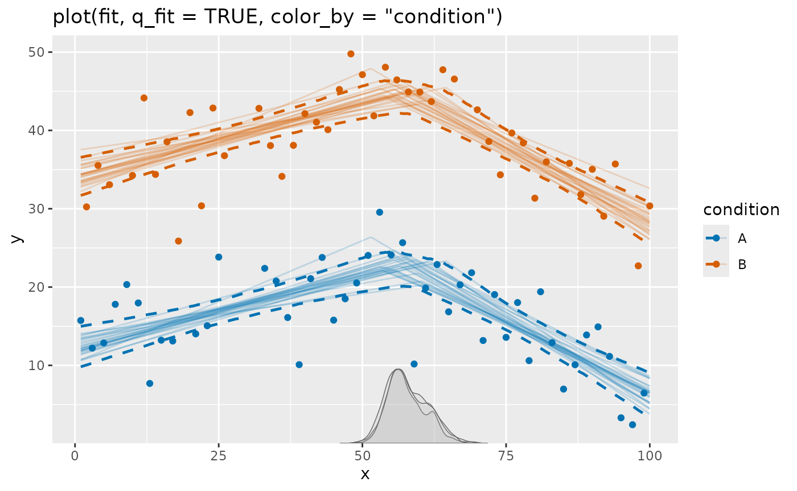
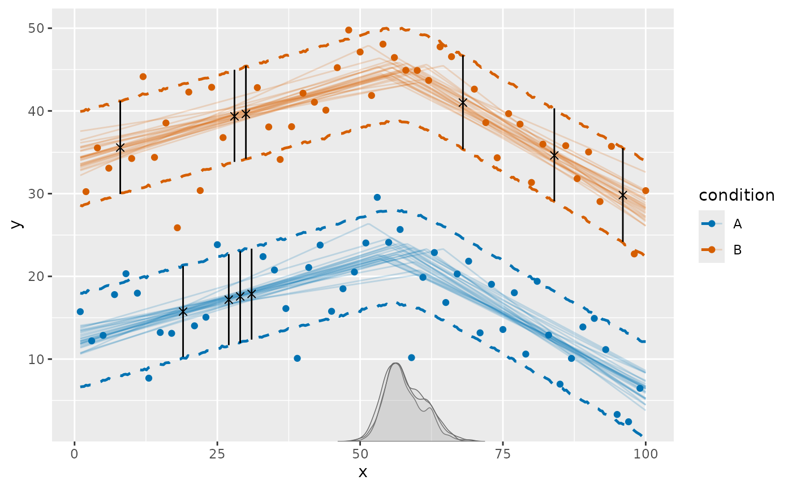
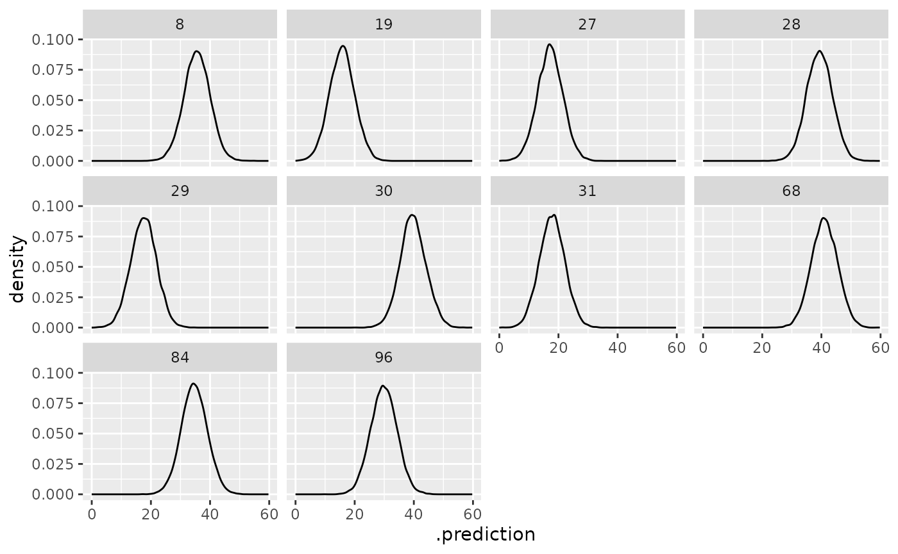

# Missing responses and imputation

`mcp` allows missing values in the response. JAGS treats the unknown
responses as latent variables and samples them together with the model
parameters. `mcp` retains those posterior imputation draws for later
use. This article shows how to inspect expected responses, posterior
imputations, and their uncertainty.

## An example with missing responses

The built-in example has a change in slope, a strong difference between
two conditions, scattered missing responses, and a short run of missing
responses. First, let’s fit the example and visualize it:

``` r

library(mcp)
library(dplyr)
library(ggplot2)
set.seed(42)
```

``` r

fit = mcp_example("missing")
```



The ordinary plot shows the observed responses and model estimates.
Missing responses are omitted. See below how they can be visualized.

The underlying data contain some missing responses in `y`:

``` r

fit$data |> filter(is.na(y))
```

    ##     y  x condition
    ## 1  NA  8         B
    ## 2  NA 19         A
    ## 3  NA 27         A
    ## 4  NA 28         B
    ## 5  NA 29         A
    ## 6  NA 30         B
    ## 7  NA 31         A
    ## 8  NA 68         B
    ## 9  NA 84         B
    ## 10 NA 96         B

## Expected responses and imputations

You can see the imputations fairly directly.
[`predict()`](https://lindeloev.github.io/mcp/dev/reference/execute-mcp-model.md)
describes plausible values of the missing response itself. These are the
latent response draws sampled jointly with the model parameters. The
imputation comes from trends in non-missing data and what they imply,
given the observed covariates (`condition` and `x`), for the missing
rows.

``` r

# Quantiles of posterior predictive for missing data: 10%, median, 90%
predict(fit, probs = c(0.1, 0.5, 0.9)) |>
  filter(is.na(y))
```

    ##     y  x condition  predict    error      Q10      Q50      Q90
    ## 1  NA  8         B 35.56253 4.419118 29.95548 35.56930 41.20200
    ## 2  NA 19         A 15.73385 4.291075 10.25534 15.74153 21.24741
    ## 3  NA 27         A 17.18995 4.319638 11.68267 17.18341 22.69825
    ## 4  NA 28         B 39.35814 4.360269 33.84142 39.34863 44.97061
    ## 5  NA 29         A 17.53493 4.342543 11.93050 17.57624 23.03809
    ## 6  NA 30         B 39.72457 4.395872 34.21186 39.63402 45.46708
    ## 7  NA 31         A 17.86313 4.310939 12.35445 17.88023 23.35061
    ## 8  NA 68         B 41.02949 4.432776 35.35581 41.01021 46.73113
    ## 9  NA 84         B 34.66639 4.403015 29.10218 34.61960 40.31673
    ## 10 NA 96         B 29.84740 4.444047 24.17653 29.82303 35.50264

[`fitted()`](https://lindeloev.github.io/mcp/dev/reference/execute-mcp-model.md)
has the same syntax as
[`predict()`](https://lindeloev.github.io/mcp/dev/reference/execute-mcp-model.md)
but returns the posterior *expected* response. Its intervals are
narrower because they do not include response variation:

``` r

# Quantiles of posterior evaluated at missing data: 10%, median, 90%
fitted(fit, probs = c(0.1, 0.5, 0.9)) |>
  filter(is.na(y))
```

    ##     y  x condition   fitted     error      Q10      Q50      Q90
    ## 1  NA  8         B 35.59660 1.0822734 34.21332 35.58895 36.97023
    ## 2  NA 19         A 15.67273 0.8439373 14.59499 15.66736 16.75268
    ## 3  NA 27         A 17.18509 0.7712880 16.19701 17.19370 18.16411
    ## 4  NA 28         B 39.37751 0.7529116 38.41263 39.38142 40.32518
    ## 5  NA 29         A 17.56318 0.7702221 16.57246 17.56510 18.55032
    ## 6  NA 30         B 39.75560 0.7532309 38.79511 39.75869 40.70785
    ## 7  NA 31         A 17.94128 0.7763222 16.94184 17.94266 18.93378
    ## 8  NA 68         B 41.01491 1.1308007 39.66032 40.93023 42.50801
    ## 9  NA 84         B 34.61602 0.8909397 33.47974 34.61514 35.75656
    ## 10 NA 96         B 29.81495 1.2722363 28.18347 29.82766 31.43195

## Visualize imputations on the model plot

Imputations are not added to
[`plot()`](https://lindeloev.github.io/mcp/dev/reference/plot.mcpfit.md)
automatically. Since
[`plot()`](https://lindeloev.github.io/mcp/dev/reference/plot.mcpfit.md)
returns a ggplot, it is easy to extend. Here an `×` marks the posterior
median and a vertical line shows the central 80% imputation interval:

``` r

imputed = predict(fit, probs = c(0.1, 0.5, 0.9)) |>
  filter(is.na(y))

# Start with mcp plot with prediction interval. Use all draws for less Monte Carlo error.
set.seed(42)
plot(fit, color_by = "condition", q_predict = c(0.1, 0.9), ndraws = Inf) +

  # Add posterior predictive interval
  geom_linerange(
    data = imputed,
    aes(x = x, ymin = Q10, ymax = Q90),
    inherit.aes = FALSE,
    color = "black"
  ) +

  # Add "x" at posterior median
  geom_point(
    data = imputed,
    aes(x = x, y = Q50),
    inherit.aes = FALSE,
    shape = 4,  # an "x"
    size = 2
  )
```



This deliberately distinguishes imputed values from the solid observed
points. You can change the quantiles, marker, color, or add a subset of
the missing rows using ordinary `dplyr` and `ggplot2` code.

The plot above reduces each posterior predictive distribution to a
simple interval. Use `summary = FALSE` when you need the individual
draws instead. Here we plot the posterior predictive distribution for
each missing row:

``` r

imputed_draws = predict(fit, summary = FALSE) |>
  filter(is.na(y))

ggplot(imputed_draws, aes(x = .prediction)) +
  geom_density() + 
  facet_wrap(~x)
```



### Making probabilistic statements about missing responses

Sometimes, the missing response is of direct interest. For example, you
may want to know the probability that a missing response is above a
threshold. You can use
[`predict()`](https://lindeloev.github.io/mcp/dev/reference/execute-mcp-model.md)
with `summary = FALSE` to get all posterior draws and then calculate
probabilities of various statements. For example:

``` r

imputed_draws |>
  filter(data_row == 19) |>
  summarise(
    p_greater = mean(.prediction > 20),
    p_lower = mean(.prediction < 10),
    p_between = mean(.prediction > 10 & .prediction < 20)
  )
```

    ## # A tibble: 1 × 3
    ##   p_greater p_lower p_between
    ##       <dbl>   <dbl>     <dbl>
    ## 1     0.160  0.0876     0.753

### Other continuous predictors

Plotting differs from
[`fitted()`](https://lindeloev.github.io/mcp/dev/reference/execute-mcp-model.md)
and
[`predict()`](https://lindeloev.github.io/mcp/dev/reference/execute-mcp-model.md)
in one respect: The smooth curves in
[`plot()`](https://lindeloev.github.io/mcp/dev/reference/plot.mcpfit.md)
are evaluated on data made by
[`interpolate_newdata()`](https://lindeloev.github.io/mcp/dev/reference/interpolate_newdata.md),
which keeps additional continuous predictors (i.e., predictors not
assigned an aesthetic) at their observed means by default, or at values
supplied through the `at`-argument. The plot caption reports these fixed
values.

The imputation markers above are different: `predict(fit)` evaluates the
original data, so every missing row uses its own predictor values. If
another continuous predictor is especially important, an imputation may
therefore lie away from a curve drawn at that predictor’s mean. This is
expected, just as an observed response with unusual predictor values may
lie away from that curve. Use `plot(fit, at = ...)` or
`interpolate_newdata(fit, at = ...)` or make separate plots when those
differences deserve emphasis.

## What else can be modeled?

Missing responses work with the usual `mcp` model features. For example,
you can:

- Include [continuous and categorical
  predictors](https://lindeloev.github.io/mcp/dev/articles/formulas.md)
  so imputations follow observed covariate information.
- Use [group-level
  effects](https://lindeloev.github.io/mcp/dev/articles/group_effects.md)
  so sparsely observed groups borrow information from the population and
  their available observations.
- [Model changing residual standard deviation with
  `sigma()`](https://lindeloev.github.io/mcp/dev/articles/dpar.md) so
  imputation uncertainty can vary over the predictor range.
- Use [binomial, Bernoulli, Poisson, or negative-binomial
  responses](https://lindeloev.github.io/mcp/dev/articles/families.md).
  Their imputations remain on the appropriate discrete response scale;
  binomial predictions can also be returned as rates.

The predictors required by the model must themselves be observed. `mcp`
currently imputes missing responses, not missing predictor values, and
it does not model the process that caused responses to be missing. As
with ordinary regression using incomplete outcomes, interpretation
relies on the missing responses being reasonably explained by the
observed predictors and model structure.

## Model evaluation and time-series histories

Missing rows are not treated as observed contributions to
[`log_lik()`](https://lindeloev.github.io/mcp/dev/reference/execute-mcp-model.md),
[`loo()`](https://lindeloev.github.io/mcp/dev/reference/loo.mcpfit.md),
or
[`waic()`](https://lindeloev.github.io/mcp/dev/reference/loo.mcpfit.md).
For ordinary non-AR/MA models, the remaining observed rows can still be
used for these calculations.

AR/MA models need extra care because a missing response can become part
of the history for later observations. `mcp` retains the JAGS draws so
[`fitted()`](https://lindeloev.github.io/mcp/dev/reference/execute-mcp-model.md)
and
[`predict()`](https://lindeloev.github.io/mcp/dev/reference/execute-mcp-model.md)
can reconstruct that history, but it does not currently integrate over
missing histories for pointwise likelihood calculations. Consequently,
[`log_lik()`](https://lindeloev.github.io/mcp/dev/reference/execute-mcp-model.md),
[`loo()`](https://lindeloev.github.io/mcp/dev/reference/loo.mcpfit.md),
and
[`waic()`](https://lindeloev.github.io/mcp/dev/reference/loo.mcpfit.md)
are unavailable when a missing response preceeds some observed data.

The [time-series
article](https://lindeloev.github.io/mcp/dev/articles/arma.md) discusses
this. Briefly, use `posterior_predict()` to generate fresh replicated
series from the posteriors (as all other mcp functions do), which do not
depend on the observed response history.

## Original data versus new data

The retained JAGS draws belong to the missing rows in the original
fitted data. Calling `predict(fit)` uses them. For the non-AR/MA example
in this article, predictions for genuinely new data are ordinary
posterior predictions rather than imputations of the original missing
responses:

``` r

newdata = data.frame(
  x = c(20, 80),
  condition = factor(c("A", "B"), levels = levels(fit$data$condition))
)

predict(fit, newdata = newdata, probs = c(0.1, 0.5, 0.9))
```

    ##    x condition  predict    error      Q10      Q50      Q90
    ## 1 20         A 15.91159 4.360699 10.27322 15.95551 21.36106
    ## 2 80         B 36.23491 4.358845 30.66190 36.24973 41.81820
