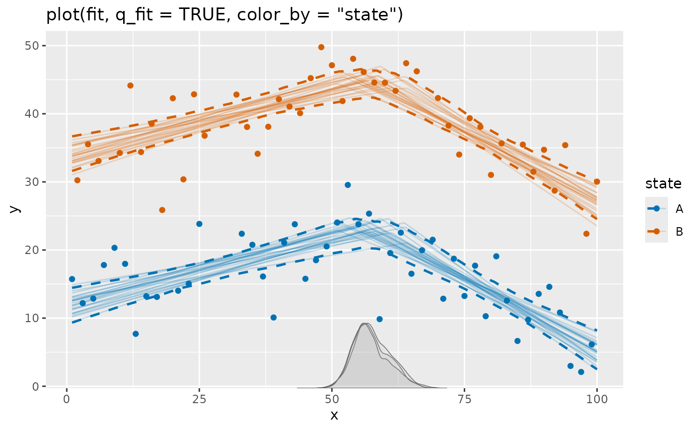
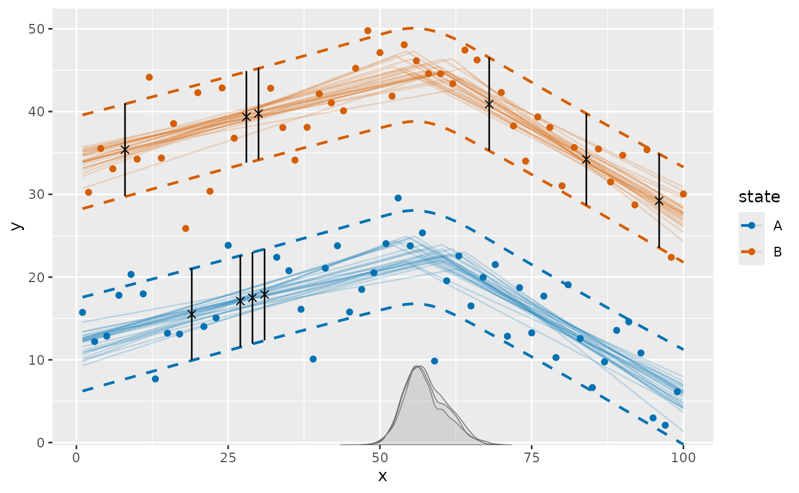
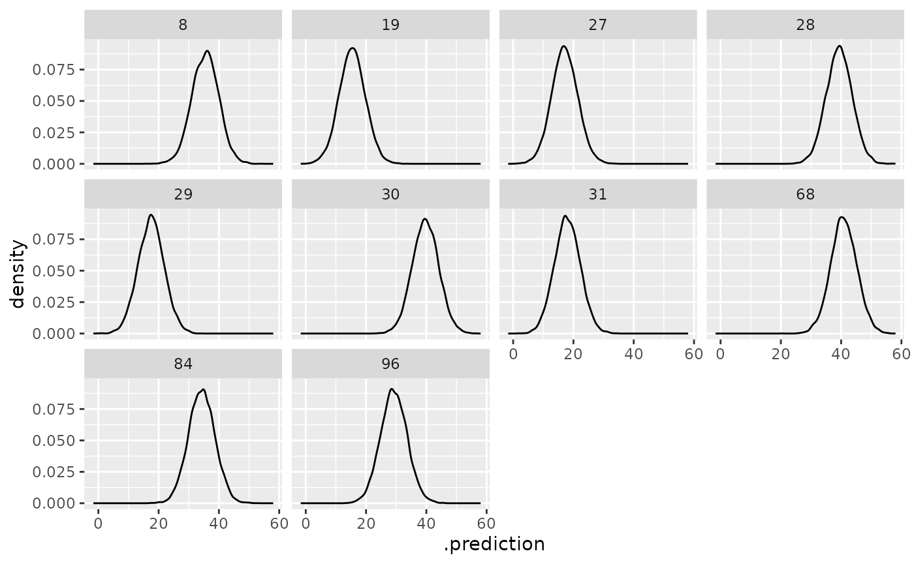

# Missing responses and imputation

`mcp` allows missing values in the response. JAGS treats the unknown
responses as latent variables and samples them together with the model
parameters. `mcp` retains those posterior imputation draws for later
use. This article shows how to inspect expected responses, posterior
imputations, and their uncertainty.

## An example with missing responses

The built-in example has a change in slope, a strong difference between
two states, scattered missing responses, and a short run of missing
responses. First, let’s fit the example and visualize it:

``` r

library(mcp)
library(dplyr)
library(ggplot2)
```

``` r

fit = mcp_example("missing")
```



The ordinary plot shows the observed responses and model estimates.
Missing responses are omitted. See below how they can be visualized.

The underlying data contain some missing responses in `y`:

``` r

fit$data |> filter(is.na(y))
```

    ##     y  x state
    ## 1  NA  8     B
    ## 2  NA 19     A
    ## 3  NA 27     A
    ## 4  NA 28     B
    ## 5  NA 29     A
    ## 6  NA 30     B
    ## 7  NA 31     A
    ## 8  NA 68     B
    ## 9  NA 84     B
    ## 10 NA 96     B

## Expected responses and predictions

[`predict()`](https://lindeloev.github.io/mcp/dev/reference/execute-mcp-model.md)
evaluates the posterior predictive distribution at the missing rows,
generating fresh simulated responses that include residual variation.
The predictions come from trends in non-missing data and what they
imply, given the observed covariates (`state` and `x`), for the missing
rows.

``` r

# Quantiles of posterior predictive for missing data: 10%, median, 90%
imputed = predict(fit, probs = c(0.1, 0.5, 0.9)) |>
  filter(is.na(y))
imputed
```

    ##     y  x state  predict       sd       Q10      Q50      Q90
    ## 1  NA  8     B 35.45345 4.386589 29.773656 35.39169 41.01965
    ## 2  NA 19     A 15.43809 4.381197  9.953695 15.50569 21.06093
    ## 3  NA 27     A 17.08113 4.289495 11.557569 17.09433 22.63124
    ## 4  NA 28     B 39.32535 4.325647 33.829700 39.36367 44.89855
    ## 5  NA 29     A 17.45105 4.348898 11.954423 17.49148 23.02793
    ## 6  NA 30     B 39.84313 4.324595 34.226327 39.76084 45.29546
    ## 7  NA 31     A 17.80191 4.360712 12.349630 17.88864 23.42627
    ## 8  NA 68     B 40.92797 4.436705 35.267203 40.89004 46.54264
    ## 9  NA 84     B 34.22311 4.328006 28.660885 34.22310 39.78665
    ## 10 NA 96     B 29.17941 4.442429 23.532199 29.21877 34.89677

[`fitted()`](https://lindeloev.github.io/mcp/dev/reference/execute-mcp-model.md)
has the same syntax as
[`predict()`](https://lindeloev.github.io/mcp/dev/reference/execute-mcp-model.md)
but returns the posterior *expected* response. Its intervals are
narrower because they do not include response variation:

``` r

# Quantiles of posterior evaluated at missing data: 10%, median, 90%
fitted(fit, probs = c(0.1, 0.5, 0.9)) |>
  filter(is.na(y))
```

    ##     y  x state   fitted        sd      Q10      Q50      Q90
    ## 1  NA  8     B 35.39478 1.0927946 33.99687 35.38418 36.80770
    ## 2  NA 19     A 15.50674 0.8459778 14.42264 15.51230 16.58823
    ## 3  NA 27     A 17.09444 0.7751878 16.10607 17.09719 18.08262
    ## 4  NA 28     B 39.36404 0.7655497 38.39038 39.35423 40.34212
    ## 5  NA 29     A 17.49136 0.7747784 16.50649 17.48963 18.47974
    ## 6  NA 30     B 39.76096 0.7661437 38.79187 39.75462 40.73938
    ## 7  NA 31     A 17.88829 0.7815812 16.89242 17.88402 18.89368
    ## 8  NA 68     B 40.89909 1.1411081 39.55064 40.79432 42.39155
    ## 9  NA 84     B 34.22348 0.8842023 33.08631 34.22620 35.34917
    ## 10 NA 96     B 29.21615 1.2674923 27.56746 29.24404 30.82415

## Visualize imputations on the model plot

Imputations are not added to
[`plot()`](https://lindeloev.github.io/mcp/dev/reference/plot.mcpfit.md)
automatically. Since
[`plot()`](https://lindeloev.github.io/mcp/dev/reference/plot.mcpfit.md)
returns a ggplot, it is easy to extend. Here an `×` marks the posterior
median and a vertical line shows the central 80% imputation interval:

``` r

# Start with mcp plot with prediction interval. Use all draws for less Monte Carlo error.
plot(fit, color_by = "state", q_predict = c(0.1, 0.9)) +

  # Add imputation interval
  geom_linerange(
    data = imputed,
    aes(x = x, ymin = Q10, ymax = Q90),
    inherit.aes = FALSE,
    color = "black"
  ) +

  # Add "x" at posterior median
  geom_point(
    data = imputed,
    aes(x = x, y = Q50),
    inherit.aes = FALSE,
    shape = 4,  # an "x"
    size = 2
  )
```



This deliberately distinguishes imputed values from the solid observed
points. You can change the quantiles, marker, color, or add a subset of
the missing rows using ordinary `dplyr` and `ggplot2` code.

The plot above reduces each imputation distribution to an interval. Use
`summary = FALSE` when you need the individual draws instead. Here we
plot the imputation distribution for each missing row:

``` r

missing_draws = predict(fit, summary = FALSE) |>
  filter(is.na(y))

ggplot(missing_draws, aes(x = .prediction)) +
  geom_density() + 
  facet_wrap(~x)
```



### Making probabilistic statements about missing responses

Sometimes, the missing response is of direct interest. For example, you
may want to know the probability that a missing response is above a
threshold. You can use
[`predict()`](https://lindeloev.github.io/mcp/dev/reference/execute-mcp-model.md)
with `summary = FALSE` to get all posterior predictive draws and then
calculate probabilities of various statements. For example:

``` r

missing_draws |>
  filter(data_row == 19) |>
  summarise(
    p_greater = mean(.prediction > 20),
    p_lower = mean(.prediction < 10),
    p_between = mean(.prediction > 10 & .prediction < 20)
  )
```

    ## # A tibble: 1 × 3
    ##   p_greater p_lower p_between
    ##       <dbl>   <dbl>     <dbl>
    ## 1     0.147   0.103     0.750

### Other continuous predictors

Plotting differs from
[`fitted()`](https://lindeloev.github.io/mcp/dev/reference/execute-mcp-model.md)
and
[`predict()`](https://lindeloev.github.io/mcp/dev/reference/execute-mcp-model.md)
in one respect: The smooth curves in
[`plot()`](https://lindeloev.github.io/mcp/dev/reference/plot.mcpfit.md)
are evaluated on data made by
[`interpolate_newdata()`](https://lindeloev.github.io/mcp/dev/reference/interpolate_newdata.md),
which keeps additional continuous predictors (i.e., predictors not
assigned an aesthetic) at their observed means by default, or at values
supplied through the `at`-argument. The plot caption reports these fixed
values.

The imputation markers above are different: `predict(fit)` evaluates the
original data, so every missing row uses its own predictor values. If
another continuous predictor is especially important, an imputation may
therefore lie away from a curve drawn at that predictor’s mean. This is
expected, just as an observed response with unusual predictor values may
lie away from that curve. Use `plot(fit, at = ...)` or
`interpolate_newdata(fit, at = ...)` or make separate plots when those
differences deserve emphasis.

## What else can be modeled?

Missing responses work with the usual `mcp` model features. For example,
you can:

- Include [continuous and categorical
  predictors](https://lindeloev.github.io/mcp/dev/articles/formulas.md)
  so imputations follow observed covariate information.
- Use [group-level
  effects](https://lindeloev.github.io/mcp/dev/articles/group_effects.md)
  so sparsely observed groups borrow information from the population and
  their available observations.
- [Model changing residual standard deviation with
  `sigma()`](https://lindeloev.github.io/mcp/dev/articles/dpar.md) so
  imputation uncertainty can vary over the predictor range.
- Use [binomial, Bernoulli, Poisson, or negative-binomial
  responses](https://lindeloev.github.io/mcp/dev/articles/families.md).
  Their imputations remain on the appropriate discrete response scale;
  binomial predictions can also be returned as rates.

The predictors required by the model must themselves be observed. `mcp`
currently imputes missing responses, not missing predictor values, and
it does not model the process that caused responses to be missing. As
with ordinary regression using incomplete outcomes, interpretation
relies on the missing responses being reasonably explained by the
observed predictors and model structure.

## Model evaluation and time-series histories

Missing rows are not treated as observed contributions to
[`log_lik()`](https://lindeloev.github.io/mcp/dev/reference/execute-mcp-model.md),
[`loo()`](https://lindeloev.github.io/mcp/dev/reference/loo.mcpfit.md),
or
[`waic()`](https://lindeloev.github.io/mcp/dev/reference/loo.mcpfit.md).
For ordinary non-AR/MA models, the remaining observed rows can still be
used for these calculations.

AR/MA models need extra care because a missing response can become part
of the history for later observations. `mcp` retains the JAGS draws so
[`fitted()`](https://lindeloev.github.io/mcp/dev/reference/execute-mcp-model.md)
and
[`predict()`](https://lindeloev.github.io/mcp/dev/reference/execute-mcp-model.md)
can reconstruct that history, but it does not currently integrate over
missing histories for pointwise likelihood calculations. Consequently,
[`log_lik()`](https://lindeloev.github.io/mcp/dev/reference/execute-mcp-model.md),
[`loo()`](https://lindeloev.github.io/mcp/dev/reference/loo.mcpfit.md),
and
[`waic()`](https://lindeloev.github.io/mcp/dev/reference/loo.mcpfit.md)
are unavailable when a missing response precedes some observed data.

The [time-series
article](https://lindeloev.github.io/mcp/dev/articles/arma.md) discusses
this. Use `predict(fit, conditional = FALSE)` or
`posterior_predict(fit, conditional = FALSE)` to generate fresh
replicated series recursively. Their histories are generated rather than
taken from the observed responses. The default predictions condition on
observed responses and retained imputations as histories, but still
generate fresh outcomes at every row.

## Original data versus new data

In AR/MA models, the retained JAGS draws belong to the missing rows in
the original fitted data and supply their histories. For the non-AR/MA
example in this article, predictions for genuinely new data are ordinary
posterior predictions, evaluated just like predictions at the missing
rows:

``` r

newdata = data.frame(
  x = c(20, 80),
  state = factor(c("A", "B"), levels = levels(fit$data$state))
)

predict(fit, newdata = newdata, probs = c(0.1, 0.5, 0.9))
```

    ##    x state  predict       sd      Q10      Q50      Q90
    ## 1 20     A 15.76983 4.386446 10.15562 15.70427 21.25578
    ## 2 80     B 35.90065 4.371161 30.33700 35.89114 41.45010
