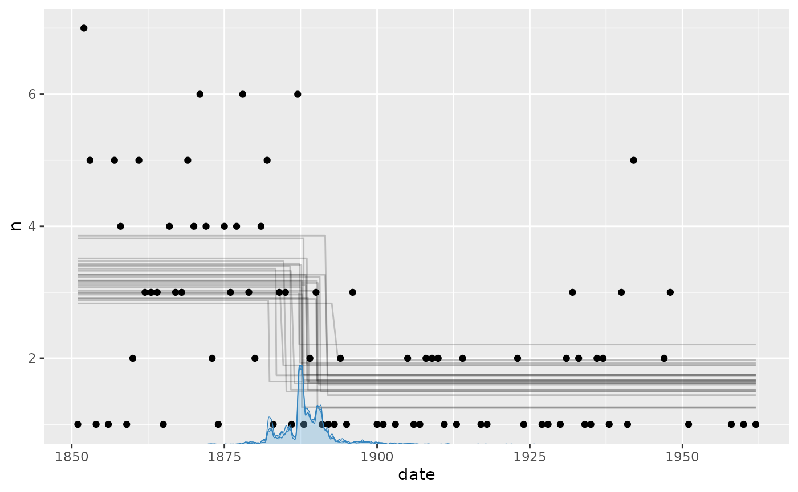
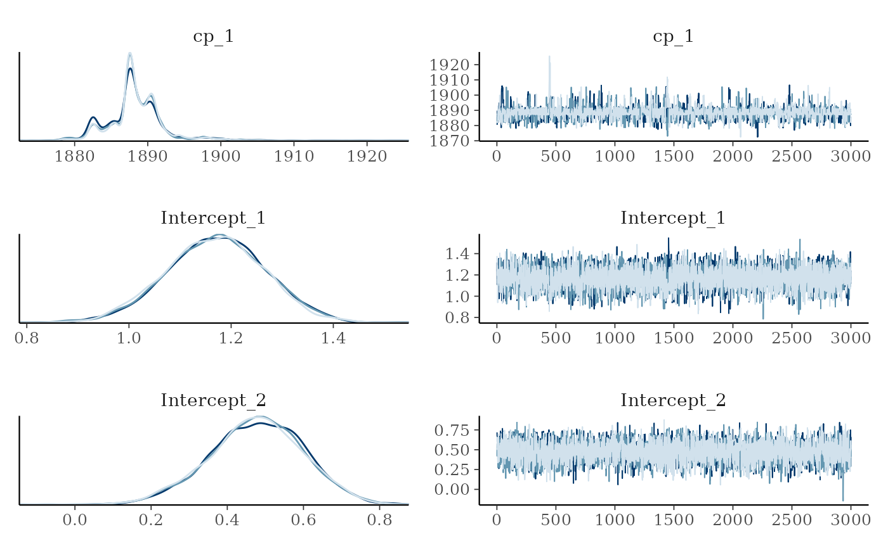
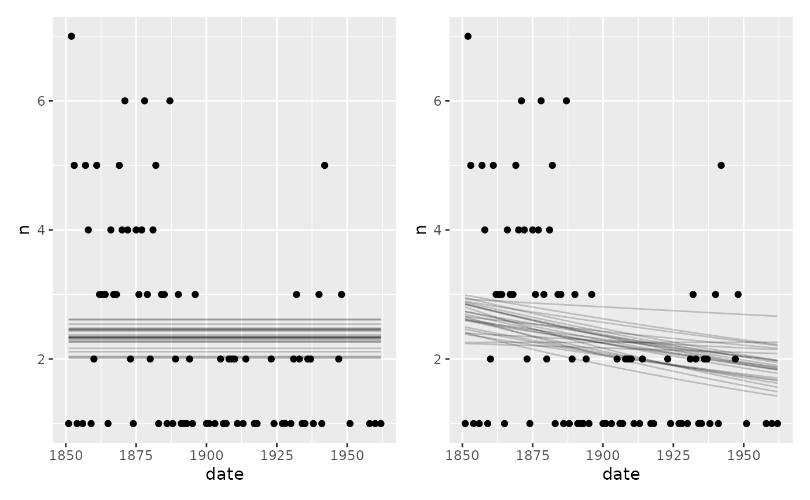

# Poisson and negative-binomial change point analysis

The Poisson and negative-binomial distributions model counts observed
within comparable units of time, space, or exposure. The worked example
below uses Poisson regression; a later section explains the additional
`shape` parameter and priors in
[`negbinomial()`](https://lindeloev.github.io/mcp/dev/reference/negbinomial.md).

## Coal mining disasters

A dataset on coal mining disasters has grown very popular in the change
point literature (available in
[`boot::coal`](https://rdrr.io/pkg/boot/man/coal.html)). It contains a
timestamp of each coal mining disaster from 1851 to 1962. By binning the
number of events within each year (fixed time frame), we have something
very Poisson-friendly:

``` r

# Number of disasters by year
library(dplyr, warn.conflicts = FALSE)
df = round(boot::coal) %>% 
  group_by(date) %>% 
  count()

# See it
head(df)
```

    ## # A tibble: 6 × 2
    ## # Groups:   date [6]
    ##    date     n
    ##   <dbl> <int>
    ## 1  1851     1
    ## 2  1852     7
    ## 3  1853     5
    ## 4  1854     1
    ## 5  1856     1
    ## 6  1857     5

The number of events (`n`) as a function of year (`date`) is typically
modeled as a change between two intercepts. This is very simple to do in
`mcp`:

``` r

library(mcp)
future::plan(future::multisession, workers = 3)
set.seed(42)  # Make the script deterministic
```

``` r

model = list(
  n ~ 1,  # intercept-only
  ~ 1  # intercept-only
)

fit = mcp(model, data = df, family = poisson(), par_x = "date", seed = 42)
```

Let us see the two intercepts (lambda in log-units) and the change point
(in years):

``` r

result = summary(fit)
```

    ## Family: poisson
    ## Links: mu = log
    ## Iterations: 3000 from 3 chains.
    ## Segments:
    ##   1: n ~ 1
    ##   2: n ~ 1 ~ 1
    ## 
    ## Change point parameters:
    ##     variable    mean    sd   lower   upper rhat ess_bulk ess_tail
    ##  cp_1        1888.36 3.902 1881.67 1898.25 1.00     1584     1440
    ## 
    ## Population-level parameters:
    ##     variable    mean    sd   lower   upper rhat ess_bulk ess_tail
    ##  Intercept_1    1.17 0.096    0.98    1.36 1.00     3679     4107
    ##  Intercept_2    0.48 0.123    0.22    0.71 1.00     3978     4474

We can see that the model ran well with good convergence and a large
number of effective samples. At a first glance, the change point is
estimated to lie between the years 1880 and 1895 (approximately).

Let us take a more direct look, using the default `mcp` plot:

``` r

set.seed(42)
plot(fit)
```



It seems to fit the data well, but we can see that the change point
probability “lumps” around particular data points. Years with a very low
number of disasters abruptly increase the probability that the change to
a lower disaster rate has taken place. The posterior distributions of
change points regularly take these “weird” forms, i.e., not
well-described by our toolbox of parameterized distributions.

We can see this more clearly if plotting the posteriors. We include a
traceplot too, just to check convergence visually.

``` r

set.seed(42)
plot_pars(fit)
```



## Priors for Poisson models

[`poisson()`](https://rdrr.io/r/stats/family.html) defaults to
`link = 'log'`, meaning that we have to exponentiate the estimates to
get the “raw” Poisson parameter \lambda. \lambda has the nice property
of being the mean number of events. So we see that the mean number of
events in segment 1 is `exp(result$mean[2])` (3.2229705) and it is
`exp(result$mean[3])` (1.6108874) for segment 2.

The intercept prior is a Student-t distribution centered on the rounded
median of `log(pmax(n, 0.1))`, with scale equal to the maximum of 2.5
and its rounded MAD. This follows the robust calibration in `brms`;
[`pmax()`](https://rdrr.io/r/base/Extremes.html) keeps zeros finite and
the minimum scale avoids a narrow prior.

Categorical contrasts use scale 2.5; numeric coefficients are scaled to
a representative predictor change. These are proper Student-t priors
where `brms` is flat, allowing prior sampling and mild regularization of
short segments.

``` r

prior_summary(fit)
```

    ## # A tibble: 3 × 5
    ##   parameter   segment dpar  prior                                          bounds                
    ##   <chr>         <int> <chr> <chr>                                          <chr>                 
    ## 1 cp_1              2 cp    dirichlet(alpha = 1)                           [min(date), max(date)]
    ## 2 Intercept_1       1 mu    student_t(df = 3, location = 0.7, scale = 2.5) none                  
    ## 3 Intercept_2       2 mu    student_t(df = 3, location = 0.7, scale = 2.5) none

As always, the prior on the change point forces it to occur in the
observed range. The coefficient priors are deliberately broad defaults,
so update them with more informed priors for your particular case when
possible, e.g.:

``` r

prior = list(
  cp_1 = "dnorm(1900, 30) T(min(date), 1925)"
)
fit_with_prior = mcp(model, data = df, family = poisson(), prior = prior, par_x = "date")
```

## Negative-binomial extension

[`negbinomial()`](https://lindeloev.github.io/mcp/dev/reference/negbinomial.md)
uses log links for both its conditional mean `mu` and overdispersion
`shape`, where \operatorname{Var}(y) = \mu + \mu^2 / \mathit{shape}. Its
mean priors are the same as for
[`poisson()`](https://rdrr.io/r/stats/family.html).

When no `shape()` formula is supplied, the response-scale shape has an
inverse-gamma(0.4, 0.3) prior, matching `brms`. It covers both strong
overdispersion and the large-shape Poisson limit; `fit$prior` shows its
log-shape representation as `dloginvgamma(0.4, 0.3)`.

An explicit `shape()` formula models log-shape. Its intercept defaults
to `dt(0, 2.5, 3)` and coefficients use the usual proper scaling. `brms`
uses the same intercept prior but flat coefficients. Shape regression
can be weakly identified, so informed priors may be useful.

## Modeling rates using `offset()`

When modeling event counts where exposure (e.g., person-years, area, or
population size) varies across observations, you can model rates \lambda
= \text{Count} / \text{exposure} on the log link by supplying
`offset(log(exposure))`:

``` r

# Example: Event counts over varying observation durations (as here) or population
model = list(
  events ~ 1 + year + offset(log(exposure)),  # Segment 1
  ~ 1 + year                                  # Segment 2
)

fit = mcp(model, data = df, family = poisson())  # implicit link = "log"
```

Adding a categorical predictor to the model, you can also model rate
ratios.

> **Note on `par_x` vs. cumulative exposure:**  
> The offset is evaluated per row as local exposure for that
> observation. If `par_x` represents continuous cumulative time from an
> origin (e.g., \[0, t_i\]), using `offset(log(par_x))` does **not**
> integrate piecewise rates across prior segments; instead, the active
> segment’s rate is applied to the total duration. If your data consists
> of discrete time intervals (bins) of duration \Delta t_i, using
> `offset(log(delta_t))` is valid.

## Model comparison

Despite the popularity of this dataset, a question rarely asked is what
the evidence is that there is a change point at all. Let us fit two
no-changepoint models and use approximate leave-one-out cross-validation
to see how the predictive performance of the two models compare.

A flat model and a one-decay model:

``` r

# Fit an intercept-only model
fit_flat = mcp(list(n ~ 1), data = df, family=poisson(), par_x = "date", seed = 42)
fit_decay = mcp(list(n ~ 1 + date), data = df, family = poisson(), seed = 42)


set.seed(42)
plot(fit_flat) + plot(fit_decay)
```



Not we compute and compare the LOO ELPDs:

``` r

fit_loo = loo(fit)
fit_flat_loo = loo(fit_flat)
fit_decay_loo = loo(fit_decay)
```

``` r

loo::loo_compare(fit_loo, fit_flat_loo, fit_decay_loo)
```

    ## 
    ## Diagnostic flags present.
    ## See ?`loo-glossary` (sections `diag_diff` and `diag_elpd`)
    ## or https://mc-stan.org/loo/reference/loo-glossary.html.

    ##   model elpd_diff se_diff p_worse diag_diff      diag_elpd
    ##  model1       0.0     0.0      NA           3 k_psis > 0.7
    ##  model3      -5.1     2.7    0.97   N < 100               
    ##  model2      -9.3     3.8    0.99   N < 100

The change point model seems to be preferred with a ratio of around 1.9
over the decay model and 2.5 over the flat model. Another approach is to
look at the model weights:

``` r

loo_list = list(fit_loo, fit_flat_loo, fit_decay_loo)
loo::loo_model_weights(loo_list, method="pseudobma")
```

    ## Method: pseudo-BMA+ with Bayesian bootstrap
    ## ------
    ##        weight
    ## model1 0.936 
    ## model2 0.008 
    ## model3 0.056

Again, unsurprisingly, the change point model is preferred and they show
the same ranking as implied by `loo_compare`.

## JAGS code for the Poisson example

Here is the JAGS code for the full Poisson change-point model above.

``` r

fit$jags_code
```

    ## model {
    ##   # mcp helper values
    ##   cp_0 = CONST1_
    ##   cp_2 = CONST2_
    ## 
    ##   # Priors for population-level effects
    ##   cp_frac_1_ ~ dbeta(1, 1)  # Relative fraction of remaining span (Uniform order statistics)
    ##   cp_1 = cp_0 + cp_frac_1_ * (cp_2 - cp_0)  # Ordered change point
    ##   Intercept_1 ~ dt(0.7, 1/(2.5)^2, 3)   # Robustly centered log-count intercept with a minimum scale of 2.5
    ##   Intercept_2 ~ dt(0.7, 1/(2.5)^2, 3)   # Robustly centered log-count intercept with a minimum scale of 2.5
    ## 
    ##   # Model and likelihood
    ##   for (i_ in 1:length(date)) {
    ##     # par_x local to each segment
    ##     x_local_1_[i_] = min(date[i_], cp_1)
    ##     x_local_2_[i_] = min(date[i_], cp_2) - cp_1
    ##     
    ##     # Formula for mu
    ##     link_mu_[i_] =
    ##       (date[i_] >= cp_0) * (date[i_] < cp_1) * inprod(rhs_matrix_[i_, c(1)], c(Intercept_1)) * 1 + 
    ##       (date[i_] >= cp_1) * inprod(rhs_matrix_[i_, c(2)], c(Intercept_2)) * 1
    ## 
    ##     # Likelihood and log-density for family = poisson()
    ##     mu_[i_] = exp(link_mu_[i_])
    ##     n[i_] ~ dpois(mu_[i_])
    ##   }
    ## }
