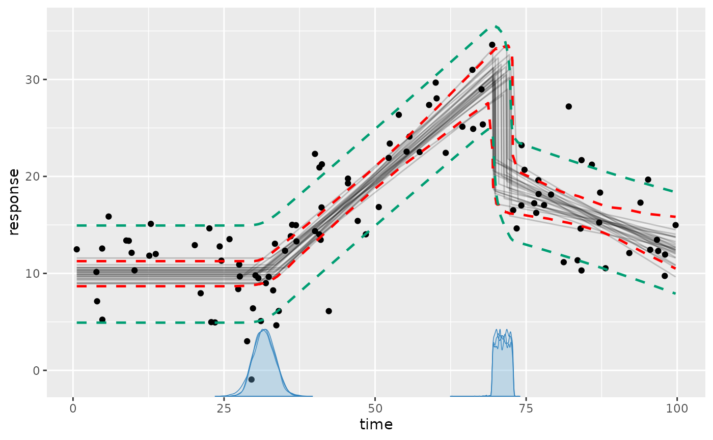
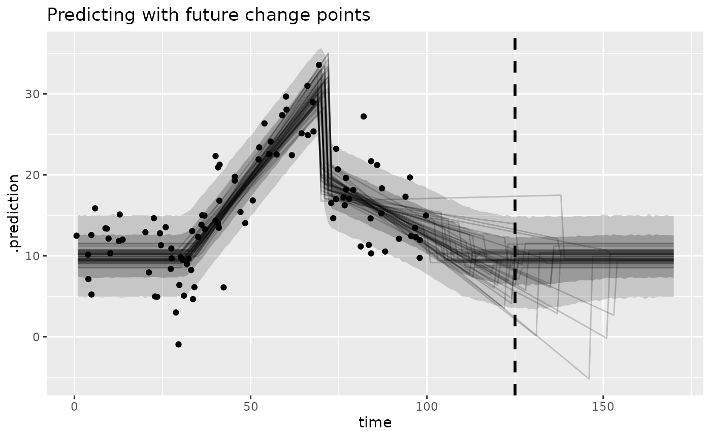

# Fits and predictions

This article introduces
[`predict()`](https://lindeloev.github.io/mcp/dev/reference/execute-mcp-model.md),
[`fitted()`](https://lindeloev.github.io/mcp/dev/reference/execute-mcp-model.md),
[`residuals()`](https://lindeloev.github.io/mcp/dev/reference/execute-mcp-model.md)
for in-sample and out-of-sample data. I will also show how to get
creative with `mcp`, including how to make predictions around future
change points.

## Preparation: an example model

We need an `mcpfit` to get started. We take the “demo” dataset:

``` r

library(mcp)
future::plan(future::multisession, workers = 3)

data = mcp_example_data("demo")
head(data)
```

    ##   response     time
    ## 1 17.23552 76.33986
    ## 2 11.35171 83.51711
    ## 3 28.04995 60.18529
    ## 4 20.68198 74.72964
    ## 5 21.21364 85.88256
    ## 6 22.32282 40.05069

… and model it as three segments, i.e., two change points:

``` r

# Define the model
model = list(
  response ~ 1,  # plateau (Intercept_1)
  ~ 0 + time,    # joined slope (time_2) at cp_1
  ~ 1 + time     # disjoined slope (Intercept_3, time_3) at cp_2
)

# Fit it
fit = mcp(model, data = data)
```

This is what the data and inferred fit look like with a 95% central
posterior interval for the expected response and an 80% posterior
predictive interval:

``` r

plot(fit, q_fit = TRUE, q_predict = c(0.1, 0.9))
```



To review what we see here:

- The black dots are the data from `data`.
- The gray lines are 25 samples from the posterior (control using
  `plot(fit, lines = 100)`).
- The dashed red lines are the 2.5% and 97.5% quantiles of the fitted
  (expected) values.
- The green lines are the 10% and 90% quantiles of the predicted values.
- The blue curves on the x-axis are the posterior distributions of the
  change point locations (better viewed using
  `plot_pars(fit, pars = c("cp_1", "cp_2"))`).

Behind the scenes,
[`plot()`](https://lindeloev.github.io/mcp/dev/reference/plot.mcpfit.md)
merely calls
[`predict()`](https://lindeloev.github.io/mcp/dev/reference/execute-mcp-model.md)
and
[`fitted()`](https://lindeloev.github.io/mcp/dev/reference/execute-mcp-model.md)
to show these inferences.

## Extracting `fitted()` values

To get the fitted values for each data point, simply do `fitted(fit)`:

``` r

head(fitted(fit))
```

    ##   response     time   fitted        sd     Q2.5    Q97.5
    ## 1 17.23552 76.33986 17.84217 0.9990016 15.84515 19.79815
    ## 2 11.35171 83.51711 16.41701 0.7249251 14.96533 17.85840
    ## 3 28.04995 60.18529 25.44790 0.8844492 23.70304 27.14645
    ## 4 20.68198 74.72964 18.16191 1.0936603 15.99893 20.29138
    ## 5 21.21364 85.88256 15.94730 0.7188174 14.54413 17.36917
    ## 6 22.32282 40.05069 14.47462 0.6410212 13.15862 15.68560

In general, this output contains:

- A column for each predictor column in the data. Here, `time` is the
  only predictor and you see the values in the same order as in `data`
  (which is copied to `fit$data`). Models with [group-level
  effects](https://lindeloev.github.io/mcp/dev/articles/group_effects.md)
  additionally have the relevant grouping columns,
  [`binomial()`](https://rdrr.io/r/stats/family.html) models have the
  number of trials, etc.

- **fitted:** The fitted value (posterior mean). When `summary = TRUE`
  (default), the column is called `fitted`. When `summary = FALSE`, the
  column is named `.epred`, matching
  [`tidybayes::add_epred_draws()`](https://mjskay.github.io/tidybayes/reference/add_predicted_draws.html)
  conventions.

- **sd:** The posterior standard deviation of the expected response
  corresponding to `fitted`. In
  [`predict()`](https://lindeloev.github.io/mcp/dev/reference/execute-mcp-model.md)
  output, `sd` is instead the posterior predictive standard deviation.

- **Q\[some number\]:** The quantiles of the fitted distribution. You
  can set the quantiles using `fitted(fit, probs = c(0.1, 0.5, 0.9))`.

If you compare these values to the plot, you will see that they
correspond.
[`plot()`](https://lindeloev.github.io/mcp/dev/reference/plot.mcpfit.md)
merely calls
[`fitted()`](https://lindeloev.github.io/mcp/dev/reference/execute-mcp-model.md)
behind the scenes.

### Expected responses for out-of-sample data

To predict out-of-sample data, you can simply use the `newdata`
argument.

``` r

newdata = data.frame(time = c(data$time[1], 25, -20, 200))
fitted(fit, newdata = newdata)
```

    ##        time    fitted        sd       Q2.5    Q97.5
    ## 1  76.33986 17.842172 0.9990016  15.845155 19.79815
    ## 2  25.00000  9.935817 0.6604596   8.609782 11.23334
    ## 3 -20.00000  9.935788 0.6605319   8.609782 11.23334
    ## 4 200.00000 -6.712685 9.3058981 -25.149202 11.43209

Note that:

- We get one row per value of `time`.
- The first value for `time` is in the dataset. The values correspond to
  the same row in `fitted(fit)` because that’s merely a shortcut to do
  `fitted(fit, newdata = fit$data)`.
- The second value (`time = 25`) is within the observed region, but not
  in the dataset.
- The third value (`time = - 20`) is outside the observed region, but
  `mcp` merely extends the first segment backwards in time. Because it’s
  a plateau, we see approximately the same values as for `time = 25`.
- The fourth value (`time = 200`) is way outside the observed region.
  Because it is the extrapolation of the slope in the third segment of
  which we’ve only observed the first tiny bit, the posterior
  distribution is very wide because even a small uncertainty in the
  slope results in very large differences further out.

### Arguments

If you look at the documentation for
[`predict()`](https://lindeloev.github.io/mcp/dev/reference/execute-mcp-model.md),
[`fitted()`](https://lindeloev.github.io/mcp/dev/reference/execute-mcp-model.md),
and
[`residuals()`](https://lindeloev.github.io/mcp/dev/reference/execute-mcp-model.md),
you’ll see that they are quite versatile, taking many different
arguments. To mention a few, you can set `fitted(fit, dpar = "sigma")`
to get fitted values for `sigma` ([more on modeling
sigma](https://lindeloev.github.io/mcp/dev/articles/dpar.md)),
`prior = TRUE` to predict using only the prior, and `arma = FALSE` to
exclude AR/MA effects. For group-level effects, use `group = TRUE`
(all), `FALSE` (none), `"cp"` or `"predictor"` (a formula part), or an
exact group-level parameter name.

## Predictions

[`predict()`](https://lindeloev.github.io/mcp/dev/reference/execute-mcp-model.md)
draws from the posterior predictive distribution and takes almost the
same arguments as
[`fitted()`](https://lindeloev.github.io/mcp/dev/reference/execute-mcp-model.md).
This supports predictions for in-sample and out-of-sample data.
[`plot()`](https://lindeloev.github.io/mcp/dev/reference/plot.mcpfit.md)
uses
[`predict()`](https://lindeloev.github.io/mcp/dev/reference/execute-mcp-model.md)
under the hood for posterior predictive intervals. The values below
correspond to the dashed green lines in the plot (the 80% posterior
predictive interval):

``` r

set.seed(42)
head(predict(fit, probs = c(0.1, 0.9)))
```

    ##   response     time  predict       sd       Q10      Q90
    ## 1 17.23552 76.33986 17.76087 4.025946 12.729675 22.95364
    ## 2 11.35171 83.51711 16.39834 3.945877 11.381113 21.45299
    ## 3 28.04995 60.18529 25.50435 3.974106 20.369367 30.52404
    ## 4 20.68198 74.72964 18.12685 4.009017 13.017773 23.30484
    ## 5 21.21364 85.88256 15.83290 3.944597 10.913034 20.98206
    ## 6 22.32282 40.05069 14.48612 3.932286  9.456287 19.49107

Note that
[`predict()`](https://lindeloev.github.io/mcp/dev/reference/execute-mcp-model.md)
uses random sampling under the hood, so these values will differ
slightly from call to call. You can make it replicable using
[`set.seed()`](https://rdrr.io/r/base/Random.html) as above. In general,
the more posterior draws, the less the call-to-call variance will be.
Conversely, fewer draws means more call-to-call variation, e.g., if you
do `predict(fit, ndraws = 10)`.

## Residuals

[`residuals()`](https://lindeloev.github.io/mcp/dev/reference/execute-mcp-model.md)
is simply `data$response - fitted()`. It may be useful for model
checking, but the typical needs are covered using posterior predictive
checking (`pp_check(fit)`) and visual inspection of
`plot(fit, q_fit = TRUE, q_predict = TRUE)`.

## Forecasting with future change points

Bayesian inference is the principled updating of prior knowledge using
data. Where there is little or no data, the prior speaks louder.
Sometimes, we can learn surprising stuff simply by inspecting the prior
predictive, e.g., how the priors combine when “put through” the model.
In `mcp`, most functions come with a `prior = FALSE` default, but you
can simply do `plot(fit, prior = TRUE)`, `fitted(fit, prior = TRUE)`, or
`predict(fit, prior = TRUE)`.

Say you want to forecast at `time = 125` and you know that a changepoint
to the baseline level (an intercept change to `Intercept_1`) will occur
approximately after the same interval as between `cp_1` and `cp_2`
(i.e., at `cp_2 + (cp_2 - cp_1)`). Here is a way to “hack” `mcp` to do
this. *(NOTE: I plan on implementing this in a much more user-friendly
way in a future release; see the discussion in [this github
issue](https://github.com/lindeloev/mcp/issues/78) and current status in
[this github issue](https://github.com/lindeloev/mcp/issues/82))*.

### Step 1: run the model for observed data

We already did that above, resulting in our `fit`. But we only do it to
get the default priors that are suitable for inferring change points in
this region, so you could’ve just run it without sampling:

``` r

empty = mcp(model, data = data, sample = FALSE)
```

### Step 2: add the unobserved segment(s) and fit

Now we extend the model with the future segment of which we have prior
knowledge:

``` r

model_forecast = c(empty$model, list(
  ~ same(1, as = 1)  # Return to Intercept_1 after cp_3
))
```

And finally, we extend the list of priors with the new change point
`cp_3`. The model needs a predictor value at the end of the forecasting
horizon so that the future change point remains within its supported
range. Its response is missing, so it contributes no observed outcome.
It may be helpful to review [the article on priors in
mcp](https://lindeloev.github.io/mcp/dev/articles/priors.md).

``` r

forecast_horizon = 170
data_forecast = rbind(data, data.frame(time = forecast_horizon, response = NA))
observed_start = min(data$time)
observed_end = max(data$time)
prior_forecast = c(empty$prior[!names(empty$prior) %in% c("cp_1", "cp_2")], list(
  cp_1 = paste0("dunif(", observed_start, ", ", observed_end, ")"),
  cp_2 = paste0("dunif(cp_1, ", observed_end, ")"),
  cp_3 = paste0("dnorm(cp_2 + (cp_2 - cp_1), 20) T(", observed_end, ", ", forecast_horizon, ")")  # In the future at the same interval
))
```

Now let’s fit it:

``` r

fit_forecast = mcp(model_forecast, data = data_forecast, prior = prior_forecast)
```

### Step 3: predict!

We can now compute 50% and 80% posterior predictive intervals at
`time = 125`:

``` r

predict(fit_forecast, newdata = data.frame(time = 125), probs = c(0.1, 0.25, 0.75, 0.9))
```

    ##   time  predict       sd      Q10      Q25      Q75     Q90
    ## 1  125 9.244078 4.499987 3.553236 6.425221 12.29614 14.8795

To really understand what’s going on here, it may be helpful to
visualize the model. For now, we will have to hack this a bit too,
manually doing our plot:

``` r

# Get expected-response and posterior predictive draws
newdata = data.frame(time = 1:170)
fitted_forecast = fitted(fit_forecast, newdata = newdata, summary = FALSE, ndraws = 50)
predict_forecast = predict(fit_forecast, newdata = newdata, summary = FALSE)

# Plot it
library(ggplot2)
library(tidybayes)  # Optional package for summarizing and plotting draws
ggplot(predict_forecast, aes(x = time, y = .prediction)) +
  # Posterior predictive intervals and line at x = 125
  stat_summary(fun.data = median_qi, fun.args = list(.width = 0.8), geom = "ribbon", alpha = 0.2) +
  stat_summary(fun.data = median_qi, fun.args = list(.width = 0.5), geom = "ribbon", alpha = 0.3) +
  geom_vline(xintercept = 125, lty = 2, lwd = 1) +

  # Lines for fitted draws
  geom_line(aes(y = .epred, group = .draw), data = fitted_forecast, alpha = 0.2) +

  # Observed data
  geom_point(aes(x = time, y = response), data = data) +
  labs(title = "Predicting with future change points")
```



You can read the predicted values from above at `x = 125` off this
graph. We literally just predicted for all values between 1 and 170, and
visualized it using a ribbon. This means that you can also predict
further into the future, if you’d like.

You can extend this approach to an arbitrary number of future segments,
even using the posterior from the “unobserved” segment 4 in the priors
for parameters in future segments. In Bayesian inference, it really does
not make much of a difference whether credence in some parameter values
has been updated using data or not - it’s all credence.

Without doing this formal model of the future change point, one may have
thought that the change point should occur around `time = 110` since
that’s the expected value of `cp_2 + (cp_2 - cp_1)`. However, we
truncated the prior for the future change point (`cp_3`) so that it
occurs *after* the last data point (`max(time)`), i.e., at `time > 100`.
This is knowledge that the third change point had not yet been observed
at `time = 100`, and this pushes the distribution further into the
future (actually around 120; see `summary(fit_forecast)`).
