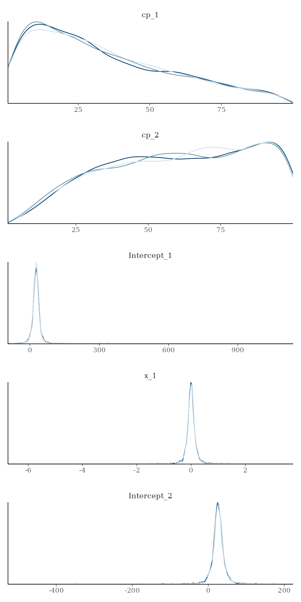
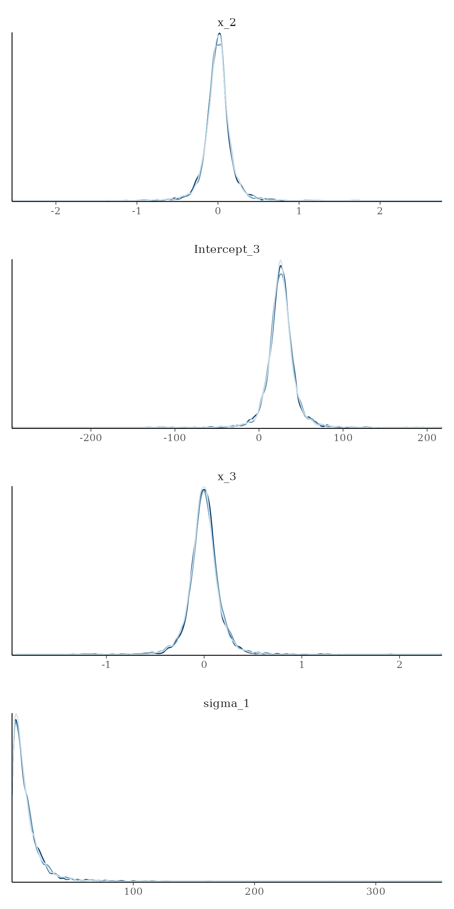
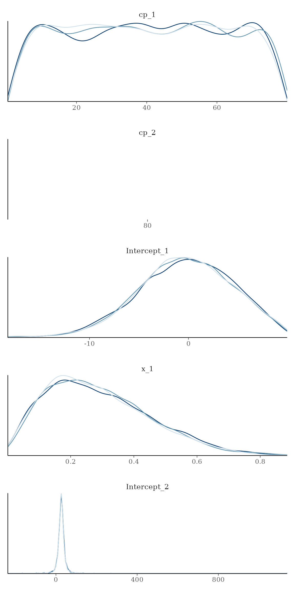
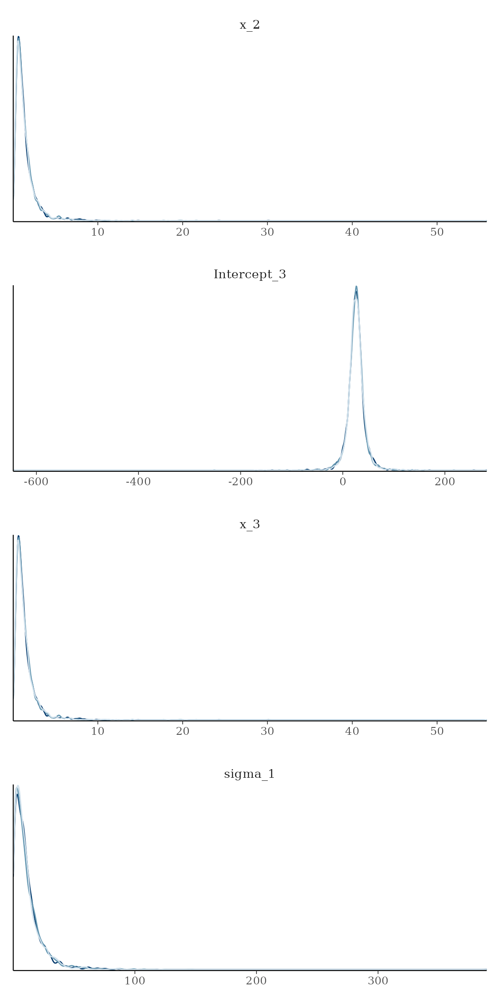
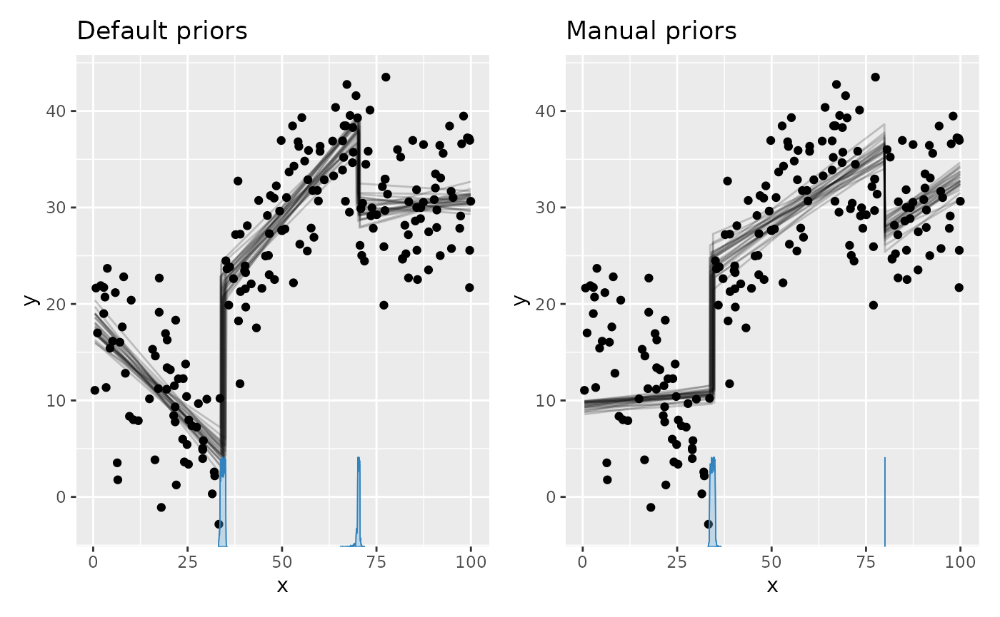
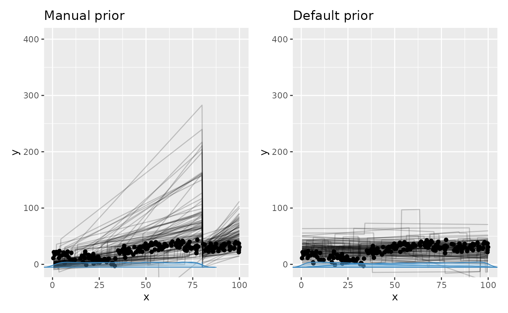

# Working with priors

*NOTE: the JAGS-specific prior interface below is likely to be
deprecated in the future, when additional backends are added beyond
JAGS.*

## Setting a prior

`mcp` takes priors in the form of a named list. The names are the
parameter names, and the values are JAGS code. Here is a fairly
complicated example, to demonstrate the various ways priors can be used:

``` r

model = list(
  y ~ 1 + x,  # Intercept_1 + x_1
  ~ 1 + x,  # cp_1, Intercept_2, and x_2
  ~ 1 + x  # cp_2
)

prior = list(
  Intercept_1 = "dnorm(0, 5) T(, 10)",  # Intercept; less than 10
  x_1 = "dbeta(2, 5)",  # slope: beta with right skew
  cp_1 = "dunif(min(x), cp_2)",  # change point between smallest x and cp_2
  x_2 = "dt(0, 1, 3) T(x_1, )",  # slope 2 > slope 1 and t-distributed
  cp_2 = 80,  # A constant (set; not estimated)
  x_3 = "x_2"  # continue same slope
  # Intercept_2 and Intercept_3 not specified. Use default.
)
```

The values use mcp’s JAGS-string syntax, so JAGS distributions are
generally allowed. See the [JAGS user
manual](https://altushost-swe.dl.sourceforge.net/project/mcmc-jags/Manuals/4.x/jags_user_manual.pdf)
for more details. Prior strings use R-like conventional distribution
scales even though JAGS has a different parameterization underneath: SD
for [`dnorm()`](https://rdrr.io/r/stats/Normal.html), scale for
[`dt()`](https://rdrr.io/r/stats/TDist.html), `ddexp()`, and
[`dlogis()`](https://rdrr.io/r/stats/Logistic.html), and log-SD for
[`dlnorm()`](https://rdrr.io/r/stats/Lognormal.html). When generating
JAGS code, `mcp` converts these to inverse variance for
[`dnorm()`](https://rdrr.io/r/stats/Normal.html),
[`dt()`](https://rdrr.io/r/stats/TDist.html), and
[`dlnorm()`](https://rdrr.io/r/stats/Lognormal.html), and inverse scale
for `ddexp()` and [`dlogis()`](https://rdrr.io/r/stats/Logistic.html).
You can inspect the translation by comparing `fit$prior` with
`fit$jags_code`.

Other notes:

- Default population-level change-point priors are ordered. For user
  priors, `mcp` adds truncation (e.g., `T(cp_1, )`) only when the prior
  has neither explicit truncation nor an inherently bounded form such as
  [`dunif()`](https://rdrr.io/r/stats/Uniform.html) or `dirichlet()`.
  User-specified population-level bounds are respected as written. When
  change points have group-level deviations, their realized locations
  are constrained to remain ordered within every group.

- `mcp` allows inserting data-dependent values: for example, `min(x)`,
  `max(x)`, `median(y)`, `mad(y)`, `max(x) - min(x)`, `n_segments()`,
  and `n_cp()`. `mcp` resolves these expressions before generating JAGS
  code. The older `mcp` v0.3.4 uppercase constants (`MINX`, `MAXX`, and
  so on) remain temporarily supported with a deprecation warning.

- You can fix any parameter to a specific value. Simply set it to a
  numerical value (as `cp_2` above). A constant is a 100% prior belief
  in that value, and it will therefore not be estimated.

- You can also equate one variable with another (`x_3 = "x_2"` above).
  You would usually do this to share parameters across segments, but you
  can be creative and do something like `x_3 = "x_2 + 5 - cp_1/10"` if
  you want. In any case, it will lead to one less parameter being
  estimated, i.e., one less free parameter.

Let us see the priors after running them through `mcp` and compare to
the default priors:

``` r

library(mcp)
df_dummy = data.frame(x = 1:100, y = 1:100)
empty_manual = mcp(model, data = df_dummy, prior = prior, sample = FALSE)
empty_default = mcp(model, data = df_dummy, sample = FALSE)

# Inspect resolved priors and bounds. Add rules, descriptions, sources, and
# kinds with prior_summary(empty_manual, verbose = TRUE).
prior_summary(empty_manual, verbose = TRUE)
```

    ## # A tibble: 9 × 9
    ##   parameter   segment dpar  prior          bounds rule  description source kind 
    ##   <chr>         <int> <chr> <chr>          <chr>  <chr> <chr>       <chr>  <chr>
    ## 1 cp_1              2 cp    uniform(min =… [min(… unif… User-speci… user   dist…
    ## 2 cp_2              3 cp    80             none   80    Fixed at 80 user   cons…
    ## 3 Intercept_1       1 mu    normal(mean =… [-Inf… norm… User-speci… user   dist…
    ## 4 x_1               1 mu    beta(shape1 =… [0, 1] beta… User-speci… user   dist…
    ## 5 Intercept_2       2 mu    student_t(df … none   stud… Robustly c… defau… dist…
    ## 6 x_2               2 mu    student_t(df … [x_1,… stud… User-speci… user   dist…
    ## 7 Intercept_3       3 mu    student_t(df … none   stud… Robustly c… defau… dist…
    ## 8 x_3               3 mu    x_2            none   x_2   Same value… user   alias
    ## 9 sigma_1           1 sigma student_t(df … [0, I… stud… Positive r… defau… dist…

``` r

prior_summary(empty_default, verbose = TRUE)
```

    ## # A tibble: 9 × 9
    ##   parameter   segment dpar  prior          bounds rule  description source kind 
    ##   <chr>         <int> <chr> <chr>          <chr>  <chr> <chr>       <chr>  <chr>
    ## 1 cp_1              2 cp    student_t(df … [min(… stud… Regularizi… defau… dist…
    ## 2 cp_2              3 cp    student_t(df … [cp_1… stud… Regularizi… defau… dist…
    ## 3 Intercept_1       1 mu    student_t(df … none   stud… Robustly c… defau… dist…
    ## 4 x_1               1 mu    student_t(df … none   stud… Regularizi… defau… dist…
    ## 5 Intercept_2       2 mu    student_t(df … none   stud… Robustly c… defau… dist…
    ## 6 x_2               2 mu    student_t(df … none   stud… Regularizi… defau… dist…
    ## 7 Intercept_3       3 mu    student_t(df … none   stud… Robustly c… defau… dist…
    ## 8 x_3               3 mu    student_t(df … none   stud… Regularizi… defau… dist…
    ## 9 sigma_1           1 sigma student_t(df … [0, I… stud… Positive r… defau… dist…

Now, let’s simulate some data from `model`. The following priors are “at
odds” with the actual data so as to show their effect.

``` r

df = data.frame(x = runif(200, 0, 100), y = 1)  # 200 datapoints between 0 and 100
set.seed(42)
df$y = empty_default$simulate(empty_default, df, 
    Intercept_1 = 20, Intercept_2 = 22, Intercept_3 = 30,  # intercepts
    x_1 = -0.5, x_2 = 0.5, x_3 = 0,  # slopes
    cp_1 = 35, cp_2 = 70,  # change points
    sigma = 5)

head(df)
```

    ##            x        y
    ## 1  8.0750138 22.81729
    ## 2 83.4333037 27.17651
    ## 3 60.0760886 36.35369
    ## 4 15.7208442 15.30389
    ## 5  0.7399441 21.65137
    ## 6 46.6393497 27.28905

Sample the prior and posterior. We give the manual fit a longer warmup
since it is harder to find the right posterior under these weird prior
constraints (priors will usually improve sampling efficiency).

``` r

future::plan(future::multisession, workers = 3)
fit_manual = mcp(model, data = df, sample = "both", warmup = 10000, prior = prior, seed = 42)
fit_default = mcp(model, data = df, sample = "both", warmup = 10000, seed = 42)
```

First, let’s look at the priors side by side. Notice the use of
`prior = TRUE` to show prior samples. This works in
[`plot()`](https://lindeloev.github.io/mcp/dev/reference/plot.mcpfit.md),
[`plot_pars()`](https://lindeloev.github.io/mcp/dev/reference/plot_pars.md),
and
[`summary()`](https://lindeloev.github.io/mcp/dev/reference/summary.mcpfit.md)
among others.

``` r

library(ggplot2)
set.seed(42)
pp_default = plot_pars(fit_default, type = "dens_overlay", prior = TRUE) + 
  ggtitle("Default priors")
```



``` r

set.seed(42)
pp_manual = plot_pars(fit_manual, type = "dens_overlay", prior = TRUE) +
  ggtitle("Manual priors")
```



``` r

pp_default + pp_manual
```

    ## integer(0)

Here are the resulting posterior fits:

``` r

set.seed(42)
plot_default = plot(fit_default) + ggtitle("Default priors")

set.seed(42)
plot_manual = plot(fit_manual) + ggtitle("Manual priors")

plot_default + plot_manual
```



We see the effects of the priors:

- The intercept `Intercept_1` was truncated to be below 10.
- The slope `x_1` is bound to be non-negative (because `dbeta`).
- The slopes `x_2` and `x_3` were forced to be identical.
- The change point `cp_2` was a constant, so there is no uncertainty
  there.

This is a contrived example. Usually setting priors manually aims to
sample the “correct” posterior.

## Default priors on change points

Change point locations must lie within the observed range
`[min(x), max(x)]` and maintain strict order `cp_1 < cp_2 < ... < cp_n`.
Without this rule, change point locations would be unidentifiable. If
you inspect `fit$jags_code`, you will see that `mcp` inserts boundary
markers at `cp_0 = min(x)` and `cp_{n+1} = max(x)` to ensure the
ordering constraint.

For any given range, introducing more change points makes the prior for
each change point more informative (as shown in the figure below). `mcp`
provides two built-in population-level prior families:

- **One change point:** Both specifications default to
  `cp_1 = uniform(min(x), max(x))`. Its location is uniform over the
  observed x-range.
- **The t-tail prior (default for 2+ change points):** Sequentially
  truncated Student-t distributions centered at `min(x)`. Specifically,
  `cp_i = student_t(df = n_cp() - 1, location = min(x), scale = (max(x) - min(x)) / n_cp()) T(cp_{i-1}, max(x))`.
- **The Dirichlet prior:** A joint prior on segment spacings specified
  via `prior = list(cp_1 = "dirichlet(1)", cp_2 = "dirichlet(1)", ...)`.

&nbsp;

    ## Posterior was not drawn. Using prior draws. Set `prior = TRUE` to mute this message.
    ## Posterior was not drawn. Using prior draws. Set `prior = TRUE` to mute this message.


### The t-tail prior on 2+ change points (default)

For 2+ change points, the default rule (on all change points) is
`cp_i = student_t(df = n_cp() - 1, location = min(x), scale = (max(x) - min(x)) / n_cp())`,
bounded below by the preceding change point and above by `max(x)`.

- **Degrees of freedom:** It is t-distributed with $`N - 1`$ degrees of
  freedom (`n_cp() - 1`). Together with the decreasing scale, this makes
  the underlying distributions more concentrated as the number of change
  points increases.
- **Scale:** The scale is `(max(x) - min(x)) / n_cp()`. This is a
  calibration choice, not the equal-segment spacing (which would divide
  by `n_cp() + 1`).
- **Location and truncation:** The location parameter is always the
  lowest observed `x`. Thus `cp_1` is a bounded half-t and `cp_2+` use
  sequentially truncated right tails of the same t (hence “t-tail
  prior”). Their means are shifted by truncation and are not equal to
  `min(x)`.
- **Properties:** The sequential truncation does not produce exact
  uniform order statistics; the middle segments tend to get narrower
  than the first/last segments. For non-small datasets, the effect on
  the posterior is negligible, though
  point-[`hypothesis()`](https://lindeloev.github.io/mcp/dev/reference/hypothesis.md)
  tests via Savage-Dickey density ratios would be strongly impacted. Its
  main advantage is sampling speed: JAGS samples this formulation much
  faster than the Dirichlet prior.

### Dirichlet-based prior on change points

The [Dirichlet
distribution](https://en.wikipedia.org/wiki/Dirichlet_distribution)
places a joint prior on positive segment spacings that sum to the
observed x-range. Consequently, the derived population-level change
points are naturally ordered and bounded. This construction also
underlies monotonic effects in `brms` ([Bürkner & Charpentier
(2019)](https://psyarxiv.com/9qkhj/)).

The Dirichlet distribution is a simplex of beta distributions (they
always sum to 1), where the individual betas represent inter-changepoint
distances. For $`N`$ change points, the distribution for change point
$`i`$ is $`\text{Beta}(i, N + 1 - i)`$, so `cp_1 ~ Beta(1, N)` and
`cp_N ~ Beta(N, 1)`. Scaling from $`[0, 1]`$ to the observed data range
(`0 --> min(x)`, `1 --> max(x)`) gives the desired bounding.

To use the Dirichlet prior, specify it for all change points:

``` r

prior_dirichlet = list(
  cp_1 = "dirichlet(1)",
  cp_2 = "dirichlet(1)",
  cp_3 = "dirichlet(1)"
)
```

The number in parentheses is a common $`\alpha`$ concentration parameter
(all change points must share the same $`\alpha`$). Values below 1 favor
uneven spacings, `dirichlet(1)` treats spacings exchangeably (giving the
ordered-uniform distribution), and values above 1 favor more evenly
spaced change points.

### Manual priors on change points

You can customize change point priors as shown in the initial example.
Beware that the nature of the priors changes when truncation is applied;
use `plot_pars(fit, prior = TRUE)` to inspect the realized prior
distributions.

For an otherwise unbounded user prior such as `cp_2 = "dnorm(40, 10)"`,
`mcp` automatically adds default bounds equivalent to
`cp_2 = "dnorm(40, 10) T(cp_1, max(x))"`. An explicit truncation,
including `T(,)`, or a [`dunif()`](https://rdrr.io/r/stats/Uniform.html)
prior is used as written. Relaxing the order can cause label-switching
between segments and make sampling difficult, so inspect the resulting
prior carefully.

## Default priors on linear predictors

The defaults borrow the robust calibration used by `brms`, adapted to
the local parameterization of `mcp`. You can inspect all resolved priors
for a model using `prior_summary(fit, verbose = TRUE)`.

- **Intercepts:** Unlike the improper flat default coefficient priors in
  `brms`, `mcp` uses proper Student-t priors because JAGS does not
  support flat priors. With the identity link, the Gaussian intercept
  prior is centered on `round(median(y), 1)` with scale
  `max(2.5, round(mad(y), 1))`. With the log link, location and scale
  are derived from $`\log(y)`$ (with zeros replaced by 0.1).
- **Slopes:** Numeric coefficient priors use the corresponding
  family-level scale divided by a representative change in the
  predictor: its observed range `max(x) - min(x)` for `par_x` and binary
  variables, and two standard deviations ($`2\,\text{SD}`$) otherwise.
  This follows the scaling convention proposed by [Gelman
  (2008)](https://doi.org/10.1002/sim.3107) and ensures that slope
  priors remain identical and comparable across models regardless of the
  number of change points.
- **Unspecified SD model (`sigma`):** For Gaussian models without an
  explicit [`sigma()`](https://rdrr.io/r/stats/sigma.html) formula,
  `sigma_1` defaults to `dt(0, max(2.5, round(mad(y), 1)), 3) T(0, )`,
  matching `brms`. This remains true for `gaussian(link = "log")`: that
  link constrains the conditional mean, not the observations, so
  non-positive responses are valid and are not passed through
  [`log()`](https://rdrr.io/r/base/Log.html) merely to construct a sigma
  prior.
- **Modeled SD (`sigma(1 + x)`):** An explicit
  [`sigma()`](https://rdrr.io/r/stats/sigma.html) formula models log-SD,
  as in `brms`. Its intercept prior is `dt(0, 2.5, 3)`, and its contrast
  and numeric-coefficient priors use the same reference-change scaling
  described above.

## Default priors on group-level effects

Each group-level effect has a population-level SD parameter.
Predictor-side deviations use a zero-mean normal distribution governed
by that SD, as in ordinary multilevel regression. With a
multi-coefficient `||` term, every independent coefficient has its own
SD. The SD receives a positive, weakly informative prior from the family
and link specification. For distributional parameters, the deviations
and their SD are on that parameter’s link scale; for example, effects
inside an explicit [`sigma()`](https://rdrr.io/r/stats/sigma.html)
formula are on the log-SD scale.

Group-level change-point deviations are exactly zero-centered so that
each population-level change point is the arithmetic mean of its
group-specific locations. Their default priors use sequential bounds,
and the model constrains the resulting locations to remain ordered
within each group. All group-level change points in one model must use
the same grouping factor. Predictor-side deviations are hierarchically
mean-zero but are neither exactly centered nor ordered. See [group-level
effects with
mcp](https://lindeloev.github.io/mcp/dev/articles/group_effects.md).

## Prior predictive checks

Prior predictive checks are a great way to ensure that the priors are
meaningful. Simply set `sample = "prior"`. Let us do it for the two sets
of priors defined previously in this article, to see their different
prior predictive space.

``` r

# Sample priors 
fit_pp_manual = mcp(model, data = df, prior = prior, sample = "prior", seed = 42)
fit_pp_default = mcp(model, data = df, sample = "prior", seed = 42)

# Plot it
set.seed(42)
plot_pp_manual = plot(fit_pp_manual, lines = 100) + ylim(c(-400, 400)) + ggtitle("Manual prior")
set.seed(42)
plot_pp_default = plot(fit_pp_default, lines = 100) + ylim(c(-400, 400)) + ggtitle("Default prior")
plot_pp_manual +  plot_pp_default  # using patchwork
```



You can see how the manual priors are more dense to the left, and the
“concerted” change at x = 80.

## JAGS code

Here is the JAGS code for `fit_manual`:

``` r

fit_manual$jags_code
```

    ## model {
    ##   # mcp helper values
    ##   cp_0 = CONST1_
    ##   cp_3 = CONST2_
    ## 
    ##   # Priors for population-level effects
    ##   cp_1 ~ dunif(CONST1_, cp_2)  # User-specified prior
    ##   cp_2 = CONST3_  # Fixed at 80
    ##   Intercept_1 ~ dnorm(0, 1/(5)^2) T(,10)  # User-specified prior
    ##   x_1 ~ dbeta(2, 5)  # User-specified prior
    ##   Intercept_2 ~ dt(26, 1/(10.3)^2, 3)   # Robustly centered mean intercept with a minimum scale of 2.5
    ##   x_2 ~ dt(0, 1/(1)^2, 3) T(x_1,)  # User-specified prior
    ##   Intercept_3 ~ dt(26, 1/(10.3)^2, 3)   # Robustly centered mean intercept with a minimum scale of 2.5
    ##   x_3 = x_2  # Same value as x_2
    ##   sigma_1 ~ dt(0, 1/(10.3)^2, 3) T(0,)  # Positive residual SD calibrated on the response scale
    ## 
    ##   # Model and likelihood
    ##   for (i_ in 1:length(x)) {
    ##     # par_x local to each segment
    ##     x_local_1_[i_] = min(x[i_], cp_1)
    ##     x_local_2_[i_] = min(x[i_], cp_2) - cp_1
    ##     x_local_3_[i_] = min(x[i_], cp_3) - cp_2
    ##     
    ##     # Formula for mu
    ##     link_mu_[i_] =
    ##     
    ##       # Segment 1: y ~ 1 + x
    ##       (x[i_] >= cp_0) * (x[i_] < cp_1) * inprod(rhs_matrix_[i_, c(1)], c(Intercept_1)) * 1 + 
    ##       (x[i_] >= cp_0) * (x[i_] < cp_1) * inprod(rhs_matrix_[i_, c(2)], c(x_1)) * x_local_1_[i_] + 
    ##     
    ##       # Segment 2: y ~ 1 ~ 1 + x
    ##       (x[i_] >= cp_1) * (x[i_] < cp_2) * inprod(rhs_matrix_[i_, c(3)], c(Intercept_2)) * 1 + 
    ##       (x[i_] >= cp_1) * (x[i_] < cp_2) * inprod(rhs_matrix_[i_, c(4)], c(x_2)) * x_local_2_[i_] + 
    ##     
    ##       # Segment 3: y ~ 1 ~ 1 + x
    ##       (x[i_] >= cp_2) * inprod(rhs_matrix_[i_, c(5)], c(Intercept_3)) * 1 + 
    ##       (x[i_] >= cp_2) * inprod(rhs_matrix_[i_, c(6)], c(x_3)) * x_local_3_[i_]
    ##     
    ##     # Formula for sigma
    ##     link_sigma_[i_] =
    ##     
    ##       # Segment 1: y ~ 1 + x
    ##       (x[i_] >= cp_0) * inprod(rhs_matrix_[i_, c(7)], c(sigma_1)) * 1
    ## 
    ##     # Likelihood and log-density for family = gaussian()
    ##     mu_[i_] = link_mu_[i_]
    ##     sigma_[i_] = max(1e-03, link_sigma_[i_])
    ##     y[i_] ~ dnorm(mu_[i_], 1 / sigma_[i_]^2)
    ##   }
    ## }
