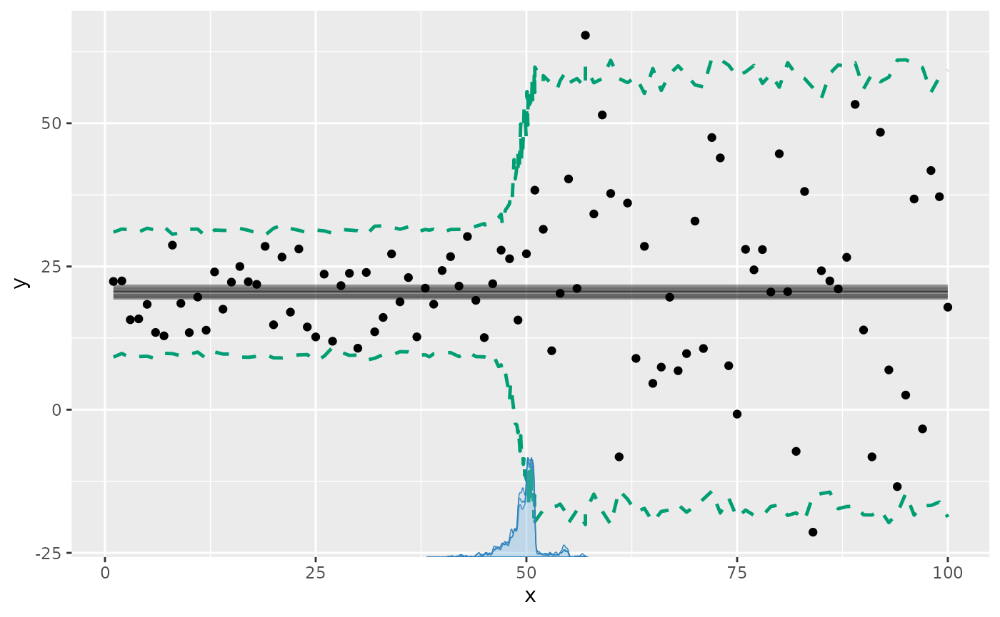
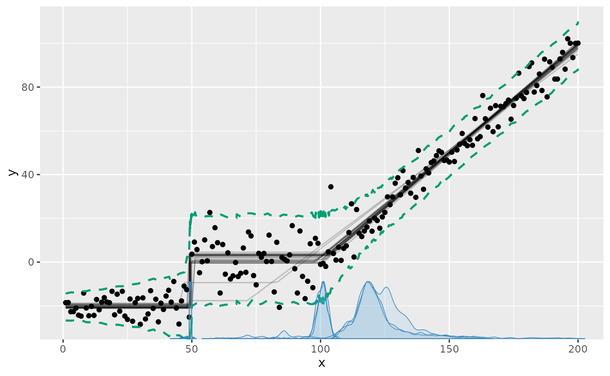
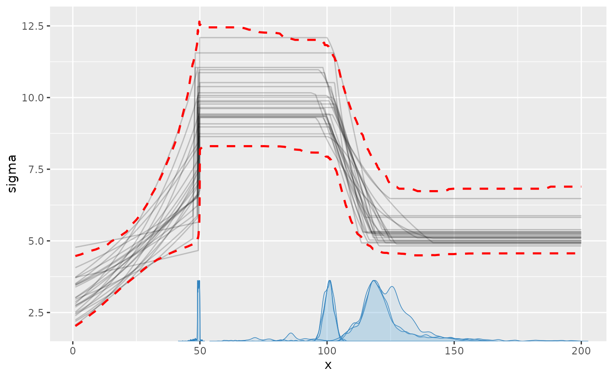
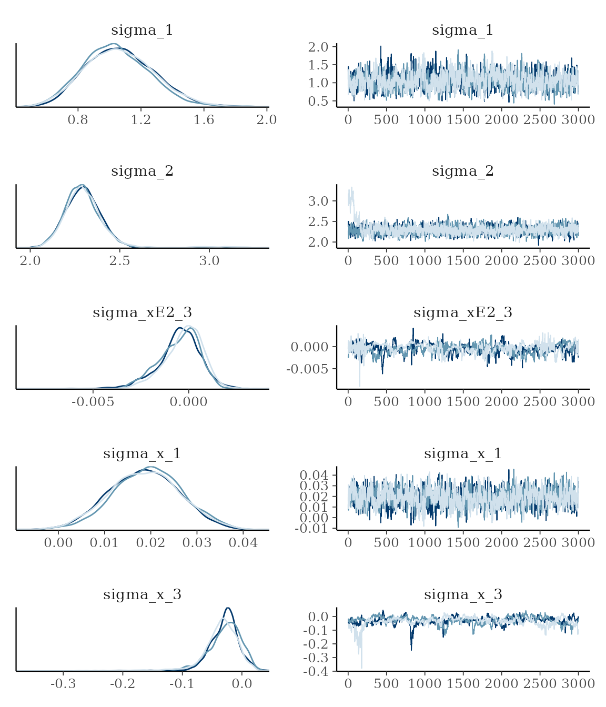
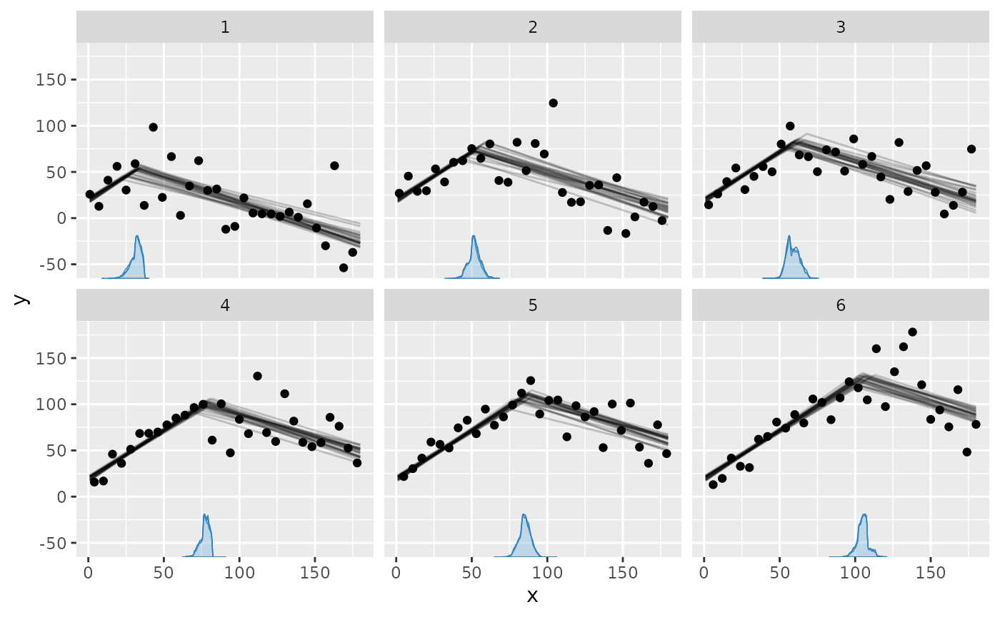

# Modeling variance and variance changes

For GLM families with a variance parameter (`sigma`), you can model this
explicitly. For example, if you want a flat mean (a plateau) with
increasing variance, you can do `y ~ 1 + sigma(1 + x)`. An explicit
[`sigma()`](https://rdrr.io/r/stats/sigma.html) formula uses a log link,
so its linear predictor is log-SD and `sigma = exp(eta_sigma)`, as in
`brms`. This guarantees a positive, smoothly varying SD. In general, all
formula syntax that is allowed outside of
[`sigma()`](https://rdrr.io/r/stats/sigma.html) (where it applies to the
mean) also works inside it (applying to log-SD). For example, you can do
`~ 1 + sigma(1 + z + I(x^2))`. Read more about mcp formulas
[here](https://lindeloev.github.io/mcp/dev/articles/formulas.md).

There is one intentional distinction for the common model without any
[`sigma()`](https://rdrr.io/r/stats/sigma.html) term. Its implicit
constant `sigma_1` is the residual SD itself, not log-SD, and its
default response-scale half-Student-t prior matches `brms`. As soon as
any segment contains an explicit
[`sigma()`](https://rdrr.io/r/stats/sigma.html) term, all `sigma_*`
coefficients in that model are on the log-SD scale. Thus simulation
values use, for example, `sigma_1 = log(5)`, while
`fitted(fit, dpar = "sigma")` still returns an SD of 5 on the response
scale.

## Priors for sigma models

Without an explicit [`sigma()`](https://rdrr.io/r/stats/sigma.html)
formula, the default is the intercept-only prior
`dt(0, max(2.5, round(mad(y), 1)), 3) T(0, )` directly on the residual
SD. The response-calibrated scale adapts to the units of `y`, with a
minimum of 2.5 to avoid an accidentally narrow prior. This matches
`brms`.

With an explicit [`sigma()`](https://rdrr.io/r/stats/sigma.html)
formula, the intercept instead defaults to `dt(0, 2.5, 3)` on log-SD,
with scaled Student-t coefficient priors. `brms` uses the same log-SD
parameterization and intercept prior but flat coefficients; the proper
`mcp` defaults support prior sampling and mildly regularize short
segments.

``` r

library(mcp)
future::plan(future::multisession, workers = 3)
set.seed(42)  # Make the script deterministic
```

## Simple example: a change in variance

Let us model a simple change in variance on a plateau model. First, we
specify the model:

``` r

model = list(
  y ~ 1,  # sigma(1) is implicit in the first segment
  ~ 0 + sigma(1)  # a new intercept on sigma, but not on the mean
)
```

We can simulate some data, starting with low variance and an abrupt
change to a high variance at $`x = 50`$:

``` r

set.seed(40)
df = data.frame(x = 1:100, y = 1)
empty = mcp(model, data = df, sample = FALSE, par_x = "x")
df$y = empty$simulate(
  empty, df, 
  cp_1 = 50, Intercept_1 = 20, 
  sigma_1 = log(5), sigma_2 = log(20))

head(df)
```

    ##   x        y
    ## 1 1 22.38870
    ## 2 2 22.48091
    ## 3 3 15.70208
    ## 4 4 15.85470
    ## 5 5 18.39213
    ## 6 6 13.48115

Now we fit the model to the simulated data.

``` r

fit = mcp(model, data = df, par_x = "x")
```

We plot the results with the prediction interval to show the effect of
the variance, since it won’t be immediately obvious on the default plot
of the fitted mean predictions:

``` r

plot(fit, q_predict = TRUE)
```



We can see all parameters are well recovered (compare `sim` to `mean`).
Like the other parameters, the `sigma`s are named after the segment
where they were instantiated. There will always be a `sigma_1`.

``` r

summary(fit)
```

    ## Family: gaussian(link = 'identity')
    ## Iterations: 3000 from 3 chains.
    ## Segments:
    ##   1: y ~ 1
    ##   2: y ~ 1 ~ 0 + sigma(1)
    ## 
    ## Population-level parameters:
    ##         name match  sim mean lower upper Rhat ess_bulk ess_tail
    ##         cp_1    OK 50.0 49.7  45.3  54.4    1     1681      980
    ##  Intercept_1    OK 20.0 20.3  18.9  21.9    1     4743     5078
    ##      sigma_1    OK  1.6  1.7   1.5   1.9    1     3798     4324
    ##      sigma_2    OK  3.0  2.9   2.8   3.2    1     4985     4383

## Advanced example

We can model changes in `sigma` alone or in combination with changes in
the mean. In the following, I define a needlessly complex model, just to
demonstrate the flexibility of modeling variance:

``` r

model = list(
  # Increasing variance.
  y ~ 1 + sigma(1 + x),
  
  # Abrupt change in mean and variance.
  ~ 1 + sigma(1),
  
  # Joined slope on mean. variance changes as 2nd order poly.
  ~ 0 + x + sigma(0 + x + I(x^2)),
  
  # Continue slope on mean, but plateau variance (no sigma() tern).
  ~ 0 + x
)

# The slope in segment 4 is just a continuation of 
# the slope in segment 3, as if there was no change point.
prior = list(
  x_4 = "x_3"
)
```

Notice a few things here:

- Segment 3 and 4: I changed the variance on a continuous slope. You can
  do this using priors to define that the slope is shared between
  segment 3 and 4, effectively canceling the change point on the mean
  (more about using priors in mcp
  [here](https://lindeloev.github.io/mcp/dev/articles/priors.md)).
- Segment 4: By not specifying
  [`sigma()`](https://rdrr.io/r/stats/sigma.html), segment 4 (and later
  segments) just inherits the variance from the state it was left in in
  the previous segment.

In general, the log-SD parameters are named `sigma_[normalname]`, where
“normalname” is the usual parameter names in mcp (see more
[here](https://lindeloev.github.io/mcp/dev/articles/formulas.md)). For
example, the log-SD slope on `x` in segment 3 is `sigma_x_3`. However,
`sigma_int_i` is just too verbose, so log-SD intercepts are simply
called `sigma_i`, where i is the segment number.

### Simulate data

We simulate some data from this model, setting all parameters. As
always, we can fit an empty model to get `fit$simulate`, which is useful
for simulation and predictions from this model.

``` r

set.seed(40)
df = data.frame(x = 1:200, y = 1)
empty = mcp(model, data = df, sample = FALSE)
df$y = empty$simulate(
  empty, df,
  cp_1 = 50, cp_2 = 100, cp_3 = 150,
  Intercept_1 = -20, Intercept_2 = 0,
  sigma_1 = log(3), sigma_x_1 = log(2) / 50,
  sigma_2 = log(10),
  sigma_x_3 = -0.03,
  sigma_xE2_3 = 0.0003,
  x_3 = 1, x_4 = 1)
```

### Fit it and inspect results

Fit it in parallel, to speed things up:

``` r

fit = mcp(model, data = df, prior = prior)
```

Plotting the prediction interval is an intuitive way to to see how the
variance is estimated:

``` r

plot(fit, q_predict = TRUE)
```



We can also plot the `sigma_` parameters directly. Now the y-axis is
`sigma`:

``` r

plot_dpar(fit, dpar = "sigma", q_fit = TRUE)
```



[`summary()`](https://lindeloev.github.io/mcp/dev/reference/summary.mcpfit.md)
show that the parameters are well recovered (compare `sim` to `mean`).
The last change point is estimated with greater uncertainty than the
others. This is expected, given that the only “signal” of this change
point is a stop in variance growth.

``` r

summary(fit)
```

    ## Family: gaussian(link = 'identity')
    ## Iterations: 3000 from 3 chains.
    ## Segments:
    ##   1: y ~ 1 + sigma(1 + x)
    ##   2: y ~ 1 ~ 1 + sigma(1)
    ##   3: y ~ 1 ~ 0 + x + sigma(0 + x + I(x^2))
    ##   4: y ~ 1 ~ 0 + x
    ## 
    ## Population-level parameters:
    ##         name match      sim     mean    lower    upper Rhat ess_bulk ess_tail
    ##         cp_1    OK  50.0000  4.9e+01  47.4374  49.9902    1     2686      732
    ##         cp_2    OK 100.0000  1.0e+02  95.4941 104.4704    1      110       73
    ##         cp_3    OK 150.0000  1.2e+02 106.0298 153.3169    1      105       61
    ##  Intercept_1    OK -20.0000 -2.0e+01 -21.3501 -18.8573    1     4496     4331
    ##  Intercept_2    OK   0.0000  1.2e+00  -2.0572   4.1454    1      149      106
    ##          x_3    OK   1.0000  9.8e-01   0.9276   1.0239    1      197       69
    ##          x_4    OK   1.0000  9.8e-01   0.9276   1.0239    1      197       69
    ##      sigma_1    OK   1.0986  1.1e+00   0.6679   1.5128    1      786     1625
    ##    sigma_x_1    OK   0.0139  1.9e-02   0.0038   0.0338    1      785     1544
    ##      sigma_2    OK   2.3026  2.3e+00   2.1105   2.5175    1      410      196
    ##    sigma_x_3    OK  -0.0300 -3.1e-02  -0.0989   0.0150    1       71      145
    ##  sigma_xE2_3    OK   0.0003 -4.1e-04  -0.0028   0.0014    1      128      549
    ## 
    ## Warning: 8 parameters show poor convergence (Rhat > 1.01 or ESS < 400).

The bulk and tail effective sample sizes (`ess_bulk` and `ess_tail`) are
fairly low, indicating poor mixing for these parameters. `Rhat` is
acceptable at \< 1.1, indicating good convergence between chains. Let us
verify this by taking a look at the posteriors and trace. For now, we
just look at the sigmas:

``` r

plot_pars(fit, regex_pars = "sigma_")
```



This confirms the impression from `Rhat`, `ess_bulk`, and `ess_tail`.
Setting `mcp(..., iter = 10000)` would be advisable to increase the
effective sample size. Read more about [tips, tricks, and
debugging](https://lindeloev.github.io/mcp/dev/articles/tips.md).

## Varying change points and variance

The variance model applies to varying change points as well. For
example, here we do a spin on the example in [the article on varying
change points](https://lindeloev.github.io/mcp/dev/articles/varying.md),
and add a by-person change in `sigma`. We model two joined slopes,
varying by `id`. The second slope is also characterized by a different
variance. This means that the model has more information about when the
change point occurs, so it should be easier to estimate (require fewer
data).

``` r

model = list(
  # intercept + slope
  y ~ 1 + x,
  
  # joined slope and increase in variance, varying by id.
  1 + (1|id) ~ 0 + x + sigma(1)
)
```

Simulate data:

``` r

set.seed(40)
df = data.frame(
  x = 1:180,
  id = rep(1:6, times = 30),
  y = 1
)
empty = mcp(model, data = df, sample = FALSE)
df$y = empty$simulate(
  empty, df, 
  cp_1 = 70, cp_1_id = 15 * (df$id - mean(df$id)),
  Intercept_1 = 20, x_1 = 1, x_2 = -0.5,
  sigma_1 = log(10), sigma_2 = log(25))
```

Fit it:

``` r

fit = mcp(model, data = df)
```

Plot it:

``` r

plot(fit, facet_by = "id")
```



As usual, we can get the individual change points:

``` r

mcp::ranef(fit)
```

    ##         name match   sim       mean      lower      upper      Rhat ess_bulk
    ## 1 cp_1_id[1]    OK -37.5 -36.861842 -43.484306 -31.837629 1.0006511     2366
    ## 2 cp_1_id[2]    OK -22.5 -16.478416 -22.724391 -10.099772 1.0010508     3321
    ## 3 cp_1_id[3]    OK  -7.5  -9.318467 -15.411391  -2.478497 1.0004821     2862
    ## 4 cp_1_id[4]    OK   7.5   8.944336   3.160782  13.849711 0.9999834     3366
    ## 5 cp_1_id[5]    OK  22.5  16.933810  10.480374  23.147013 1.0010938     3775
    ## 6 cp_1_id[6]    OK  37.5  36.780578  30.254391  43.756603 1.0020069     1849
    ##   ess_tail
    ## 1     3337
    ## 2     4591
    ## 3     5416
    ## 4     4590
    ## 5     4396
    ## 6     3162
