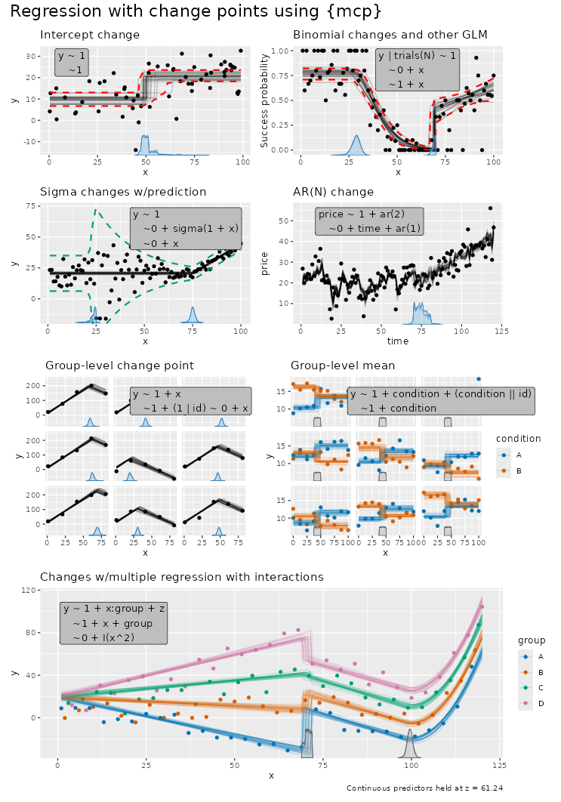

```{r, include = FALSE}
if (requireNamespace("pkgload", quietly = TRUE) && pkgload::is_dev_package("mcp")) {
  pkgload::load_all(quiet = TRUE)
}
```

`mcp` takes a list of formulas, and defines the change point as the point on the x-axis where the data shifts from being generated by one formula to the next. So with `N` formulas, you have `N - 1` change points. A list with just one formula thus correspond to normal regression with 0 change points.

The formulas are called "segments" because they divide the (observed) x-axis into `N` segments. Here are some examples:



# Formula format for segments

The three formula parts are called **response**, **cp**, and **predictor**. The general format is `response ~ cp ~ predictor`, except for the first segment, which has no change point and therefore uses `response ~ predictor`. In later segments the response is assumed identical and may be omitted. A one-sided formula such as `~ x` also uses the default change-point formula `~ 1`, so it is shorthand for `y ~ 1 ~ 1 + x`. This is familiar from `lm()`/`glm()`/`brms::brm()`.

`mcp` models consist of three parts:

**1. Response (segment 1 only):**

- `y ~ ...`: Standard continuous or count response (Gaussian, Poisson, Bernoulli).
- `successes | trials(total) ~ ...`: Binomial response (`family = binomial()`).
- `y | weights(w) ~ ...`: Observation log-likelihood weights (multiplies each observation's log-likelihood contribution by `w > 0`; affects posterior inference and `log_lik()`, but not predictions).
- `y | trials(total) + weights(w) ~ ...`: Combine response auxiliaries using `+`.

**2. Change-point modeling (`cp`, segments 2+):**

- `~ 1 ~ ...` (or omitted, e.g., `~ x`): Population-level change point (default).
- `1 + (1 | id) ~ ...`: Group-level change-point deviations around the population change point ([read more](../articles/group_effects.html)).

**3. Regression formula (all segments):**

- `~ 1 + x`: Disjoined slope with a new segment intercept.
- `~ 0 + x`: Joined slope (no intercept; continuous from previous segment).
- `~ 1`: Plateau (intercept only, no slope).
- `~ x:condition + z + (1 | id)`: Additional covariates, interactions, and group-level effects ([read more](../articles/group_effects.html)).
- `+ sigma(1 + x)` or `shape(0 + condition)`: Distributional parameters on the link scale ([read more](../articles/dpar.html)).
- `+ ar(1)` or `ma(2, 1 + x)`: Autoregressive and moving-average time-series residuals on the link scale (use `ar(0)` or `ma(0)` to turn off in later segments; [read more](../articles/arma.html)).

`mcp` is heavily inspired by `brms` which again is inspired by [`lme4::lmer()`](https://cran.r-project.org/web/packages/lme4/index.html) which extends `lm()` and `glm()`. [Here is a bit of history](https://twitter.com/jonaslindeloev/status/1117760777249853440) on that.

# How terms persist into later segments {#on-carry-over-between-segments}

When defining multiple segments in `mcp`, you only need to specify what changes:

> **1. Slopes on** $x$ are segment-local: The change-point predictor $x$ is measured from each change point onset ($\tau_{k-1}$). Writing `+ x` defines a slope in that segment; omitting $x$ yields a flat plateau (slope on $x$ is zero). Joined segments (`~ 0 ...`) connect continuously, while disjoined segments (`~ 1 ...`) jump to a new intercept.
>
> **2. Non-**$x$ terms persist forward: Terms other than $x$ start in the segment where they are declared and persist into later segments:
>
> - Omitted non-$x$ terms **PERSIST** from the previous segment.
>
> - Repeated non-$x$ terms **REPLACE** earlier terms (and repeating with zero turns them off).
>
> - A new intercept **RESETS** the population formula, removing omitted terms.

## Examples: Persistence into later segments and parameter names

`mcp` automatically assigns names to the parameters in the format `type_i` where `i` is the segment number. Change points are named `cp_1`, `cp_2`, ..., where `cp_1` separates segment 1 and 2, `cp_2` separates segment 2 and 3, etc.

```{r, eval=FALSE, R.options = list(width = 9999)}
# 1. Slope transitions on x: joined (~ 0) vs. disjoined (~ 1)
list(
  y ~ 1 + x,  # Segment 1: Intercept_1, x_1
    ~ 0 + x,  # Segment 2 (starts at cp_1): Joined slope x_2 (connects continuously)
    ~ 1 + x,  # Segment 3 (starts at cp_2): Disjoined slope x_3; Intercept_3 jumps
    ~ 0,      # Segment 4 (starts at cp_3): Joined plateau; slope on x is zero (omitted x)
    ~ 1       # Segment 5 (starts at cp_4): Disjoined plateau; Intercept_5 jumps (omitted x)
)

# 2. Covariates: persist into later segments until reset
list(
  y ~ 1 + x + z,  # Intercept_1, x_1, z_1
    ~ 0 + x,      # Joined: x_2 starts; z_1 persists into segment 2 (evaluated on observation's z_i)
    ~ 0 + x + z,  # Joined: x_3 starts; z_3 replaces z_1 with an absolute new slope
    ~ 1 + x       # Disjoined: Intercept_4 and x_4 start; z is removed by intercept reset
)

# 3. Categorical factors: dummy coefficients persist into later segments
list(
  y ~ 1 + condition,  # Intercept_1, conditionB_1, conditionC_1
    ~ 0,              # Joined: all dummies persist into segment 2 (flat continuation)
    ~ 0 + condition,  # Joined: conditionB_3, conditionC_3 replace previous dummies
    ~ 1               # Disjoined: Intercept_4 starts; condition is removed by intercept reset
)

# 4. Distributional regression and time series persist independently
list(
  y ~ 1 + x + sigma(1 + x) + ar(1),  # Intercept_1, x_1, sigma_1, sigma_x_1, ar1_1
    ~ 0 + x,                         # Joined: x_2 starts; sigma() and ar() persist into segment 2 unchanged
    ~ 1 + x + ar(2),                 # Disjoined: Intercept_3, x_3; sigma persists; ar1_3 and ar2_3 replace AR(1)
    ~ 0 + x + ar(0)                  # Joined: x_4 starts; ar(0) explicitly turns AR off
)

# 5. Group-level effects and offsets persist until explicitly turned off
list(
  y ~ 1 + x + (1 | id) + offset(log(exposure)),  # Intercept_1, x_1, Intercept_1_id, exposure offset
    ~ 0 + x,                                     # Joined: x_2 starts; group effect and offset persist into segment 2
    ~ 1 + x + (0 | id) + offset(0)               # Disjoined: Intercept_3, x_3; (0 | id) and offset(0) turn off group effect and offset
)
```

As shown above, terms not affected by the population intercept can be turned off anywhere by replacing them with zero: `(0 | group)`, `offset(0)`, or `ar(0)` / `ma(0)`.

You can inspect the parameters in any model without sampling using `mcp_pars()`:

```{r}
library(mcp)

model = list(
  y ~ 1 + x,  # Segment 1: Intercept_1, x_1
    ~ 0 + x,  # Segment 2: x_2 joined
    ~ 1       # Segment 3: Intercept_3 disjoined plateau
)

fit = mcp(model, data = data.frame(y = 1:10, x = 1:10), sample = FALSE)
mcp_pars(fit)
```

# Modeling intercept change points

A change point is simply like an `ifelse` statement or multiplying with indicators (0s and 1s):

```{r}
# Model parameters
x = 1:20
cp_1 = 12
Intercept_1 = 5
Intercept_2 = 10

# Ifelse version
y_ifelse = ifelse(x <= cp_1, yes = Intercept_1, no = Intercept_2)

# Indicator equivalent using dummy helpers
cp_0 = -Inf
cp_2 = Inf
y_indicator = (x > cp_0) * (x <= cp_1) * Intercept_1 +  # Between cp_0 and cp_1
              (x > cp_1) * (x <= cp_2) * Intercept_2  # Between cp_1 and cp_2

# Show it
par(mfrow = c(1,2))
plot(x, y_ifelse, main = "ifelse(x <= cp_1)")
plot(x, y_indicator, main = "(x > cp_1) * Intercept_2")
```

The magic of (Bayesian) MCMC sampling is that it can actually infer the change point from this simple formulation. We let `mcp` write the JAGS code for this simple two-plateaus model and see how it uses the indicator formulation of change points:

```{r}
model = list(y ~ 1, ~ 1)
fit = mcp(model, data = data.frame(y = 1:10, x = 1:10), sample = FALSE, par_x = "x")
fit$jags_code
```

Look at the section under the comment `# Formula for mu` which is the (automatically generated) model that was discussed above. Some unnecessary stuff is added to segment 1 just because it makes the code easier to generate. (`x[i_] >= cp_0` when `cp_0` is the smallest value of `x` is, of course, always true).

# Modeling slope change points

Mathematically, an `mcp` model divides the continuous predictor $x$ into $K$ segments separated by ordered change points $\tau_1 < \dots < \tau_{K-1}$. In each segment $k \in \{1, \dots, K\}$, the linear predictor $\eta_i$ on the link scale is evaluated directly from the segment-local distance $(x_i - \tau_{k-1})$:

$$\eta_i = \alpha_k + \beta_{k,1} \, (x_i - \tau_{k-1}) \quad (\text{with } \tau_0 = 0)$$

where the segment-start level $\alpha_k$ is freely estimated for the first and disjoined segments, as in non-segmented regression, and determined by continuity for joined segments:

$$\alpha_k = \begin{cases}
\beta_{k,0}, & \text{Disjoined segments } (\sim \texttt{1 + x}, \text{ including } k = 1) \\
\alpha_{k-1} + \beta_{k-1,1} (\tau_{k-1} - \tau_{k-2}), & \text{Joined segments } (k \ge 2, \, \sim \texttt{0 + x})
\end{cases}$$

Here, $\beta_{k,0}$ is the segment-start intercept, and $\beta_{k,1}$ is the slope on $x$. In all segments, estimated slope and intercept parameters are absolute values (not changes relative to preceding segments). If additional continuous covariates or categorical factors are included (e.g., `+ z + group`), they enter additively on their original scale ($+ \sum \gamma_{k,j} z_{j,i}$ for covariate $j$); only the change-point predictor $x$ is converted to segment-local coordinates.

## How mcp implements this in JAGS using indicators

Bayesian MCMC samplers like JAGS cannot evaluate dynamic conditional statements (`if/else`) on parameters being sampled. To implement this piecewise model in JAGS, `mcp` uses an **indicator and plateauing formulation** (evaluated via Iverson brackets $[A]$ which equal 1 when true and 0 when false).

First, `mcp` defines a segment-local span $X_{k,i}$ that grows linearly within segment $k$ and stays constant beyond it:

$$X_{1,i} = \min(x_i, \tau_1)$$ $$X_{k,i} = \max\bigl(0, \min(x_i, \tau_k) - \tau_{k-1}\bigr) \quad (k \ge 2)$$

When $x_i < \tau_{k-1}$, $X_{k,i} = 0$ (before the segment). When $\tau_{k-1} \le x_i < \tau_k$, $X_{k,i} = x_i - \tau_{k-1}$ (linear growth within the segment). When $x_i \ge \tau_k$, $X_{k,i} = \tau_k - \tau_{k-1}$ (constant segment width).

For a **purely joined model** (`list(y ~ 0 + x, ~ 0 + x)`), `mcp` writes $\eta_i$ as a cumulative sum of these segment spans:

$$\eta_i = \sum_{k=1}^K [x_i \ge \tau_{k-1}] \cdot \beta_{k,1} X_{k,i}$$

Because each segment's contribution stays constant beyond its change point ($\beta_{k-1,1}(\tau_{k-1} - \tau_{k-2})$), continuity is automatic with zero parameter constraints: preceding segments provide the continuous starting level for subsequent segments. The expected response on the response scale is $\mu_i = g^{-1}(\eta_i)$, which equals $\eta_i$ for Gaussian models with the default identity link.

When a segment is **disjoined** (`~ 1 + x`), it introduces a new explicit intercept $\beta_{k,0}$ at $\tau_{k-1}$, and earlier terms are capped with $[x_i < \tau_{\text{next}}]$ so previous segments stop accumulating.

Let's demonstrate this equivalence in R:

```{r}
# Model parameters
x = 1:20
cp_1 = 12
slope_1 = 2
slope_2 = -1

# Ifelse version
y_ifelse = ifelse(x <= cp_1, 
            yes = slope_1 * x,
            no = cp_1 * slope_1 + slope_2 * (x - cp_1))

# Indicator version with local plateauing coordinates (pmin is vectorized min)
y_local = slope_1 * pmin(x, cp_1) + 
          (x > cp_1) * slope_2 * (x - cp_1)

# Show that both formulations are identical
par(mfrow = c(1,2))
plot(x, y_ifelse, main = "ifelse() version")
plot(x, y_local, main = "Local plateauing coordinate")
```

Let us see this in action:

```{r}
model = list(y ~ 0 + x,
                ~ 0 + x)
fit = mcp(model, data = data.frame(y = 1:10, x = 1:10), sample = FALSE)
fit$jags_code
```

Look at the JAGS code under `# par_x local to each segment` and `# Formula for mu` to see this exact indicator formulation in action: `x_local_1_[i_]` and `x_local_2_[i_]` correspond to $X_{1,i}$ and $X_{2,i}$, and each segment's slope is multiplied by its activation indicator (e.g., `(x[i_] >= cp_1)`).

You will find the exact same formula for `y_ = ...` if you do `print(fit$simulate)`, though this function contains a whole lot of other stuff too.

# Multiple regression and categorical predictors

`mcp` supports standard R formulas with multiple continuous covariates, categorical factors, and interaction terms (e.g., `x:group`, `+ group`, `+ z`, `I(x^2)`).

Let's inspect the model in the overview plot in the top of this page - except I added one plateau segment (`~1`) below to illustrate a point.

```{r}
# Define model with multiple predictors
model = list(
  y ~ 1 + x:group + z, # Segment 1: by-group slopes on x, covariate z
  ~ 1 + x + group,     # Segment 2: shared slope on x, by-group intercepts
  ~ 0 + I(x^2),        # Segment 3: "group" intercepts persist due to "0"
  ~ 1                  # Segment 4: collapse to shared intercept, no matter group 
)

# Load data and inspect parameters without sampling
ex = mcp_example("multiple", sample = FALSE)
fit = mcp(model, data = ex$data, par_x = "x", sample = FALSE)
mcp_pars(fit)
```

Key features of multiple regression models in `mcp`:

- **Common change points across categories**: The change points `cp_1` and `cp_2` are estimated as single locations shared across all levels of `group`. (If you instead want category-specific change-point locations that deviate per group, use group-level effects like `1 + (1|group) ~ ...`; see [group-level effects](../articles/group_effects.html)).
- **Parameter names across segments**: In segment 1, `xgroupA_1` through `xgroupD_1` represent separate slopes for each level of `group`. In segment 2, `groupB_2`, `groupC_2`, and `groupD_2` represent intercept offsets relative to the reference level `groupA`. The continuous slope `z_1` on covariate `z` persists into later segments unless replaced or removed by an intercept reset.
- **Plotting and prediction**: Visualize by group using `plot(fit, color_by = "group")` or `plot(fit, facet_by = "group")`. By default, other unplotted continuous predictors (like `z`) are held at their mean automatically by `interpolate_newdata()`, or can be set explicitly via `plot(fit, color_by = "group", at = list(z = 0))`.

# Transformations are not segment-local

Transformations such as `sin()` and `poly()` in formulas are evaluated on the original predictor values, as in `lm()` and `glm()`. The change-point predictor is the exception: bare `par_x` and polynomial bases such as `I(par_x^2)` use distance from the segment onset (change point location, i.e., `cp_i` values).

For example, assuming that `x` is `par_x`:

``` r
list(
  y ~ 1,                        # Intercept_1
    ~ 1 + sin(x) + x + I(x^2)   # sin(x) uses x; x and I(x^2) use x - cp_1
)
```

# Relative changes between segments

Parameters in `mcp` represent the absolute values within each segment (e.g., `time_2` is the slope in segment 2 and `time_3` is the slope in segment 3). To evaluate the *relative change* between segments, you can use `hypothesis()` for quick estimates or use `as_draws_df()` to work with the distribution.

First, using `hypothesis()`:

```{r, R.options = list(width = 9999)}
hypothesis(demo_fit, "time_3 > time_2")
```

The estimate reflects the difference `time_3 - time_2` (how much steeper or flatter the slope became in segment 3), along with its credibility interval, posterior probability, and directional Bayes factor. [Read more about hypothesis testing in the comparison article](../articles/comparison.html). Here, we see that `time_3` is -0.76 greater (i.e., it is smaller than `time_2`).

If you need the full posterior distribution of the change (e.g., for `quantile()`, `hist()`, or plotting with `ggplot2`), extract draws, e.g., using `as_draws_df()`:

```{r, R.options = list(width = 9999)}
draws = as_draws_df(demo_fit) |> 
  dplyr::mutate(diff_time = time_3 - time_2)

head(draws)
```

You can now use `diff_time` directly with base R functions like `quantile(draws$diff_time, c(0.025, 0.975))` and `hist(draws$diff_time)`.
