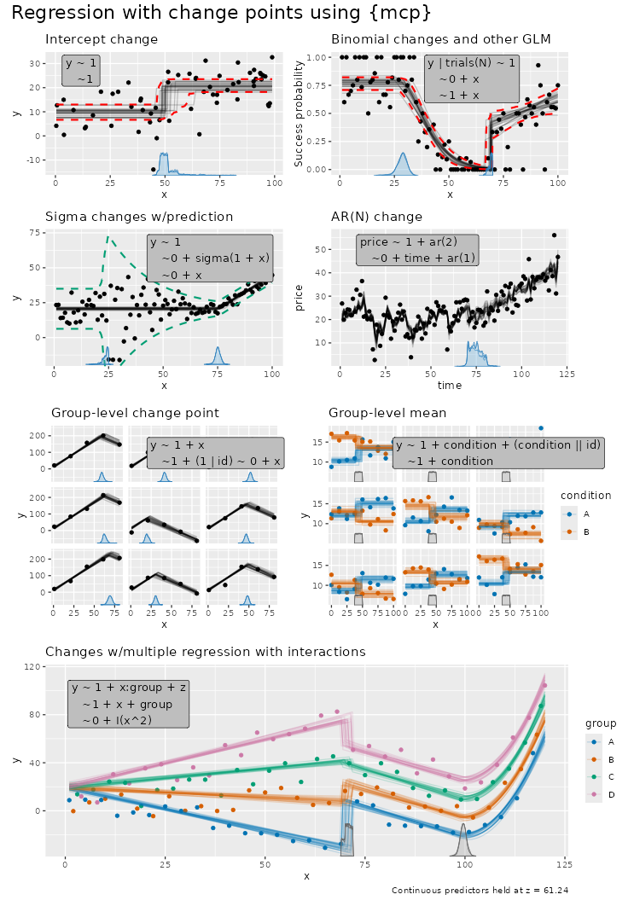

```{r, include = FALSE}
if (requireNamespace("pkgload", quietly = TRUE) && pkgload::is_dev_package("mcp")) {
  pkgload::load_all(quiet = TRUE)
}
set.seed(42)
```

`mcp` takes a list of formulas, and defines the change point as the point on the x-axis where the data shifts from being generated by one formula to the next. So with `N` formulas, you have `N - 1` change points. A list with just one formula thus corresponds to normal regression with 0 change points.

The formulas are called "segments" because they divide the (observed) x-axis into `N` segments. Here are some examples:




# Formula format for segments

The three formula parts are called **response**, **cp**, and **predictor**. The general format is `response ~ cp ~ predictor`, except for the first segment, which has no change point and therefore uses `response ~ predictor`. In later segments the response may be omitted, and the change point defaults to `1`, so `~ x` is shorthand for `y ~ 1 ~ 1 + x`. The predictor part works like in `lm()`/`glm()`/`brms::brm()`.

**1. Response (segment 1 only):**

- `y ~ ...`: Standard continuous or count response (Gaussian, Poisson, Bernoulli).
- `successes | trials(total) ~ ...`: Binomial response (`family = binomial()`).
- `y | weights(w) ~ ...`: Observation log-likelihood weights (multiplies each observation's log-likelihood contribution by `w > 0`; affects posterior inference and `log_lik()`, but not predictions).
- `y | trials(total) + weights(w) ~ ...`: Combine response auxiliaries using `+`.

**2. Change-point modeling (`cp`, segments 2+):**

- `1 ~ ...` (or omitted, e.g., `~ x`): Population-level change point (default).
- `1 + (1 | id) ~ ...`: Group-level change-point deviations around the population change point ([read more](../articles/group_effects.html)).

**3. Regression formula (all segments):**

- `~ 1 + x`: Disjoined slope with a new segment intercept.
- `~ 0 + x`: Joined slope (no new intercept).
- `~ 1`: Plateau (intercept only, no slope).
- `~ x:state + z + (1 | id)`: Other variables, interactions, and group-level effects ([read more](../articles/group_effects.html)).
- `+ sigma(1 + x)` or `shape(0 + state)`: Distributional parameters on the link scale ([read more](../articles/dpar.html)).
- `+ ar(1)` or `ma(2, 1 + x)`: Autoregressive and moving-average time-series residuals on the link scale; include them in every segment where they apply ([read more](../articles/arma.html)).

`mcp` is heavily inspired by `brms` which again is inspired by [`lme4::lmer()`](https://cran.r-project.org/web/packages/lme4/index.html) which extends `lm()` and `glm()`. [Here is a bit of history](https://twitter.com/jonaslindeloev/status/1117760777249853440) on that.


# How segments connect

Here is the demo model from the [README](../index.html), which ships already fitted as [`demo_fit`](../reference/demo_fit.html):

```{r, fig.alt = "Fitted mcp model with a plateau, a joined slope, and a disjoined slope."}
library(mcp)
model = list(
  response ~ 1,  # Plateau (Intercept_1)
  ~ 0 + time,    # Joined slope (time_2)
  ~ 1 + time     # Disjoined slope (Intercept_3, time_3)
)
plot(demo_fit)
```

Segment 2 continues from where the plateau left off, while segment 3 starts afresh with a new intercept. Three rules govern this (with `x` as the change-point variable, i.e., `time` above):

1. **Only included terms get coefficients.**\
   A segment includes the terms in its formula, plus an intercept unless removed with `0 +`. Each included term gets a new coefficient (`x_2`, `stateB_2`) or reuses an existing one with [`same()`](#sharing-coefficients-between-segments).
2. **x-terms are measured from the change point.**\
   `x`, `x:z`, `state:x`, and `I(x^2)` start at zero at the segment's change point and stop growing at the next change point (they plateau). See the [math below](#modeling-slope-change-points).
3. **Joined or disjoined.**\
   Without an intercept (`0 + ...`), a segment is *joined*: it continues from where the earlier intercept and x-terms left off. With an intercept, it is *disjoined* and starts afresh.

The same rules apply separately to `sigma()`, `shape()`, `ar()`, and `ma()`. 

`sigma` and `shape` are required by the likelihood, so they include an intercept in segment 1. Per rule 3, they are joined in later segments that do not include them.


## Joining applies to the intercept and x-terms

Other terms, such as `z`, `state`, and `(1 | id)`, end at the change point unless included again. So a joined segment can still start with a jump, as it does for the two values of `z` below. We use `fit$simulate()` to compute predictions for chosen parameter values:

```{r, fig.alt = "Two parallel lines, one per value of z, which jump onto a single shared line at the change point x = 20."}
model = list(
  y ~ 1 + x + z,  # Intercept_1, x_1, z_1
    ~ 0 + x       # Joined x_2; z is not included
)
df = expand.grid(x = seq(0, 40, by = 0.5), z = c(-1, 1), y = 0)
fit = mcp(model, data = df, par_x = "x", sample = FALSE)

df$y = fit$simulate(fit, df, cp_1 = 20, Intercept_1 = 0, x_1 = 1, z_1 = 5, x_2 = -1, sigma_1 = 1, .type = "fitted")
plot(y ~ x, data = df, col = factor(z))  # Red: z = 1. Black: z = -1
```

To keep `z` in segment 2, include it again: `~ 0 + x + same(z)` reuses `z_1` whereas `~ 0 + x + z` estimates a new `z_2`.

Conversely, a joined segment can depend on a variable it does not include: in `list(y ~ 1 + x:z, ~ 0)`, the slope in segment 1 differs by `z`, so the plateau in segment 2 does too.


## Examples: Included terms and parameter names

New coefficients are named after their segment: `x_1`, `x_2`, etc. Change points are `cp_1`, `cp_2`, etc.; `cp_1` separates segments 1 and 2. In these examples, the change-point variable is `x`; set `mcp(..., par_x = "x")` if mcp does not automatically select the correct change-point variable.

```{r, eval=FALSE, R.options = list(width = 9999)}
# 1. Slopes: joined or disjoined
model = list(
  y ~ 1 + x,  # Intercept_1, x_1
    ~ 0 + x,  # At cp_1: Joined slope (x_2)
    ~ 1 + x,  # At cp_2: Disjoined slope (Intercept_3, x_3)
    ~ 0       # At cp_3: Joined plateau (no new coefficients)
)

# 2. Factors, other variables, and interactions
model = list(
  y ~ 1 + x:state + z,  # Intercept_1, by-state slopes (xstateA_1, ...), z_1
    ~ 1 + x + state,    # At cp_1: Disjoined (Intercept_2, x_2, stateB_2, ...); z not included
    ~ 0 + x             # At cp_2: Joined slope (x_3); state not included
)

# 3. Group-level effects in the predictor
model = list(
  y ~ 1 + x + (1 | id),  # Intercept_1, x_1, group intercept deviations
    ~ 0 + x + (1 | id),  # At cp_1: Joined slope (x_2); new group deviations and SD
    ~ 0 + x              # At cp_2: Joined slope (x_3); (1 | id) not included
)

# 4. Group-level change points: effects before the last tilde
model = list(
  y ~ 1 + x,             # Intercept_1, x_1
  1 + (1 | id) ~ 0 + x,  # At cp_1, varying by id (cp_1_id): Joined slope (x_2)
    ~ 1                  # At cp_2: Disjoined plateau (Intercept_3)
)

# 5. Distributional parameters and AR/MA
model = list(
  y ~ 1 + x + sigma(1 + x) + ar(1), # Intercept_1, x_1; log-SD slope (sigma_1, sigma_x_1); AR(1) (ar1_1)
    ~ 0 + x + ar(1, 1 + x),  # At cp_1: Joined slope (x_2); sigma joined plateau; new AR(1) (ar1_2, ar1_x_2)
    ~ 0 + sigma(1),          # At cp_2: Joined mu plateau; new sigma_3; AR not included
    ~ 0 + ma(2)              # At cp_3: Joined mu plateau; sigma joined; MA(2) (ma1_4, ma2_4)
)
```

## Sharing coefficients between segments

To reuse a coefficient instead of estimating a new one, include `same(term)`. The coefficient keeps its source name:

```{r, eval=FALSE}
model = list(
  y ~ 1 + x + z + (1|id),
    ~ 0 + x + state + same(z),   # Reuse z_1; other coefficients are new
    ~ 1 + same(x + z),           # Reuse x_2 and z_1
    ~ 0 + same(x, as = 1) + same(state, as = 2), # Reuse x_1 and segment 2 factor coding/coefficients
    ~ 0 + same((1|id), as = 1),  # Reuse segment 1 group deviations and SD
    ~ 1 + sigma(0 + x),          # New log-SD slope sigma_x_6, joined to initial sigma_1
    ~ 0 + sigma(1 + same(x))     # New log-SD intercept sigma_7; reuse sigma_x_6
)
```

`same()` refers to the preceding segment by default; use `as` to pick an earlier segment. It works for factors (`same(state)`), group effects (`same((1 | id))` reuses deviations and SD), and inside distributional parameters (`sigma(0 + same(x))`). Reused x-terms are still measured from the current change point.

Reused coefficients are estimated jointly from all segments where they are included, not fitted in one segment and copied to another.

## Inspect coefficients

[`mcp_pars()`](../reference/mcp_pars.html) lists the parameters that follow from the rules above. You can use it before sampling:

```{r}
model = list(
  y ~ 1 + x:state + z,         # Intercept_1, by-state slopes, z_1
    ~ 1 + x + state + same(z), # Intercept_2, x_2, state contrasts; reuse z_1
    ~ 0 + same(x)              # Joined; reuse x_2
)
fit = mcp(model, data = mcp_example_data("multiple"), par_x = "x", sample = FALSE)
mcp_pars(fit)
```

Thanks to `same()`, there is no `z_2` or `x_3`.


## Some clarifications on formula behavior

Factors use ordinary R formula coding: with treatment coding, `1 + state` gives contrasts to a reference level, while `0 + state` gives coefficients for all levels. A predictor group effect such as `(1 | id)` applies where it is included. A change-point group effect applies only at the change point where it is included; it does not introduce group effects in the predictor.

Only bare `x`, powers such as `I(x^2)`, and their interactions are x-terms. Other transformations, such as `sin(x)` and `poly(x, 2)`, use the original values of `x`, as in `lm()`, and do not join:

```r
list(
  y ~ 1,                        # Intercept_1
    ~ 1 + sin(x) + x + I(x^2)   # sin(x) uses x; x and I(x^2) are measured from cp_1
)
```

Offsets have fixed coefficients: include `offset(log(exposure))` wherever it applies. Read more about offsets in [Poisson and Negative Binomial models](../articles/poisson.html).


# Multiple regression and categorical predictors

Here is the model from the overview plot at the top of this page, with an extra plateau segment:

```{r}
# Define model with multiple predictors
model = list(
  y ~ 1 + x:state + z, # Segment 1: by-state slopes on x, and z
  ~ 1 + x + state,     # Segment 2: shared slope on x, by-state intercepts
  ~ 0 + I(x^2),        # Segment 3: joined quadratic; state not included
  ~ 1                  # Segment 4: shared intercept for all states
)

# Load data and inspect parameters without sampling
ex = mcp_example("multiple", sample = FALSE)
fit = mcp(model, data = ex$data, par_x = "x", sample = FALSE)
mcp_pars(fit)
```

Key features of multiple regression models in `mcp`:

- **Common change points across categories**: The change points `cp_1` and `cp_2` are estimated as single locations shared across all levels of `state`. (If you instead want category-specific change-point locations that deviate per group, use group-level effects like `1 + (1|group) ~ ...`; see [group-level effects](../articles/group_effects.html)).
- **Parameter names across segments**: In segment 1, `xstateA_1` through `xstateD_1` represent separate slopes for each level of `state`. In segment 2, `stateB_2`, `stateC_2`, and `stateD_2` represent intercept offsets relative to the reference level `stateA`. A variable such as `z` must be included in each segment where it applies.
- **Plotting and prediction**: Visualize by state using `plot(fit, color_by = "state")` or `plot(fit, facet_by = "state")`. By default, other numeric variables (like `z`) are held at their mean automatically by `interpolate_newdata()`, or can be set explicitly via `plot(fit, color_by = "state", at = list(z = 0))`.

# Relative changes between segments

Parameters in `mcp` represent the absolute values within each segment (e.g., `time_2` is the slope in segment 2 and `time_3` is the slope in segment 3). To evaluate the *relative change* between segments, you can use `hypothesis()` for quick estimates or use `as_draws_df()` to work with the distribution.

First, using `hypothesis()`:

```{r, R.options = list(width = 9999)}
hypothesis(demo_fit, "time_3 > time_2")
```

The estimate reflects the difference `time_3 - time_2` (how much steeper or flatter the slope became in segment 3), along with its credibility interval, posterior probability, and directional Bayes factor. [Read more about hypothesis testing in the comparison article](../articles/comparison.html). Here, the estimate is negative, so the slope is smaller in segment 3 than in segment 2.

If you need the full posterior distribution of the change (e.g., for `quantile()`, `hist()`, or plotting with `ggplot2`), extract draws, e.g., using `as_draws_df()`:

```{r, R.options = list(width = 9999)}
draws = as_draws_df(demo_fit) |> 
  dplyr::mutate(diff_time = time_3 - time_2)

head(draws)
```

You can now use `diff_time` directly with base R functions like `quantile(draws$diff_time, c(0.025, 0.975))` and `hist(draws$diff_time)`.


# Modeling intercept change points

A change point is simply like an `ifelse` statement or multiplying with indicators (0s and 1s):

```{r}
# Model parameters
x = 1:20
cp_1 = 12
Intercept_1 = 5
Intercept_2 = 10

# Ifelse version
y_ifelse = ifelse(x <= cp_1, yes = Intercept_1, no = Intercept_2)

# Indicator equivalent using dummy helpers
cp_0 = -Inf
cp_2 = Inf
y_indicator = (x > cp_0) * (x <= cp_1) * Intercept_1 +  # Between cp_0 and cp_1
              (x > cp_1) * (x <= cp_2) * Intercept_2  # Between cp_1 and cp_2

# Show it
par(mfrow = c(1,2))
plot(x, y_ifelse, main = "ifelse(x <= cp_1)")
plot(x, y_indicator, main = "(x > cp_1) * Intercept_2")
```

The magic of (Bayesian) MCMC sampling is that it can actually infer the change point from this simple formulation. We let `mcp` write the JAGS code for this simple two-plateaus model and see how it uses the indicator formulation of change points:

```{r}
model = list(y ~ 1, ~ 1)
fit = mcp(model, data = data.frame(y = 1:10, x = 1:10), sample = FALSE, par_x = "x")
fit$jags_code
```

Look at the section under the comment `# Formula for mu` which is the (automatically generated) model that was discussed above. Some unnecessary stuff is added to segment 1 just because it makes the code easier to generate. (`x[i_] >= cp_0` when `cp_0` is the smallest value of `x` is, of course, always true).

# Modeling slope change points

Mathematically, an `mcp` model divides the change-point variable $x$ into $K$ segments separated by ordered change points $\tau_1 < \dots < \tau_{K-1}$. In each segment $k \in \{1, \dots, K\}$, the linear predictor $\eta_i$ on the link scale measures $x$ from the change point $\tau_{k-1}$:

$$\eta_i = \alpha_k + \beta_{k,1} \, (x_i - \tau_{k-1}) \quad (\text{with } \tau_0 = 0)$$

where $\alpha_k$ is the value at the start of segment $k$:

$$\alpha_k = \begin{cases}
\beta_{k,0}, & \text{disjoined } (\sim \texttt{1 + x}, \text{ or } k = 1) \\
\alpha_{k-1} + \beta_{k-1,1} (\tau_{k-1} - \tau_{k-2}), & \text{joined } (\sim \texttt{0 + x})
\end{cases}$$

That is, a disjoined segment starts at its own intercept $\beta_{k,0}$, while a joined segment continues from where segment $k-1$ left off.

Here, $\beta_{k,1}$ is the slope on $x$ in segment $k$. Intercepts and slopes are absolute values (not changes relative to preceding segments). Other variables (e.g., `+ z + state`) add $\sum_j \gamma_{k,j} z_{j,i}$ in the segments where they are included. They use their original values and are not part of $\alpha_k$, which is why they can make a joined segment start with a jump.

## How mcp implements this in JAGS using indicators

Bayesian MCMC samplers like JAGS cannot evaluate dynamic conditional statements (`if/else`) on parameters being sampled. To implement this piecewise model in JAGS, `mcp` uses an **indicator and plateauing formulation** (evaluated via Iverson brackets $[A]$ which equal 1 when true and 0 when false).

First, `mcp` defines a span $X_{k,i}$ that measures $x$ from the change point within segment $k$ and stays constant beyond it:

$$X_{1,i} = \min(x_i, \tau_1)$$ $$X_{k,i} = \max\bigl(0, \min(x_i, \tau_k) - \tau_{k-1}\bigr) \quad (k \ge 2)$$

When $x_i < \tau_{k-1}$, $X_{k,i} = 0$ (before the segment). When $\tau_{k-1} \le x_i < \tau_k$, $X_{k,i} = x_i - \tau_{k-1}$ (linear growth within the segment). When $x_i \ge \tau_k$, $X_{k,i} = \tau_k - \tau_{k-1}$ (constant segment width).

For a **purely joined model** (`list(y ~ 0 + x, ~ 0 + x)`), `mcp` writes $\eta_i$ as a cumulative sum of these segment spans:

$$\eta_i = \sum_{k=1}^K [x_i \ge \tau_{k-1}] \cdot \beta_{k,1} X_{k,i}$$

Because each segment's contribution stays constant beyond its change point ($\beta_{k-1,1}(\tau_{k-1} - \tau_{k-2})$), joining needs no parameter constraints: earlier segments provide the starting value for later segments. The expected response on the response scale is $\mu_i = g^{-1}(\eta_i)$ via link function $g(\mu_i) = \eta_i$ (identity for Gaussian, so $\mu_i = \eta_i$).

When a segment is **disjoined** (`~ 1 + x`), it introduces a new intercept $\beta_{k,0}$ at $\tau_{k-1}$, and all earlier terms get the indicator $[x_i < \tau_{k-1}]$ so they end where the disjoined segment starts. Terms that are not x-terms get the same indicator at the next change point, which is why they end there.

Let's demonstrate this equivalence in R:

```{r}
# Model parameters
x = 1:20
cp_1 = 12
slope_1 = 2
slope_2 = -1

# Ifelse version
y_ifelse = ifelse(x <= cp_1, 
            yes = slope_1 * x,
            no = cp_1 * slope_1 + slope_2 * (x - cp_1))

# Indicator version with local plateauing coordinates (pmin is vectorized min)
y_local = slope_1 * pmin(x, cp_1) + 
          (x > cp_1) * slope_2 * (x - cp_1)

# Show that both formulations are identical
par(mfrow = c(1,2))
plot(x, y_ifelse, main = "ifelse() version")
plot(x, y_local, main = "Local plateauing coordinate")
```

Let us see this in action:

```{r}
model = list(y ~ 0 + x, ~ 0 + x)
fit = mcp(model, data = data.frame(y = 1:10, x = 1:10), sample = FALSE)
fit$jags_code
```

Look at the JAGS code under `# par_x local to each segment` and `# Formula for mu` to see this exact indicator formulation in action: `x_local_1_[i_]` and `x_local_2_[i_]` correspond to $X_{1,i}$ and $X_{2,i}$, and each segment's slope is multiplied by its activation indicator (e.g., `(x[i_] >= cp_1)`).

You will find the exact same formula for `y_ = ...` if you do `print(fit$simulate)`, though this function contains a whole lot of other stuff too.

## Implementation: Improve sampling efficiency by keeping segment ends in place when change points move

In `fit$jags_code`, you may see unintuitive formulations like the following:

```{r, eval = FALSE}
# Joined segments: slope sampled as the rise over the segment
x_2_rise_ ~ dnorm(0, 1/(0.2*(cp_2-cp_1))^2)
x_2 = x_2_rise_ / (cp_2 - cp_1)

# Disjoined segments: intercept sampled as the level at the segment end
Intercept_3_end_ ~ dnorm(0.6 + x_3 * (cp_3 - cp_2), 1/(3.5)^2)
Intercept_3 = Intercept_3_end_ - (x_3 * (cp_3 - cp_2))
```

Like most Gibbs samplers, JAGS updates one parameter at a time while holding the others fixed. If it holds a slope $\beta_{k,1}$ fixed while it updates a change point $\tau_k$, the level at the end of segment $k$ moves by $\beta_{k,1} \Delta\tau$, and so do all later joined segments. Such moves fit the data badly and are mostly rejected, so the change point and the slope must creep along together, which mixes slowly.

`mcp` solves this by reparameterizing the model, sampling the above quantities whenever a prior is an mcp-default normal prior. With this, moving a change point leaves the levels at the ends of each segment in place.

This is a reparameterization, not a new model: the priors, and hence the posteriors, are exactly those of the naive formulation. If the default prior is $\beta_{k,1} \sim \text{Normal}(0, s)$, the rise $r_k = \beta_{k,1} w_k$ over the segment width $w_k = \tau_k - \tau_{k-1}$ has standard deviation $s w_k$. So `mcp` gives the rise the prior $r_k \sim \text{Normal}(0, s w_k)$, which keeps the implied slope $r_k / w_k$ at $\text{Normal}(0, s)$. Likewise, the level at the segment end, $e_k = \beta_{k,0} + \beta_{k,1} w_k \sim \text{Normal}(m + \beta_{k,1} w_k, s)$, is just the intercept's default $\text{Normal}(m, s)$ prior shifted by $\beta_{k,1} w_k$. We can verify this for widths spanning two orders of magnitude:

```{r}
s = 0.5  # Prior SD of the slope
width = runif(100000, 0.5, 50)  # Any segment widths
rise = rnorm(100000, mean = 0, sd = s * width)  # Prior on the rise
slope = rise / width  # Derived slope

c(mean = mean(slope), sd = sd(slope))  # Normal(0, 0.5), as for the naive slope
```

User-specified priors are sampled as written.
